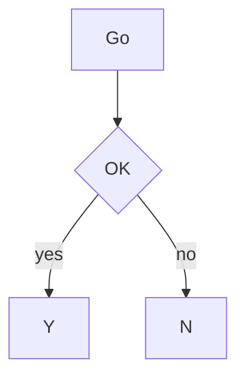
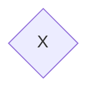
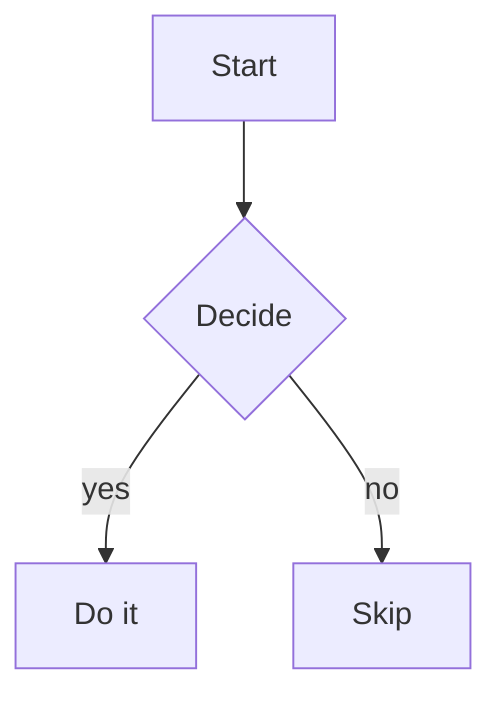
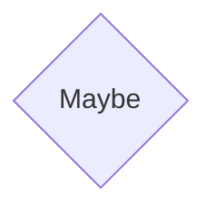
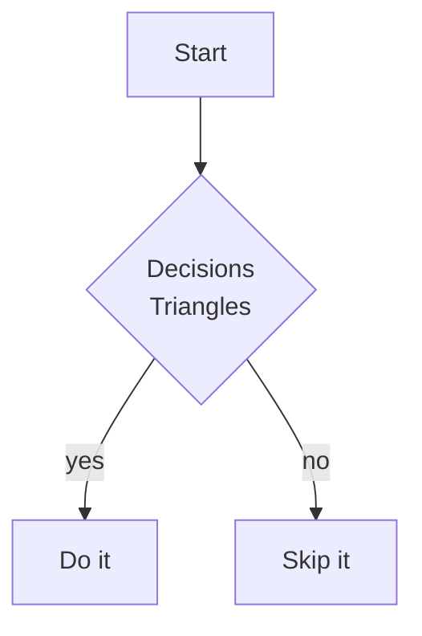
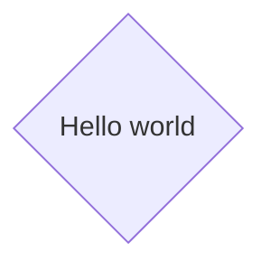
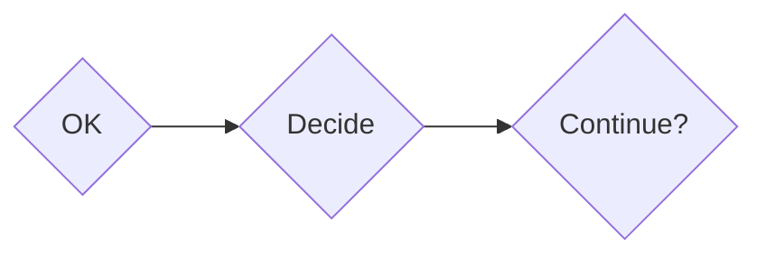

# Decision diamond sizes

Diamonds (`A{Label}`) pick one of three tip widths from the label length -- always an odd number of characters on the top and bottom so a connecting branch lands on the middle tile. Longer tips also grow taller, so the one-cell-per-row taper can open wide enough for the label.

| Tip | Characters | When |
| --- | --- | --- |
| Small | `/▔\` (3) | label width ≤ 2 |
| Medium | `/▔▔▔\` (5) | label width 3–6 |
| Large | `/▔▔▔▔▔\` (7) | label width ≥ 7 |

View this file with `./viewmd.sh docs/diamonds.md`.

## Small (3) -- short labels

## Medium (5) -- typical decision labels

## Large (7) -- long or multi-line labels

## All three in one graph

Short, medium, and long diamonds side by side (left to right). Tip size also drives height, so even when they share an LR row the small diamond stays shorter than the large one:

## Nested decisions at mixed sizes

A short gate into a longer follow-up question:

