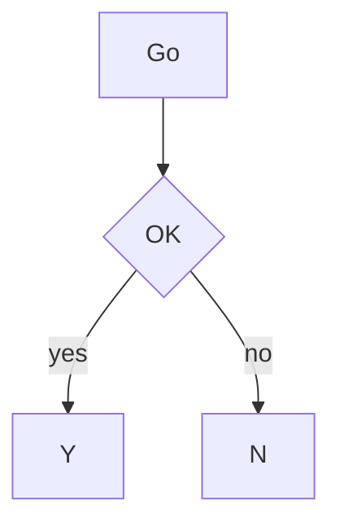
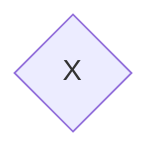
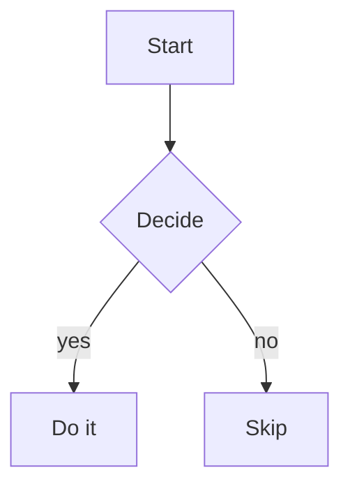
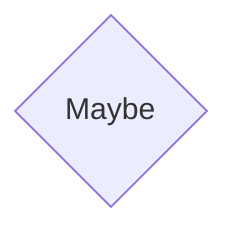
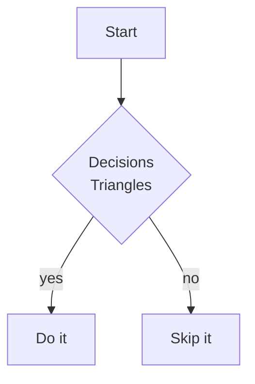
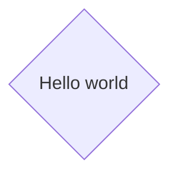
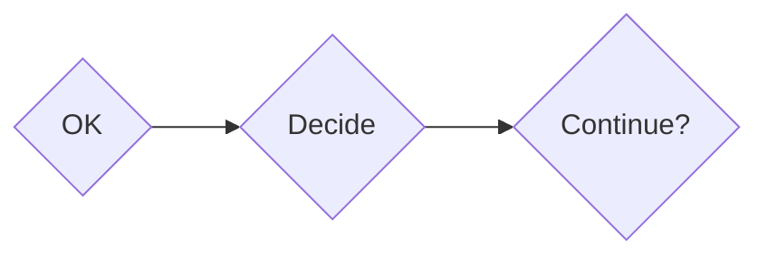
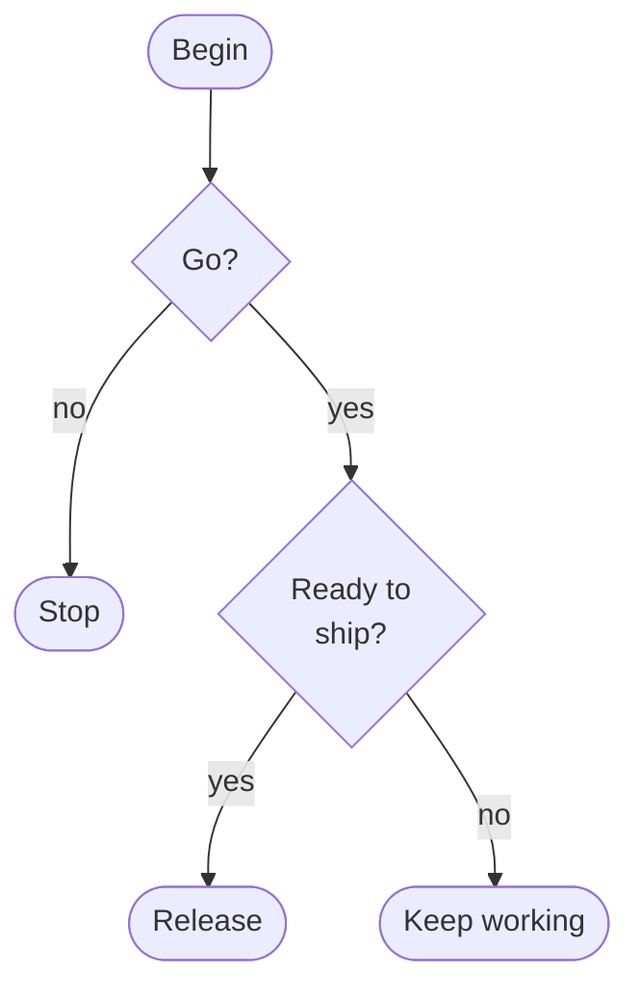

# Decision diamond sizes

Diamonds (`A{Label}`) render as a flat-topped/bottomed rounded lozenge -- the same shape family as `round`/`stadium`/`circle`, sized exactly like a same-content rectangle: one row per label line, plus 1 top and 1 bottom border row. A `◇` marks all four attachment points: centred in the top/bottom border (UP/DOWN), and immediately beside the label on every content row (LEFT/RIGHT). Unlike the old tapered-rhombus design, a diamond's height never depends on its own or a sibling's width -- only its own label's line count (VIEWMD-0038).

View this file with `./viewmd.sh docs/diamonds.md`.

## Short label

## Typical decision label

## Multi-line label

A ` ` label packs one row per line, with `◇` beside every content row:

## Several diamonds in one graph

Every diamond renders at the same height regardless of its own or a neighbour's label width:

## Nested decisions at mixed label lengths

A short gate into a longer follow-up question -- both diamonds render at the same height:

