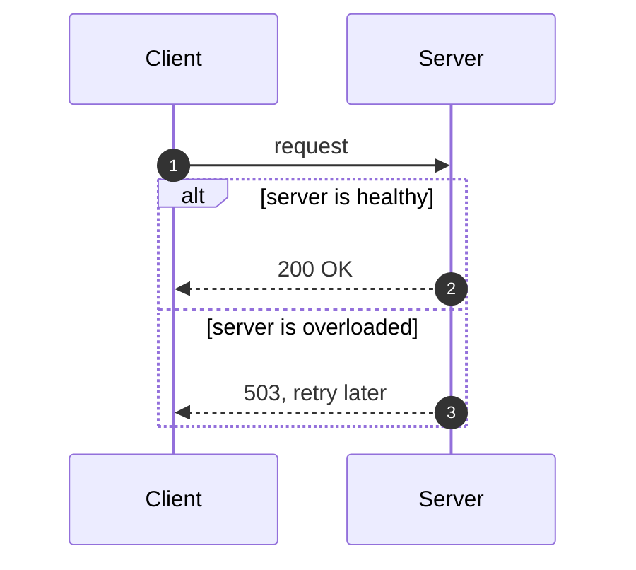
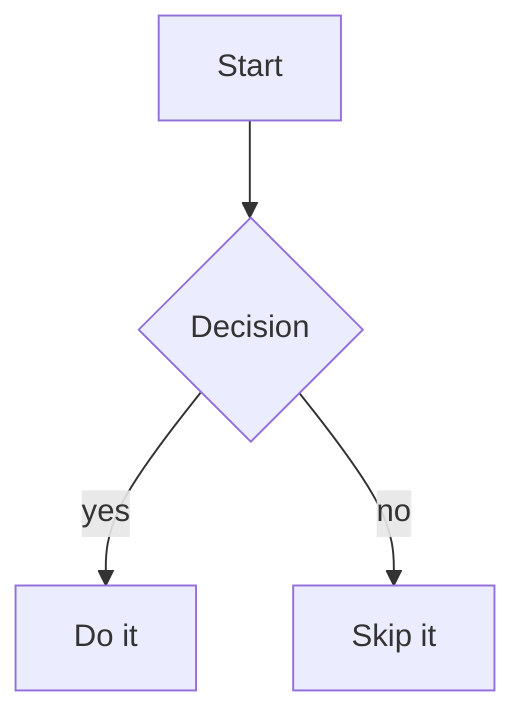
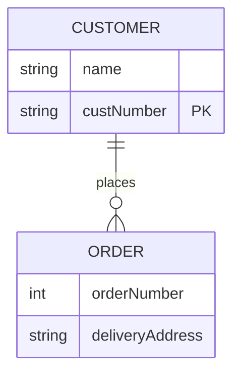
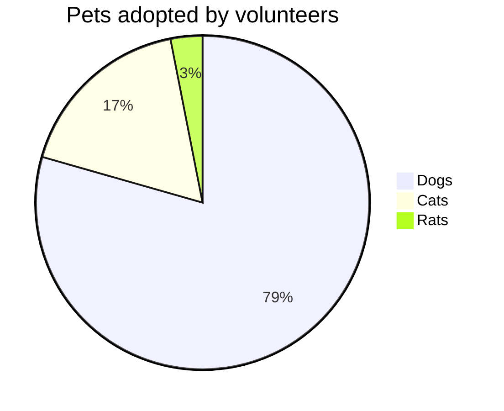
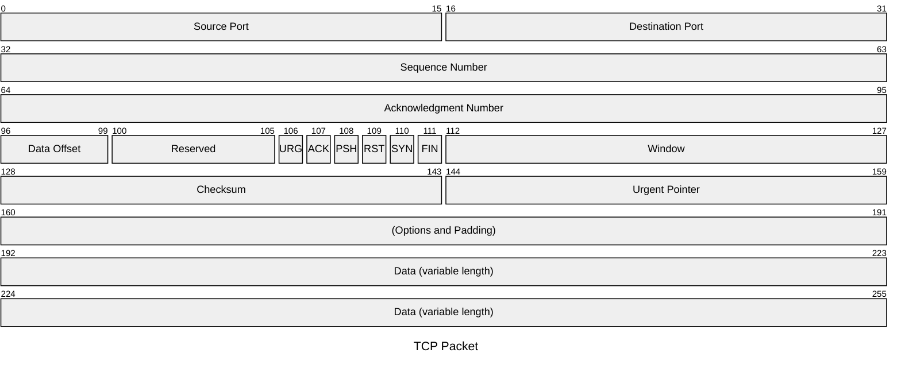
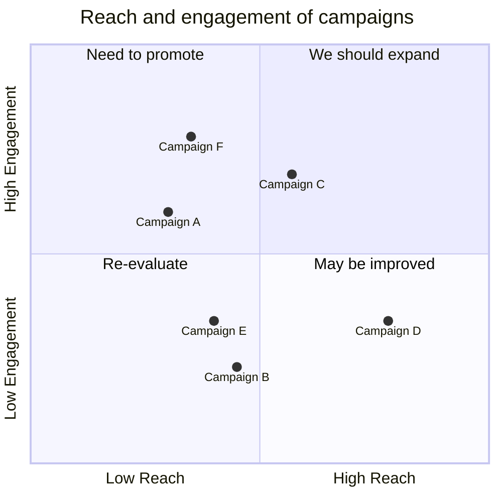
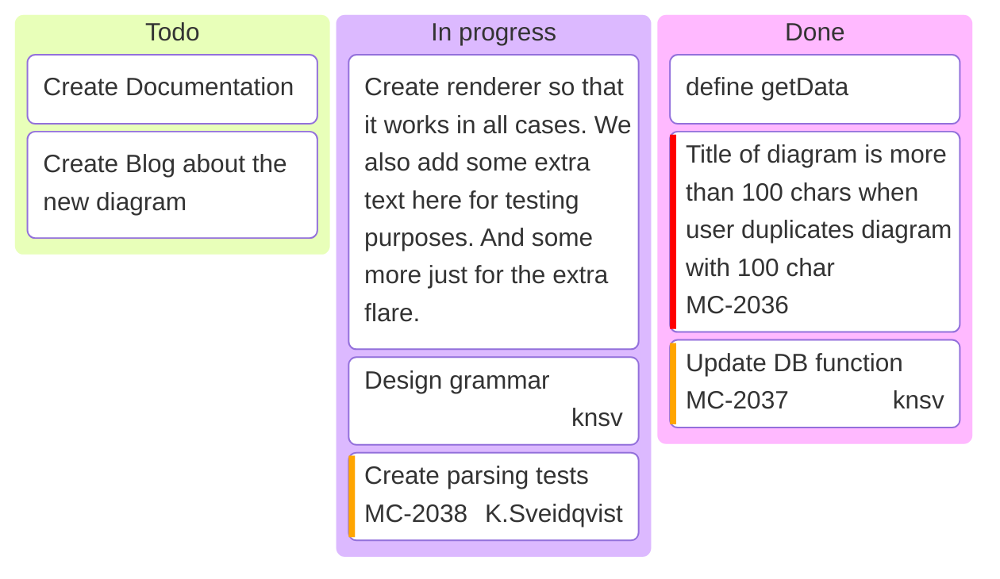

# viewmd feature showcase

View this file with viewmd itself to see everything below rendered:

```
./viewmd.sh docs/example.md
```

The front-matter block above renders as a key/value table ahead of this heading, with a divider
after it. The empty `reviewer:` field is omitted by default -- pass `--full-front-matter` to show
it anyway.

## Text formatting

Paragraphs support **bold**, *italic*, ***bold italic***, ~~strikethrough~~, and `inline code`.

> A blockquote, for a callout or a quoted remark.

---

## Wikilinks

Obsidian-style wikilinks like [[Getting Started]] or [[Getting Started|a custom display name]]
render the same as an ordinary Markdown link, brackets gone.

## Lists

- Bullet item one
- Bullet item two
  - Nested item
    1. Numbered inside a bullet
    2. Second numbered item
- Bullet item three

1. First step
2. Second step
3. Third step

## Tables

| Feature          | Status      | Notes                                   | Value |
|------------------|:-----------:|------------------------------------------|------:|
| Headers          | done        | all six levels                            | &euro;&nbsp;2,95 |
| Tables           | done        | this one, with alignment                  | &euro;&nbsp;1,50 |
| Front matter     | done        | rendered as a table, see the intro page   | &euro;&nbsp;12,50 |
| Wikilinks        | done        | see the formatting page                   | &euro;&nbsp;250,00 |
| Mermaid diagrams | done        | sequence, flowchart, ER, pie, packet, quadrant | &euro;&nbsp;1.395,00 |

## Syntax-highlighted code

```python
def render(text: str, *, width: int, color: bool) -> str:
    """Render Markdown to an ANSI string, width columns wide."""
    return _console_render(text, width=width, color=color)
```

### A line too wide for the render width

An ordinary code line longer than the render width stays intact on one line rather than folding
onto a second (VIEWMD-0019) -- same as a mermaid diagram (VIEWMD-0018). The line below is exactly
120 characters; at the default 100-column cap it should still render as a single unbroken line,
scrolling horizontally in the pager (`less -S`) instead of wrapping or being cut off:

```python
result = some_function(argument_one, argument_two, argument_three, argument_four, argument_five, argument_six, xxxxxxxx)
```

## Mermaid diagrams

A fenced ` ```mermaid ` block containing a `sequenceDiagram`, `graph`/`flowchart`, `erDiagram`,
`pie`, `packet-beta`/`packet`, or `quadrantChart` renders as box-drawing art in place of its
source. Other Mermaid diagram types, and any block that fails to parse, are left as plain source
text rather than causing an error.

### Sequence diagrams

Sequence diagrams support notes, loop/alt/par fragments, and `actor` participants (drawn as a
random 3-line stick figure instead of a box).



### Flowcharts

Flowcharts support subgraphs, labelled and bidirectional edges, `classDef` styling, A*-based
routing around other nodes, and distinct node shapes (round, stadium/pill, circle, subroutine,
cylinder/database, and diamond decision nodes rendered as a rounded lozenge -- see
[docs/diamonds.md](diamonds.md) for the shape specifically). One real limitation inherited from the upstream
renderer flowcharts are ported from: `BT`/`RL` directions are accepted but not actually reversed
(aliased to `TD`/`LR`).

Source:

```
graph TD
    A[Start] --> B{Decision}
    B -->|yes| C[Do it]
    B -->|no| D[Skip it]
```

Rendered:



### ER diagrams

ER diagrams support attribute tables, crow's-foot cardinality notation, and
identifying/non-identifying relationships. See [docs/mermaid-examples.md](mermaid-examples.md)
for an exhaustive tour of sequence diagrams, flowcharts, and ER diagrams -- every arrow type and
fragment, every flowchart direction/subgraph/styling case, ER cardinality notation, and the
graceful-fallback behavior for diagram types that aren't supported yet.

Source:

```
erDiagram
    CUSTOMER ||--o{ ORDER : places
    CUSTOMER {
        string name
        string custNumber PK
    }
    ORDER {
        int orderNumber
        string deliveryAddress
    }
```

Rendered:



### Pie charts render two ways, chosen by color (VIEWMD-0043)

Unlike the other diagram types, a `pie` chart renders differently depending on whether color is
available. With color (the default on a real terminal), it draws as an actual circle: each slice
a distinct truecolor region, a legend beside it, and its own size scaled to roughly 60% of what
comfortably fits the render width -- try `--width 60` vs. `--width 200` against this file and
compare:



Without color (`--color never`, `NO_COLOR` set, or piped output), the same chart falls back to a
horizontal bar chart instead -- a circular pie was tried without color and found illegible, so
the fallback is a deliberate second design, not a lesser version of the first. Run
`./viewmd.sh docs/example.md --color never` to see it.

### Packet diagrams (VIEWMD-0049)

A `packet-beta`/`packet` block draws a fixed-width bit/byte field layout -- the kind used to
document a network protocol header -- wrapped onto rows of 32 bits each. See
[docs/mermaid-packet.md](mermaid-packet.md) for fixtures with the `+<count>` shorthand and a
field spanning a row boundary.



### Quadrant charts (VIEWMD-0047)

A `quadrantChart` block draws a bordered box split into four labelled quadrants by an internal
cross, with each `<label>: [x, y]` point plotted at its `(x, y)` position and labelled beneath its
marker. Like the pie chart, its size scales to the render width, and with color available each
quadrant's border, label, and points are tinted a distinct color over a darkened background fill.
Without color, the same box renders plain instead. See
[docs/mermaid-quadrant.md](mermaid-quadrant.md) for more fixtures.



### Kanban boards (VIEWMD-0034)

A `kanban` block draws ordered columns of stacked task cards, each column its own colored-header
box and each card its own nested box within it. Cards word-wrap long labels and can carry
`@{ ticket, assigned, priority }` metadata, rendered as a colored line under the label: a
severity-colored `[H]`/`[VH]`/`[L]`/`[VL]`/`[M]` priority token, an underlined ticket ID, and a
right-aligned assignee. Columns size to a uniform card width but hug their own content height, so
a short column doesn't pad out to match a taller one beside it.


