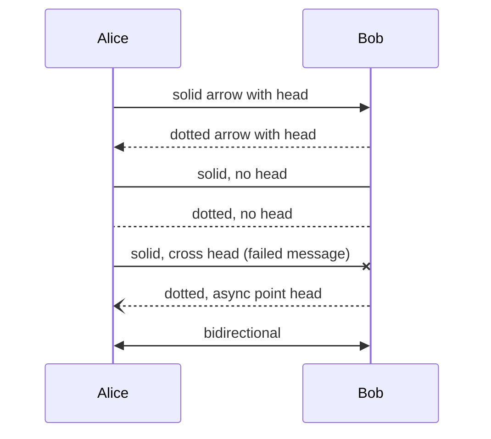
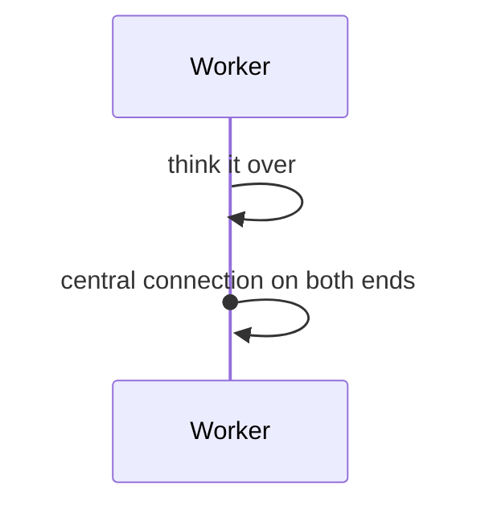
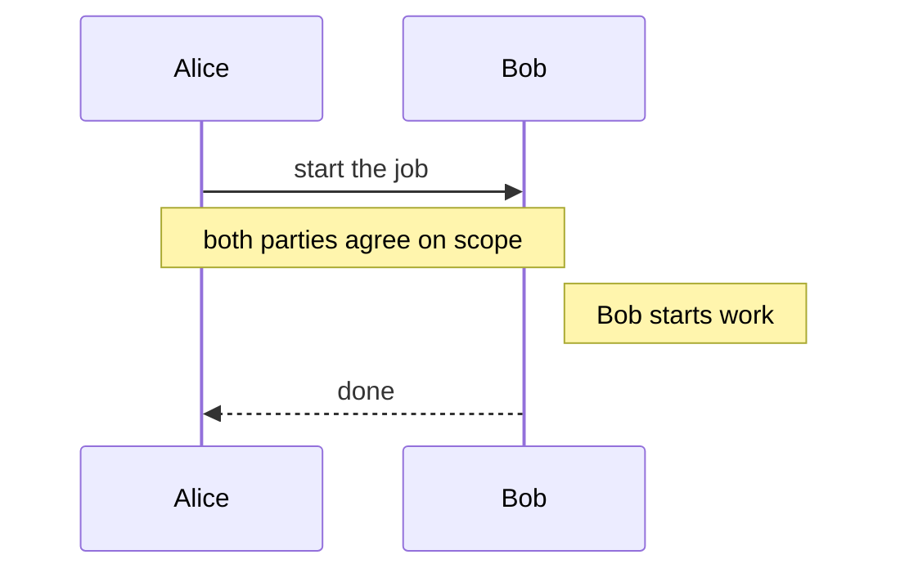
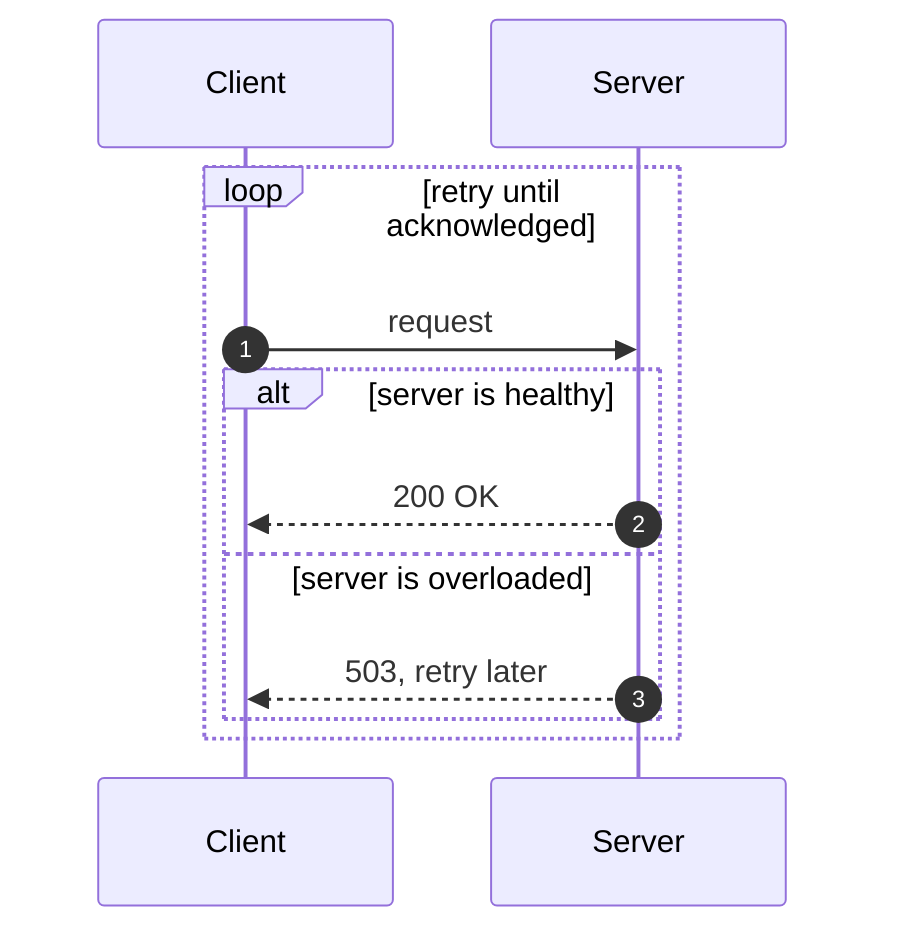
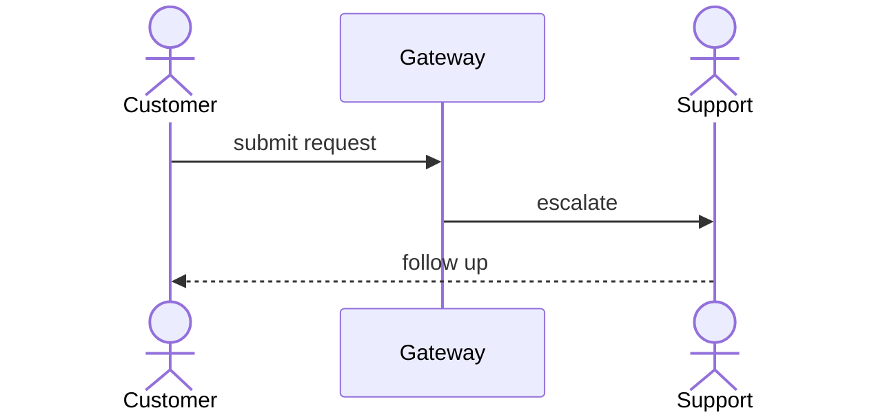
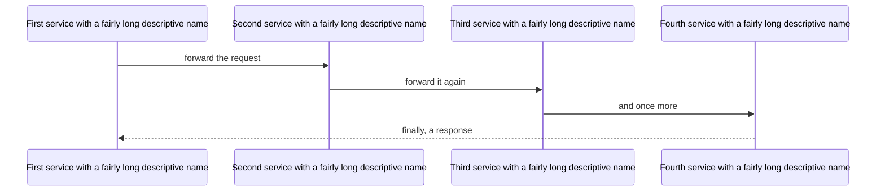
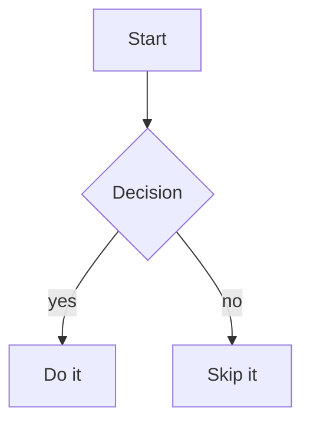

# viewmd feature showcase

View this file with viewmd itself to see everything below rendered:

```
./viewmd.sh docs/example.md
```

The front-matter block above renders as a key/value table ahead of this heading, with a divider
after it. The empty `reviewer:` field is omitted by default — pass `--full-front-matter` to show
it anyway.

## Text formatting

Paragraphs support **bold**, *italic*, ***bold italic***, ~~strikethrough~~, and `inline code`.

> A blockquote, for a callout or a quoted remark.

---

## Lists

- Bullet item one
- Bullet item two
  - Nested item
    1. Numbered inside a bullet
    2. Second numbered item
- Bullet item three

1. First step
2. Second step
3. Third step

## Tables

| Feature          | Status      | Notes                                   |
|------------------|-------------|------------------------------------------|
| Headers          | done        | all six levels                            |
| Tables           | done        | this one                                  |
| Front matter     | done        | rendered as a table, see the top of this file |
| Wikilinks        | done        | see below                                 |
| Mermaid sequence | done        | see below                                 |
| Mermaid flowchart | not yet    | falls back to plain source (see below)    |

## Syntax-highlighted code

```python
def render(text: str, *, width: int, color: bool) -> str:
    """Render Markdown to an ANSI string, width columns wide."""
    return _console_render(text, width=width, color=color)
```

### A line too wide for the render width

Unlike a mermaid diagram, an ordinary code line longer than the render width is truncated, not
wrapped (VIEWMD-0019). The line below is exactly 120 characters; at the default 100-column cap it
should render as a single line, cut off mid-argument list, with nothing folding onto a second line:

```python
result = some_function(argument_one, argument_two, argument_three, argument_four, argument_five, argument_six, xxxxxxxx)
```

## Wikilinks

Obsidian-style wikilinks like [[Getting Started]] or [[Getting Started|a custom display name]]
render the same as an ordinary Markdown link, brackets gone.

## Mermaid sequence diagrams

A fenced ` ```mermaid ` block containing a `sequenceDiagram` renders as box-drawing art in place
of its source.

### Basic messages and arrow types



### Self-messages and central connections



### Notes



### Fragments: loop, alt, and autonumber



### Actors

An `actor` declaration draws a random 3-line stick figure instead of a plain box; with more than
one actor in a diagram, each gets a different figure before any repeat.



### Full width, even wider than the terminal

Diagram rows keep their natural width instead of being wrapped/padded to the render width
(VIEWMD-0018) — a code block's long lines are truncated instead (VIEWMD-0019), but a mermaid
diagram never is. Try this one at the default 100-column cap (`./viewmd.sh docs/example.md`) and
notice every box stays intact on one row, scrolling horizontally in the pager instead of folding:



### Graceful fallback

Diagram types other than `sequenceDiagram` — and any block that fails to parse — render as plain
source text instead of raising an error, since only sequence diagrams are supported so far:


