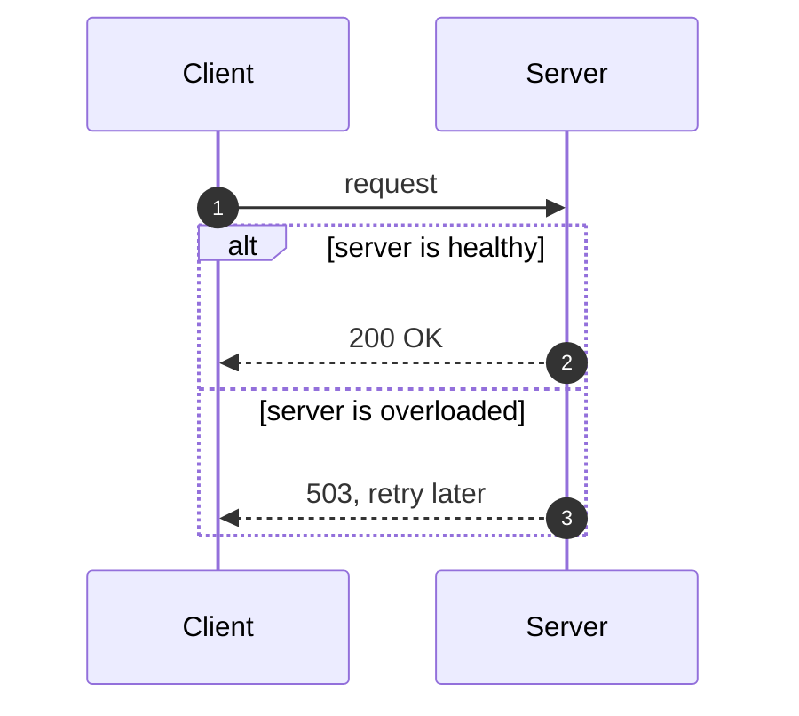
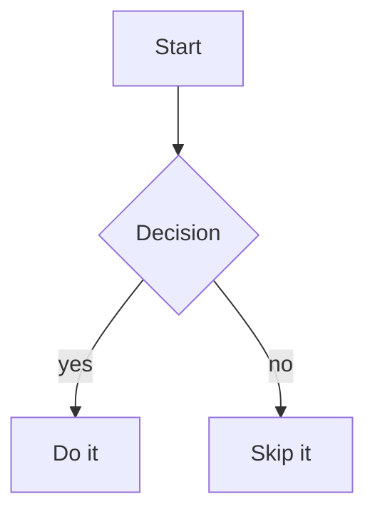
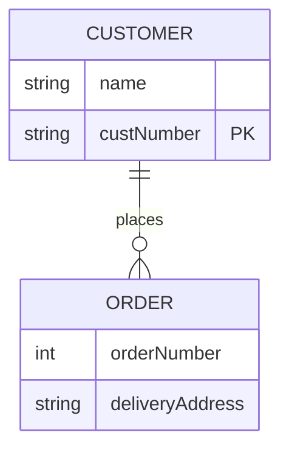
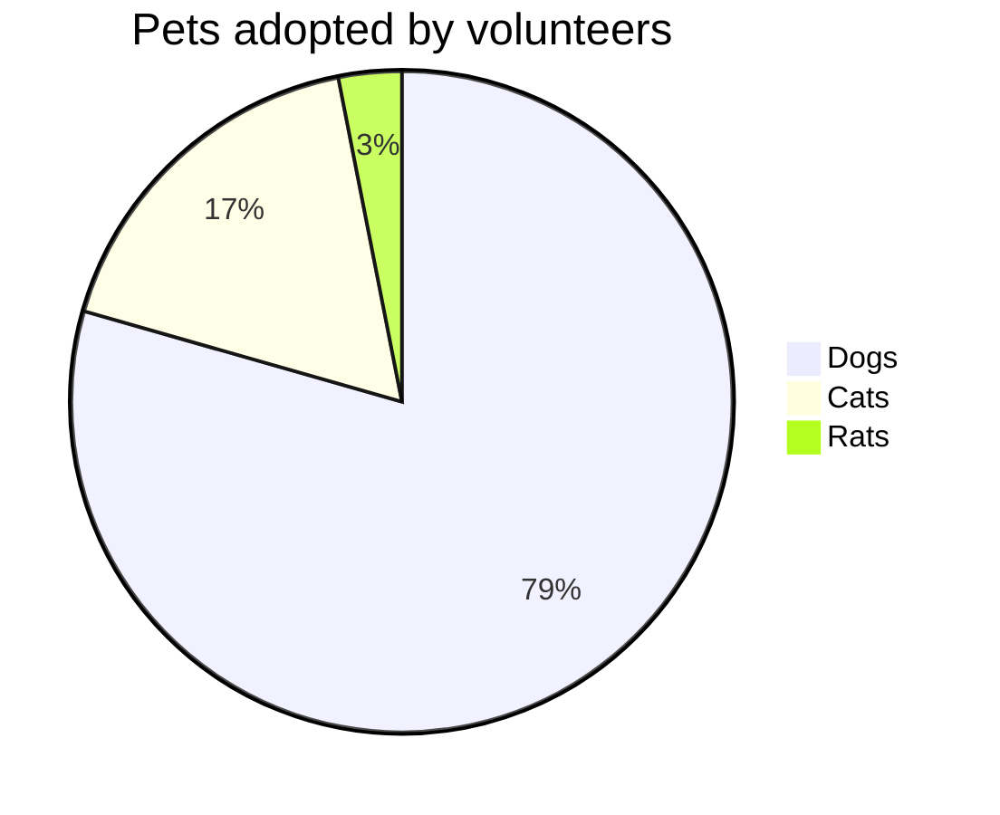
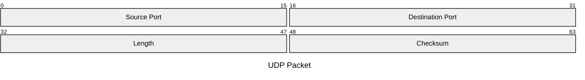

# viewmd feature showcase

View this file with viewmd itself to see everything below rendered:

```
./viewmd.sh docs/example.md
```

The front-matter block above renders as a key/value table ahead of this heading, with a divider
after it. The empty `reviewer:` field is omitted by default — pass `--full-front-matter` to show
it anyway.

## Text formatting

Paragraphs support **bold**, *italic*, ***bold italic***, ~~strikethrough~~, and `inline code`.

> A blockquote, for a callout or a quoted remark.

---

## Lists

- Bullet item one
- Bullet item two
  - Nested item
    1. Numbered inside a bullet
    2. Second numbered item
- Bullet item three

1. First step
2. Second step
3. Third step

## Tables

| Feature          | Status      | Notes                                   |
|------------------|-------------|------------------------------------------|
| Headers          | done        | all six levels                            |
| Tables           | done        | this one                                  |
| Front matter     | done        | rendered as a table, see the top of this file |
| Wikilinks        | done        | see below                                 |
| Mermaid sequence | done        | see below                                 |
| Mermaid flowchart | done       | see below                                 |
| Mermaid ER diagram | done      | see below                                 |
| Mermaid pie chart | done       | see below                                 |
| Mermaid packet diagram | done  | see below                                 |

## Syntax-highlighted code

```python
def render(text: str, *, width: int, color: bool) -> str:
    """Render Markdown to an ANSI string, width columns wide."""
    return _console_render(text, width=width, color=color)
```

### A line too wide for the render width

An ordinary code line longer than the render width stays intact on one line rather than folding
onto a second (VIEWMD-0019) — same as a mermaid diagram (VIEWMD-0018). The line below is exactly
120 characters; at the default 100-column cap it should still render as a single unbroken line,
scrolling horizontally in the pager (`less -S`) instead of wrapping or being cut off:

```python
result = some_function(argument_one, argument_two, argument_three, argument_four, argument_five, argument_six, xxxxxxxx)
```

## Wikilinks

Obsidian-style wikilinks like [[Getting Started]] or [[Getting Started|a custom display name]]
render the same as an ordinary Markdown link, brackets gone.

## Mermaid diagrams

A fenced ` ```mermaid ` block containing a `sequenceDiagram`, `graph`/`flowchart`, `erDiagram`,
`pie`, `packet-beta`/`packet`, or `quadrantChart` renders as box-drawing art in place of its
source. Other Mermaid diagram types, and any block that fails to parse, are left as plain source
text rather than causing an error. Diagram rows keep their natural width instead of being
wrapped/padded to the render width (VIEWMD-0018) — same as a wide code block's long lines
(VIEWMD-0019); docs/mermaid-examples.md has an example wide enough to demonstrate the horizontal
scroll this produces in the pager.

### Sequence diagrams, flowcharts, and ER diagrams

Sequence diagrams support notes, loop/alt/par fragments, and `actor` participants (drawn as a
random 3-line stick figure instead of a box). Flowcharts support subgraphs, labelled and
bidirectional edges, `classDef` styling, A*-based routing around other nodes, and distinct node
shapes (round, stadium/pill, circle, subroutine, cylinder/database, and diamond decision nodes
rendered as a rounded lozenge — see [docs/diamonds.md](diamonds.md) for the shape specifically).
ER diagrams support attribute tables, crow's-foot cardinality notation, and
identifying/non-identifying relationships. One real limitation inherited from the upstream
renderer flowcharts are ported from: `BT`/`RL` directions are accepted but not actually reversed
(aliased to `TD`/`LR`). See [docs/mermaid-examples.md](mermaid-examples.md) for an exhaustive tour
of all three — every arrow type and fragment, every flowchart direction/subgraph/styling case, ER
cardinality notation, and the graceful-fallback behavior for diagram types that aren't supported
yet:







### Pie charts render two ways, chosen by color (VIEWMD-0043)

Unlike the other diagram types, a `pie` chart renders differently depending on whether color is
available. With color (the default on a real terminal, or run `./viewmd.sh docs/example.md
--color always`), it draws as an actual circle: each slice a distinct truecolor region, a legend
beside it, and its own size scaled to roughly 60% of what comfortably fits the render width — try
`--width 60` vs. `--width 200` against this file and compare:



Without color (`--color never`, `NO_COLOR` set, piped output, or a plain-ASCII terminal via
`--ascii`-style rendering), the same chart falls back to a horizontal bar chart instead — a
circular pie was tried without color and found illegible (jagged edges, indistinguishable slices),
so the fallback is a deliberate second design, not a lesser version of the first:

```
Pets adopted by volunteers

Dogs┃████████████████████████████████   79.4%
Cats┃███████   17.5%
Rats┃█▎    3.1%
```

Run `./viewmd.sh docs/example.md --color never` to see this file's pie chart render that way
instead.

### Packet diagrams (VIEWMD-0049)

A `packet-beta`/`packet` block draws a fixed-width bit/byte field layout — the kind used to
document a network protocol header — wrapped onto rows of 32 bits each; a field spanning a row
boundary splits across both rows with the same label repeated. Fields can be given as explicit
`<start>-<end>`/`<start>` ranges or with the `+<count>` shorthand, which advances from wherever the
previous field left off, freely mixed in the same diagram:



See [docs/mermaid-packet.md](mermaid-packet.md) for more fixtures, including one spanning a row
boundary and one with a `+N`/explicit-range mix.

### Quadrant charts (VIEWMD-0047)

A `quadrantChart` block draws a bordered box split into four labelled quadrants by an internal
cross, with each `<label>: [x, y]` data point plotted at its `(x, y)` position (`0.0`-`1.0` on both
axes) and labelled directly beneath its marker. Like the pie chart, its default size is scaled to
the render width rather than a fixed constant — try `--width 60` vs. `--width 200` against this
file and compare — and, with color available, each quadrant's border, its own label, and every
point inside it are tinted a distinct color on top of a darkened background fill of the same hue,
while a point's own explicit `color:` style (or its `:::class`'s `classDef color:`) overrides that
quadrant tint:


Without color (`--color never`, `NO_COLOR` set, piped output, or `--ascii`), the same box renders
plain — every border segment, label, and marker uncolored, no background fill:

```
                Reach and engagement of campaigns

┌────────────────────┬────────────────────┐
│Need to promote     │We should expand    │
│                    │                    │
│             ●      │                    │
│        Campaign F  │   ●                │
│           ●        │Campaign C          │
│      Campaign A    │                    │
├────────────────────┼────────────────────┤
│Re-evaluate         │May be improved     │
│          Campaign E│                    │
│               ●    │           ●        │
│                 ●  │      Campaign D    │
│          Campaign B│                    │
│                    │                    │
│                    │                    │
└────────────────────┴────────────────────┘
      Low Reach             High Reach
```

Run `./viewmd.sh docs/example.md --color never` to see this file's quadrant chart render that way
instead. See [docs/mermaid-quadrant.md](mermaid-quadrant.md) for more fixtures, including two
points close enough to collide in the same cell.
