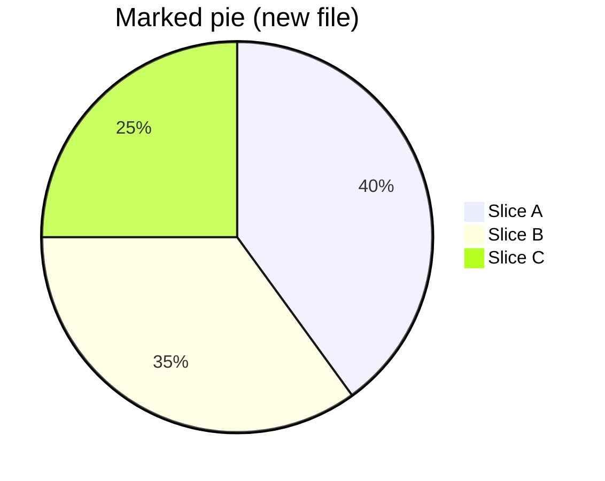
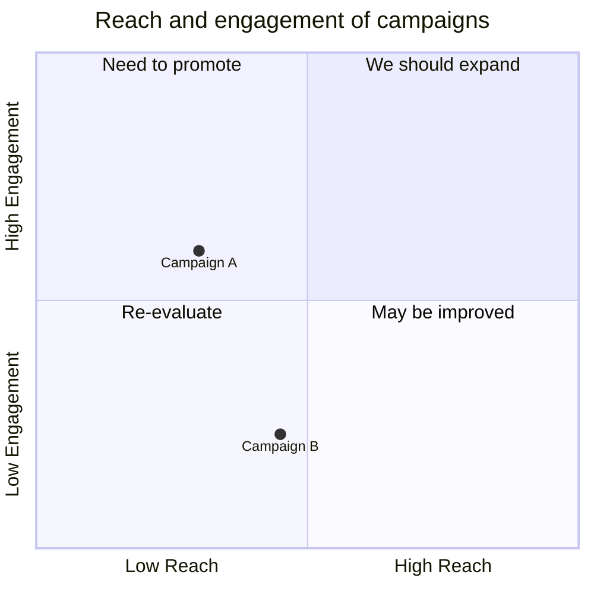

# viewmd:mark sentinel highlighting

Fixture for [VIEWMD-0104](../issues/VIEWMD-0104-highlight-marked-regions.md) (highlight regions marked by sentinel HTML comments). Render it with color to see the marked blocks below tinted per `kind` (green/amber/red for added/changed/removed):

```
./viewmd.sh --color=always docs/mark-highlight-example.md
```

Before this issue, every `<!-- viewmd:mark ... -->` sentinel below was an ordinary HTML comment that `rich.markdown.Markdown` treated as its own unknown block element -- `MarkdownElement.new_line` defaults to `True` and wasn't overridden for an unhandled token, so the render loop inserted a blank-line segment on both sides of each one, roughly doubling every marked block's gap even though the comment's own text never appeared. VIEWMD-0104 fixes this by stripping the sentinel lines from the Markdown source before Rich ever parses it (the same stage `viewmd/wikilinks.py` and `viewmd/mermaid/preprocess.py` already rewrite text at), so the marked blocks below now sit exactly where they would if the sentinel lines had simply been deleted.

Compare the unmarked baseline paragraphs below (single blank line between them, as normal) against the marked ones further down (same single blank line, now tinted with a background color instead of doubled gaps).

## Baseline (no marks)

This paragraph is not marked.

This paragraph is not marked either — note the single blank line above and below.

## Marked paragraph

<!-- viewmd:mark start kind=added -->
This whole paragraph is a brand-new block, marked `added` the way gitgleam marks every block of a
file that doesn't exist in the previous commit.
<!-- viewmd:mark end -->

This paragraph is unmarked, immediately after a marked one.

<!-- viewmd:mark start kind=changed -->
This paragraph is marked `changed` — only some of its lines actually differ from the previous
version, but the whole block is wrapped since marking is block-granular, not line-granular.
<!-- viewmd:mark end -->

## Marked list

<!-- viewmd:mark start kind=added -->
- New bullet one
- New bullet two
- New bullet three
<!-- viewmd:mark end -->

## Marked table

<!-- viewmd:mark start kind=changed -->
| Column A | Column B |
|----------|----------|
| row one  | value    |
| row two  | value    |
<!-- viewmd:mark end -->

## Marked Mermaid diagram

A marked diagram is the composition case the issue calls out explicitly: a pie chart already paints its own slice-fill background, so once VIEWMD-0104 lands the mark's background needs to take precedence there too, not just get skipped. For now this only demonstrates the same blank-line doubling around a Mermaid block as around prose.

<!-- viewmd:mark start kind=added -->

<!-- viewmd:mark end -->

## Marked quadrant chart

The composition risk the issue's design notes call out by name: a quadrant chart already paints its own per-quadrant background fill, so the mark's background needs to win there too, not just against a pie slice's fill.

<!-- viewmd:mark start kind=removed -->

<!-- viewmd:mark end -->

## Marked syntax-highlighted code

Also worth checking once the highlight itself is implemented: a fenced code block's own syntax-highlighting colors emit `RESET` codes mid-line, which would cancel a naively-applied mark background early unless it's re-applied after every reset (the `_wrap_hover` gotcha from VIEWMD-0092 the issue points at).

<!-- viewmd:mark start kind=changed -->
```python
def render(text: str, *, width: int, color: bool) -> str:
    """Render Markdown to an ANSI string, width columns wide."""
    return _console_render(text, width=width, color=color)
```
<!-- viewmd:mark end -->

## End baseline (no marks)

This paragraph is not marked.

This paragraph is not marked either.
