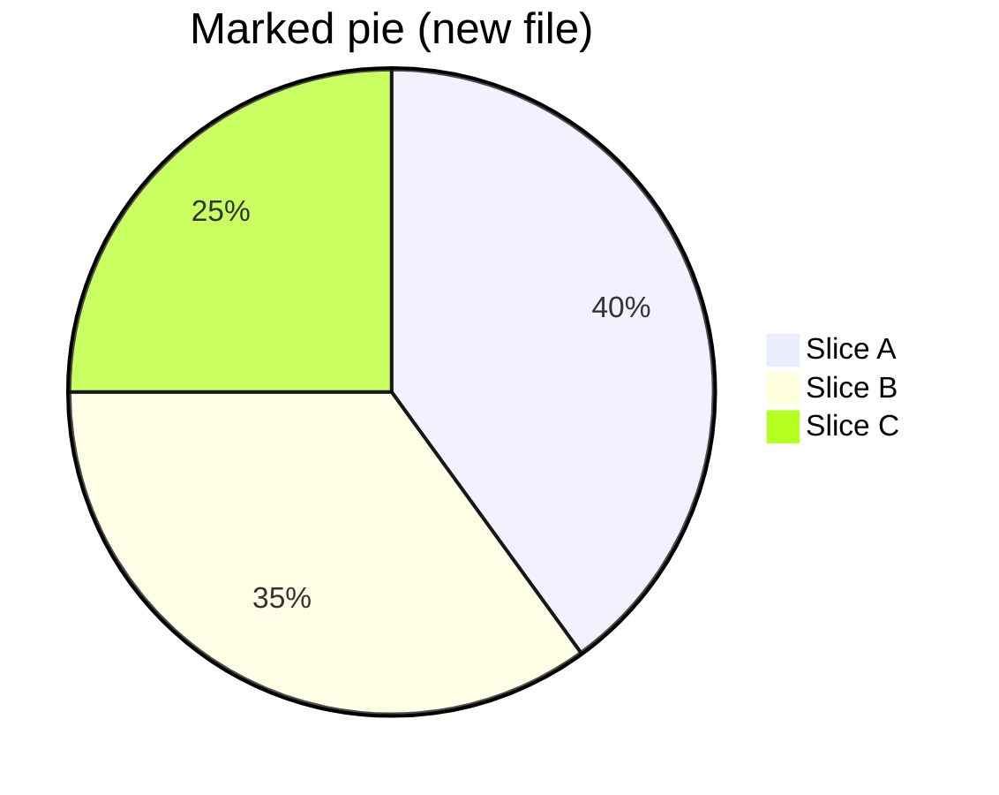

# viewmd:mark sentinel repro

Bug-repro fixture for [VIEWMD-0104](../issues/VIEWMD-0104-highlight-marked-regions.md). Render it today, before the issue is implemented, to see the problem:

```
./viewmd.sh docs/mark-highlight-example.md
```

Every `<!-- viewmd:mark ... -->` sentinel below is an ordinary HTML comment, so today's renderer (`rich.markdown.Markdown`, with no special handling for these tokens) treats each one as its own unknown block element. `MarkdownElement.new_line` defaults to `True` and isn't overridden for an unhandled token, so the render loop inserts a blank-line segment *before* the comment and leaves `new_line=True` for whatever follows — meaning each marked block gets an extra blank line on both its start and its end, on top of the blank line already separating it from its neighbors. The result: every marked block's gap roughly doubles. gitgleam's `MarkdownHighlighter` marks nearly every block in a brand-new file, so there the doubling shows up wall-to-wall.

Compare the unmarked baseline paragraphs below (single blank line between them, as normal) against the marked ones further down (doubled gaps around each marked block).

## Baseline (no marks)

This paragraph is not marked.

This paragraph is not marked either — note the single blank line above and below.

## Marked paragraph

<!-- viewmd:mark start kind=added -->
This whole paragraph is a brand-new block, marked `added` the way gitgleam marks every block of a
file that doesn't exist in the previous commit.
<!-- viewmd:mark end -->

This paragraph is unmarked, immediately after a marked one.

<!-- viewmd:mark start kind=changed -->
This paragraph is marked `changed` — only some of its lines actually differ from the previous
version, but the whole block is wrapped since marking is block-granular, not line-granular.
<!-- viewmd:mark end -->

## Marked list

<!-- viewmd:mark start kind=added -->
- New bullet one
- New bullet two
- New bullet three
<!-- viewmd:mark end -->

## Marked table

<!-- viewmd:mark start kind=changed -->
| Column A | Column B |
|----------|----------|
| row one  | value    |
| row two  | value    |
<!-- viewmd:mark end -->

## Marked Mermaid diagram

A marked diagram is the composition case the issue calls out explicitly: a pie chart already paints its own slice-fill background, so once VIEWMD-0104 lands the mark's background needs to take precedence there too, not just get skipped. For now this only demonstrates the same blank-line doubling around a Mermaid block as around prose.

<!-- viewmd:mark start kind=added -->

<!-- viewmd:mark end -->

## Marked syntax-highlighted code

Also worth checking once the highlight itself is implemented: a fenced code block's own syntax-highlighting colors emit `RESET` codes mid-line, which would cancel a naively-applied mark background early unless it's re-applied after every reset (the `_wrap_hover` gotcha from VIEWMD-0092 the issue points at).

<!-- viewmd:mark start kind=changed -->
```python
def render(text: str, *, width: int, color: bool) -> str:
    """Render Markdown to an ANSI string, width columns wide."""
    return _console_render(text, width=width, color=color)
```
<!-- viewmd:mark end -->

## End baseline (no marks)

This paragraph is not marked.

This paragraph is not marked either.
