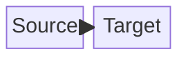
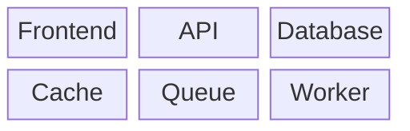
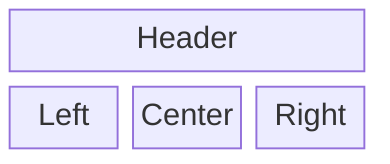
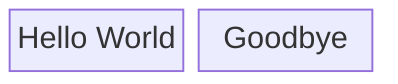
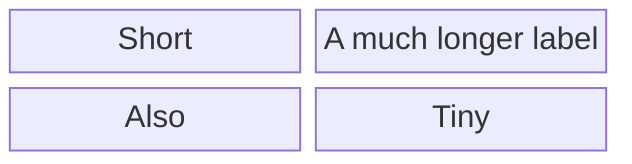
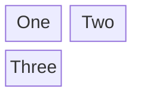

# Combined fixtures: mermaid_block (*.mmd)

## edge

Source:

```
block-beta
    A["Source"]
    B["Target"]
    A-->B
```

Rendered:



## grid

Source:

```
block-beta
    columns 3
    A["Frontend"] B["API"] C["Database"]
    D["Cache"] E["Queue"] F["Worker"]
```

Rendered:



## header

Source:

```
block-beta
    columns 3
    A["Header"]:3
    B["Left"] C["Center"] D["Right"]
```

Rendered:



## hello

Source:

```
block-beta
    A["Hello World"]
    B["Goodbye"]
```

Rendered:



## keyword_alias

Source:

```
block
    A["Hello World"]
    B["Goodbye"]
```

Rendered:


## widen

Source:

```
block-beta
    columns 2
    A["Short"] B["A much longer label"]
    C["Also"] D["Tiny"]
```

Rendered:



## wrap

Source:

```
block-beta
    columns 2
    A["One"] B["Two"]
    C["Three"]
```

Rendered:



