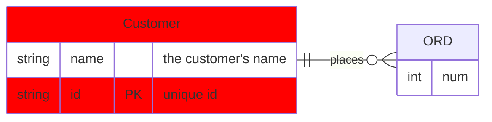
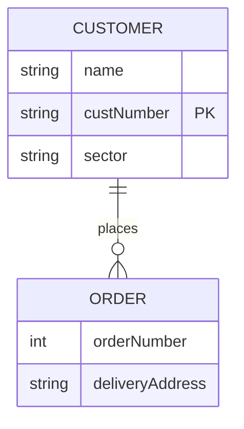
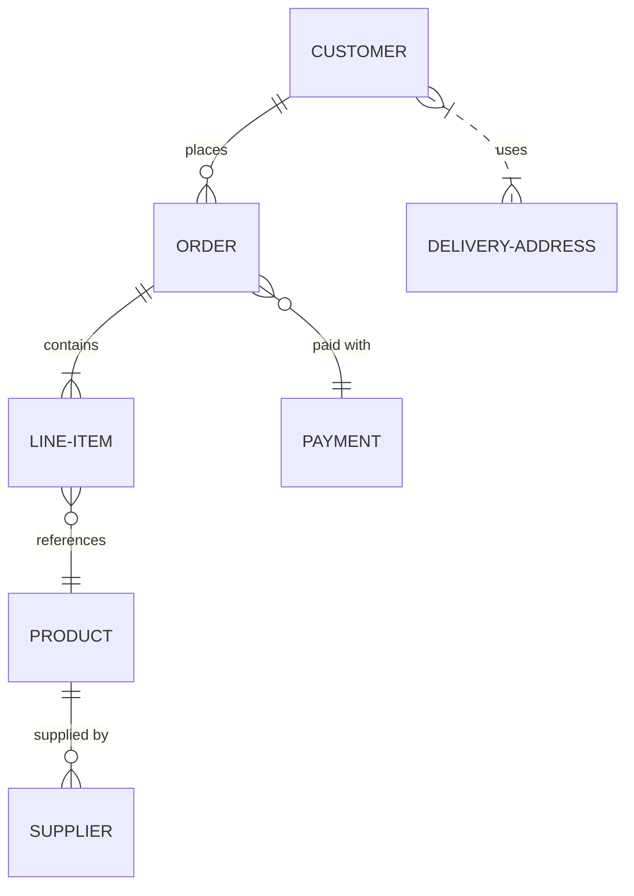
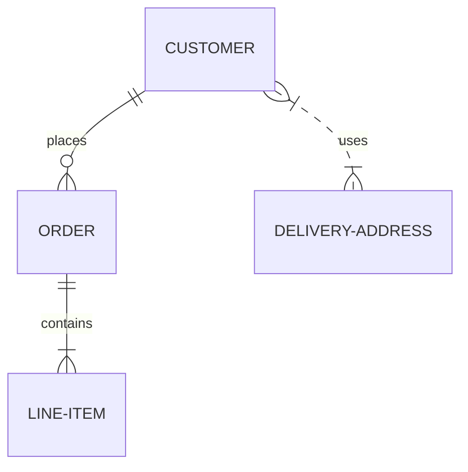
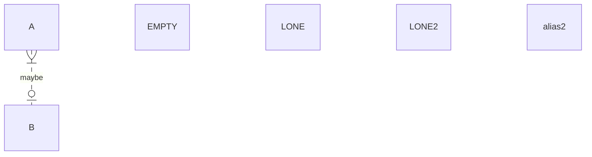
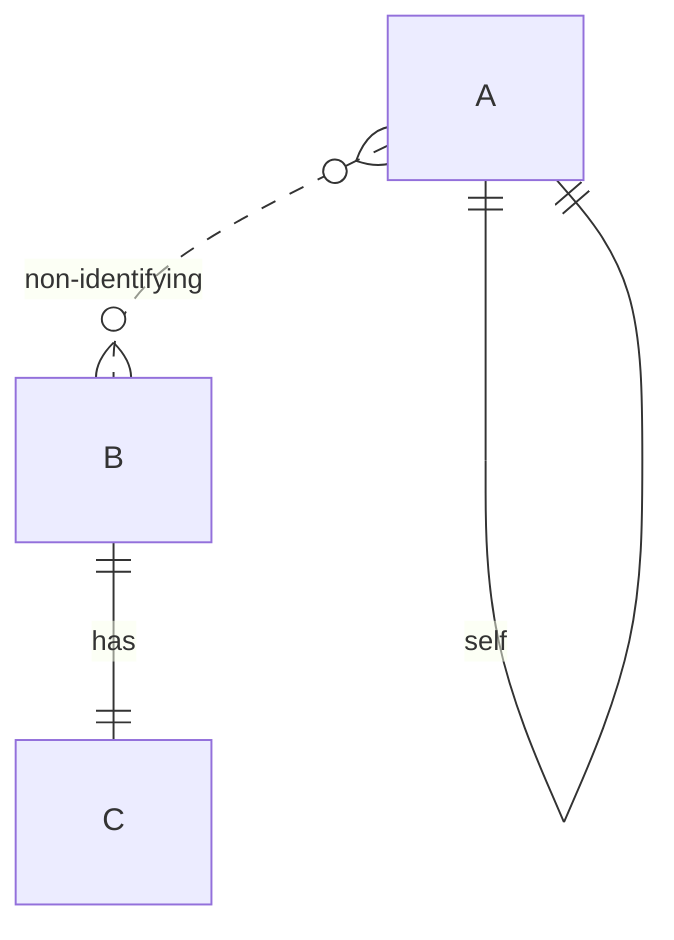
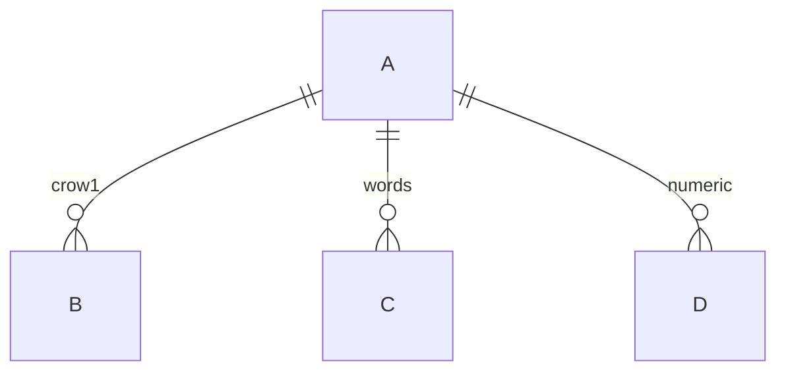

# Combined fixtures: mermaid_er (*.mmd)

## aliases_and_style

Source:

```
erDiagram
    direction LR
    %% a full-line comment
    CUST["Customer"] {
        string name "the customer's name"
        string id PK "unique id"
    }
    CUST ||--o{ ORD : places
    accTitle: my diagram
    accDescr: some description
    classDef foo fill:#f00
    class CUST foo
    ORD:::highlight {
        int num
    }
```

Rendered:



## attribute_keys_and_types

Source:

```
erDiagram
    PRODUCT {
        string sku PK
        string upc "UK code" UK
        string supplierId FK
        decimal(10, 2) price "unit price"
        string `two words` "backtick name"
    }
    ORDER ||--|{ PRODUCT : contains
```

Rendered:

```mermaid
erDiagram
    PRODUCT {
        string sku PK
        string upc "UK code" UK
        string supplierId FK
        decimal(10, 2) price "unit price"
        string `two words` "backtick name"
    }
    ORDER ||--|{ PRODUCT : contains
```

## basic_customer_order

Source:

```
erDiagram
    CUSTOMER ||--o{ ORDER : places
    CUSTOMER {
        string name
        string custNumber PK
        string sector
    }
    ORDER {
        int orderNumber
        string deliveryAddress
    }
```

Rendered:



## large_grid_layout

Source:

```
erDiagram
    CUSTOMER ||--o{ ORDER : places
    ORDER ||--|{ LINE-ITEM : contains
    CUSTOMER }|..|{ DELIVERY-ADDRESS : uses
    LINE-ITEM }o--|| PRODUCT : references
    PRODUCT ||--o{ SUPPLIER : "supplied by"
    ORDER }o--|| PAYMENT : "paid with"
```

Rendered:



## no_attributes

Source:

```
erDiagram
    CUSTOMER ||--o{ ORDER : places
    ORDER ||--|{ LINE-ITEM : contains
    CUSTOMER }|..|{ DELIVERY-ADDRESS : uses
```

Rendered:



## optionally_to_and_lone_entities

Source:

```
erDiagram
    A one or many optionally to zero or one B : maybe
    EMPTY {}
    LONE
    LONE2 alias2
```

Rendered:



## self_loop_and_dashed

Source:

```
erDiagram
    A }o..o{ B : "non-identifying"
    B ||--|| C : has
    A ||--|| A : self
```

Rendered:



## word_and_numeric_cardinality

Source:

```
erDiagram
    A ||--o{ B : "crow1"
    A one to zero or more C : "words"
    A 1 to 0+ D : "numeric"
```

Rendered:



