# Mermaid diagram showcase

An exhaustive, one-of-everything tour of the Mermaid diagram types and features viewmd renders —
every arrow type, fragment, node shape, direction, and edge case that has its own golden fixture
under `tests/fixtures/`. Two purposes at once: a visual showcase (view this file with viewmd
itself, `./viewmd.sh docs/mermaid-examples.md`, to see every example below rendered as box-drawing
art), and a living manual testcase — if a change to the renderer breaks one of these, it'll be
visibly wrong here even before `./run-tests.sh` catches it.

`docs/example.md` covers Mermaid alongside viewmd's other Markdown features, with just a couple of
representative examples; this file is Mermaid-only and goes deep on both diagram types instead.

## Sequence diagrams

### Every arrow type

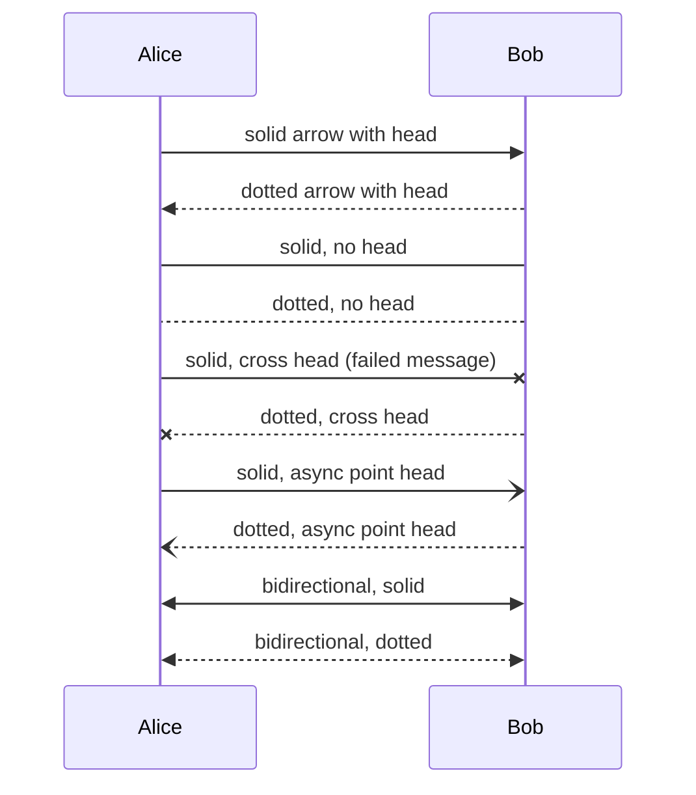

### Self-messages and central connections

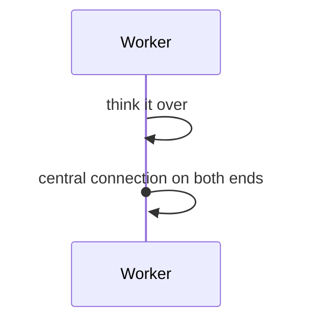

### Notes: over, left of, and right of

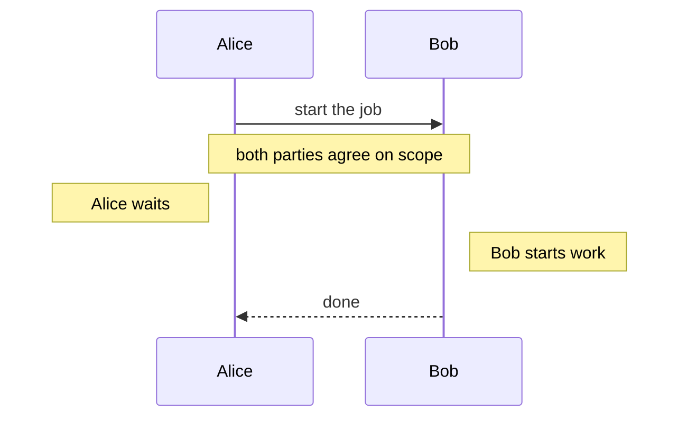

### Every fragment type

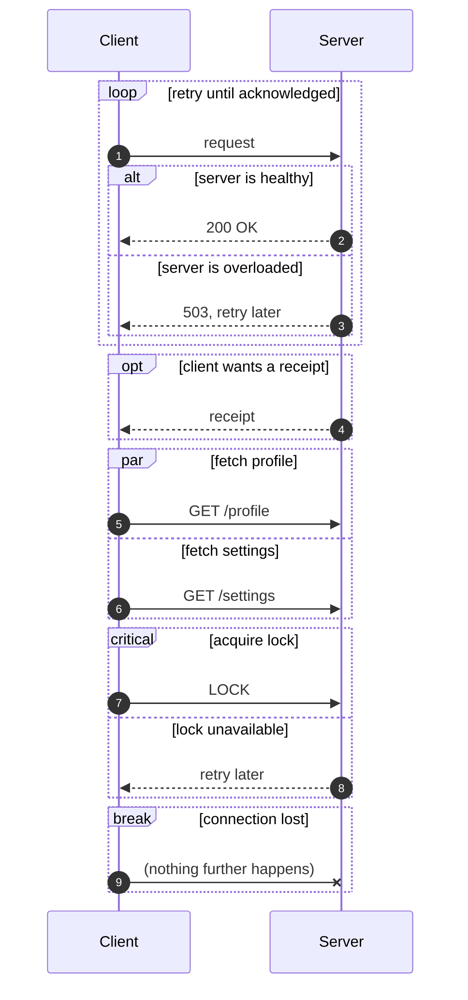

### Actors

An `actor` declaration draws a random 3-line stick figure instead of a plain box; with more than
one actor in a diagram, each gets a different figure before any repeat.

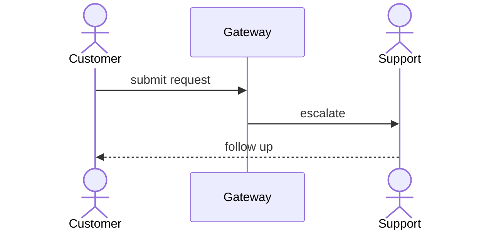

### Full width, even wider than the terminal

Diagram rows keep their natural width instead of being wrapped/padded to the render width
(VIEWMD-0018) — same as a wide code block's long lines (VIEWMD-0019). Every box below stays intact
on one row, scrolling horizontally in the pager instead of folding:

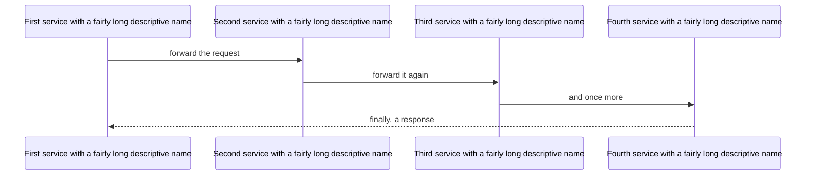

## Flowcharts

Only `A[Label]` square-bracket syntax renders as a distinct node shape — other Mermaid shape
syntax (`()`, `{}`, `(())`) falls back to a bare label, and `BT`/`RL` directions are accepted but
drawn the same as `TD`/`LR` rather than actually reversed. Both are real limitations of
`mermaid-ascii`, the upstream implementation this is ported from — not a viewmd choice — and
tracked for a possible future viewmd-only extension in VIEWMD-0022.

### Branching and labelled edges

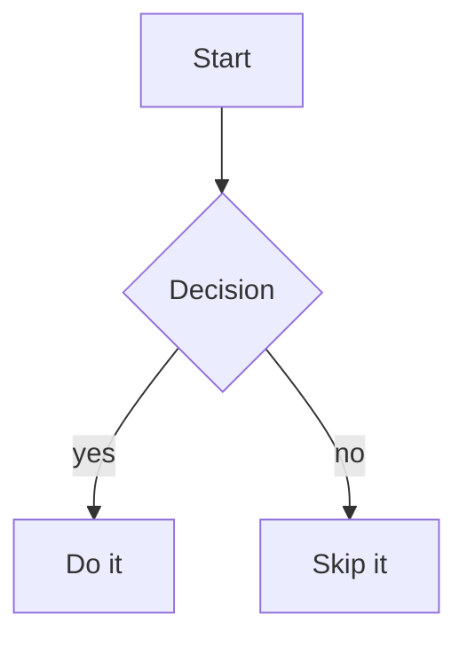

### Directions: TD/LR draw as expected, BT/RL alias to them

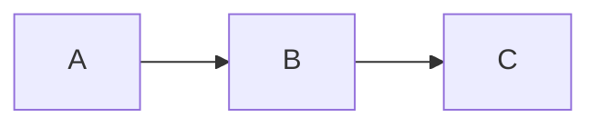

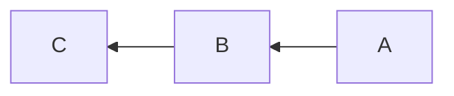

The `RL` diagram above renders identically to `LR` — same left-to-right flow — since `RL` is
parsed but not actually reversed (see the note at the top of this section).

### Chained arrows and fan-out

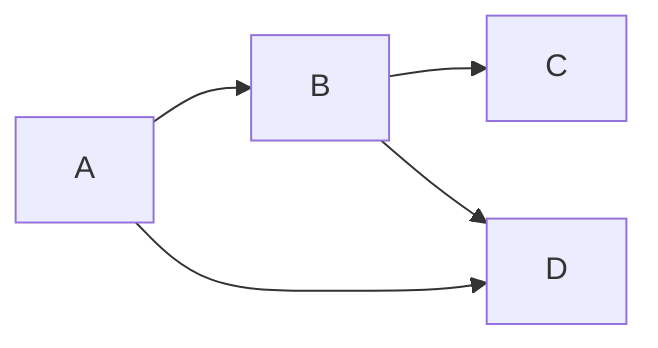

### Bidirectional edges

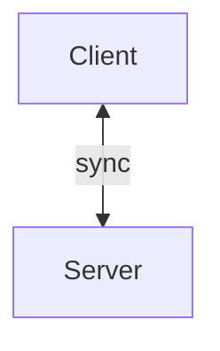

### Subgraphs, including nested

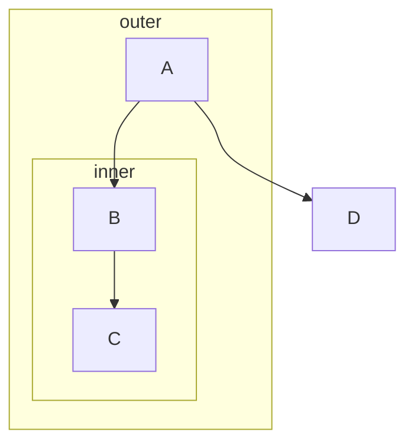

### Subgraphs with left-to-right layout

The `DB --> Server` edge below flows "backward" (right to left) relative to the diagram's overall
`LR` direction, so the router sends it out the bottom of both boxes to avoid threading back
through the nodes in between — and its horizontal segment lands on the same row as the `Backend`
subgraph's own bottom border, visually fusing the arrow into the frame. This is an upstream
`mermaid-ascii` layout limitation (subgraph padding doesn't reserve space for backward-routed
edges), reproduced here byte-for-byte, not a viewmd defect:

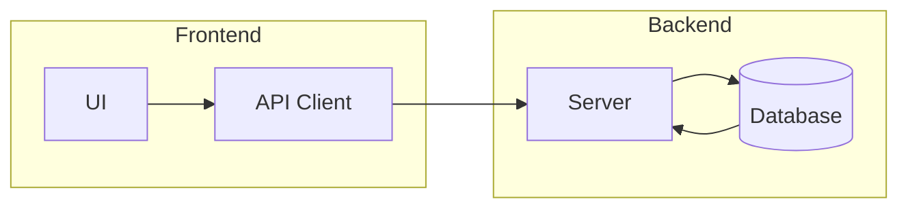

### `classDef`/`:::` styling

Renders as real 24-bit ANSI colour, matching the upstream renderer's `wrapTextInColor` — but only
when the `classDef` line has zero leading whitespace, a real upstream parsing quirk (see
`viewmd/mermaid/flowchart/parser.py`'s `test_classdef_must_be_unindented`):

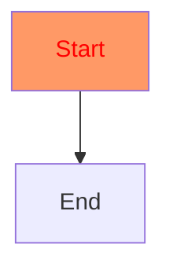

### Parallel edges between the same pair of nodes

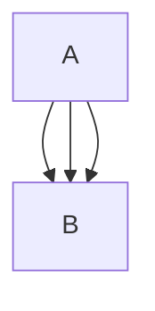

### Self-loops

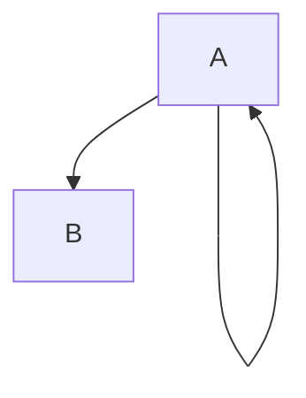

### Routing around an obstacle node

The A*-based router sends `A --> D` around `B` and `C` rather than through them:

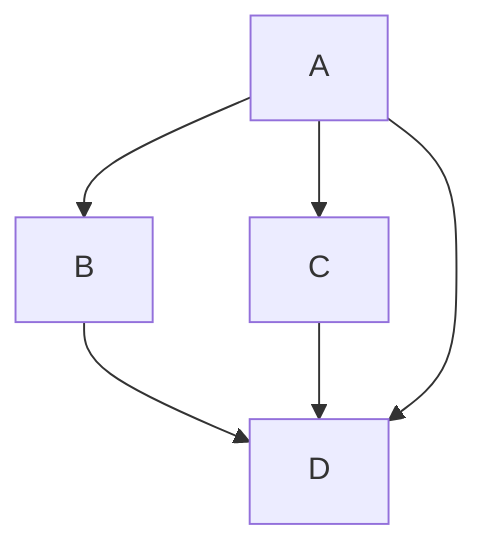

### Multi-line labels

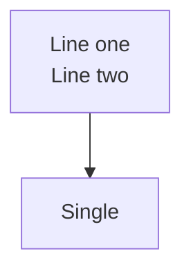

### Long labels

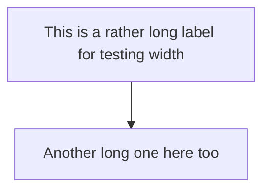

## Graceful fallback

Diagram types other than `sequenceDiagram` and `graph`/`flowchart` — and any block that fails to
parse — render as plain source text instead of raising an error, since only those two are
supported so far:

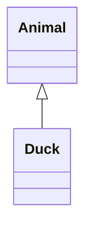
