# Mermaid diagram showcase

An exhaustive, one-of-everything tour of the Mermaid diagram types and features viewmd renders —
every arrow type, fragment, node shape, direction, and edge case that has its own golden fixture
under `tests/fixtures/`. Two purposes at once: a visual showcase (view this file with viewmd
itself, `./viewmd.sh docs/mermaid-examples.md`, to see every example below rendered as box-drawing
art), and a living manual testcase — if a change to the renderer breaks one of these, it'll be
visibly wrong here even before `./run-tests.sh` catches it.

`docs/example.md` covers Mermaid alongside viewmd's other Markdown features, with just a couple of
representative examples; this file is Mermaid-only and goes deep on all three diagram types
instead.

## Sequence diagrams

### Every arrow type

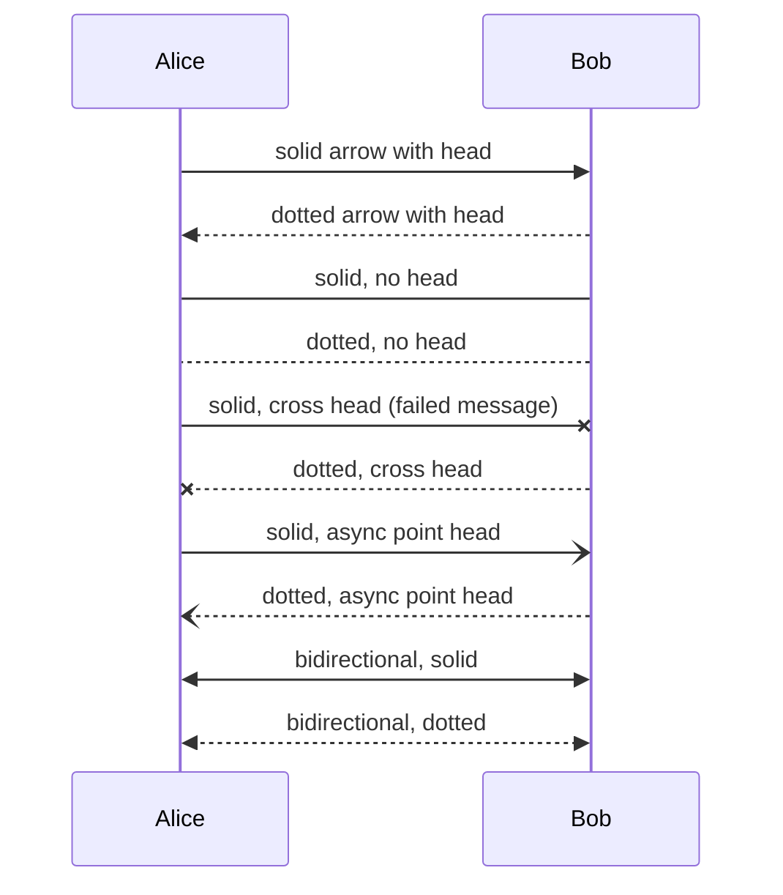

### Self-messages and central connections

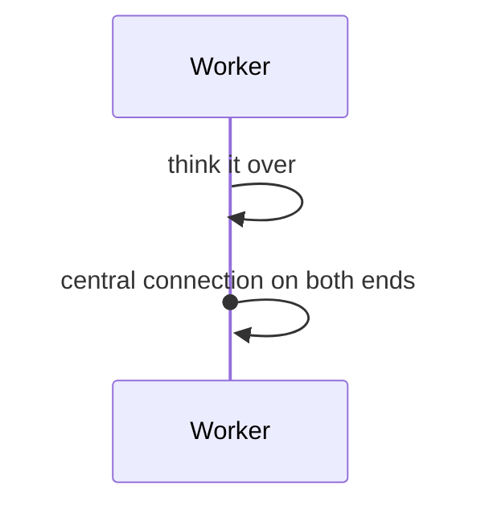

### Notes: over, left of, and right of

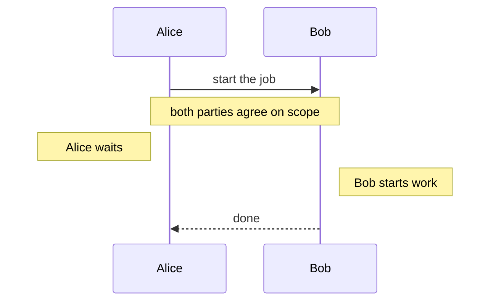

### Every fragment type

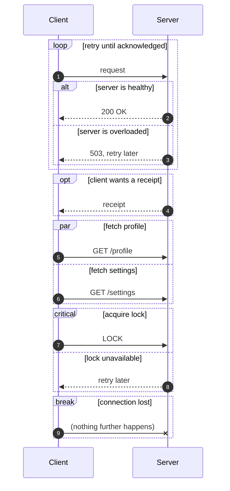

### Actors

An `actor` declaration draws a random 3-line stick figure instead of a plain box; with more than
one actor in a diagram, each gets a different figure before any repeat.

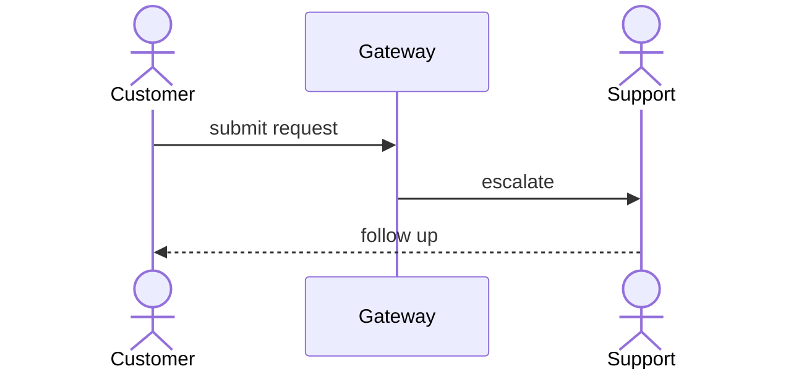

### Full width, even wider than the terminal

Diagram rows keep their natural width instead of being wrapped/padded to the render width
(VIEWMD-0018) — same as a wide code block's long lines (VIEWMD-0019). Every box below stays intact
on one row, scrolling horizontally in the pager instead of folding:

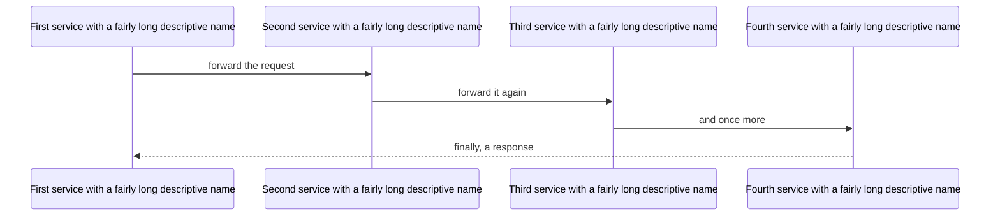

## Flowcharts

Node shapes beyond the plain `[...]` rectangle -- round `()`, stadium `([ ])`, circle `(())`, subroutine `[[ ]]`, cylinder `[( )]`, and diamond `{}` -- render with distinct borders (VIEWMD-0022). Diamonds are a true tapered rhombus; the others keep the usual box geometry with shape-specific glyphs. `BT`/`RL` directions are still accepted but drawn the same as `TD`/`LR` rather than actually reversed (upstream `mermaid-ascii` limitation, tracked as VIEWMD-0027).

### Node shapes

Each Mermaid shape delimiter below renders a distinct border. Left-to-right so the glyphs sit side by side for comparison:

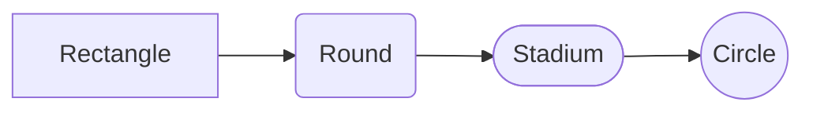

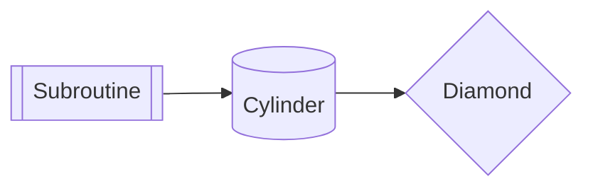

### Branching and labelled edges

The classic decision diamond: a shaped declaration (`B{Decision}`) and later bare `B` references resolve to the same node, so the yes/no arms rejoin on one diamond rather than splitting into disconnected boxes:

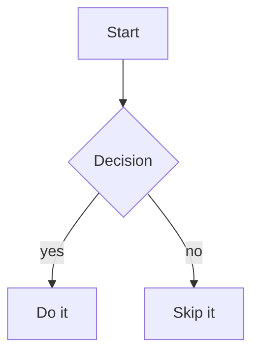

### Multi-line decision label

Diamond labels accept `<br>` line breaks; lines pack onto consecutive rows inside the taper:

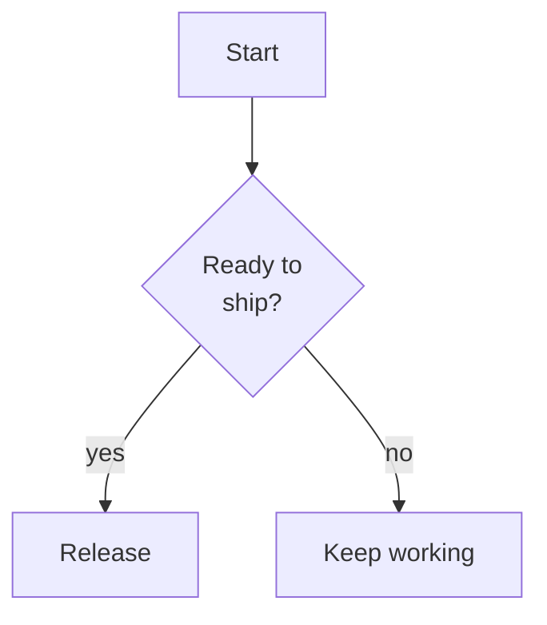

### Nested decisions

A second diamond on one branch -- common for approval / fallback flows:

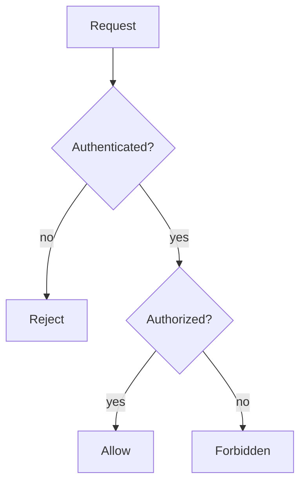

### Decision with stadium terminals

Stadium (`([ ])`) nodes as start/end terminals around a diamond, the usual flowchart convention:

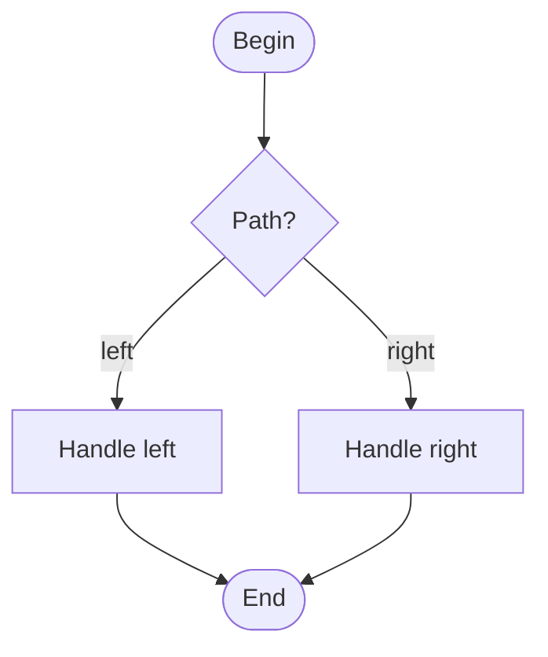

### Decision into a cylinder

Diamond choosing between two data stores:

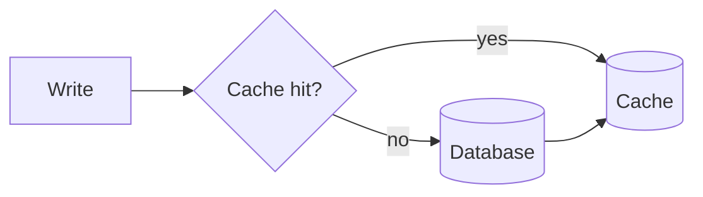

### Directions: TD/LR draw as expected, BT/RL alias to them

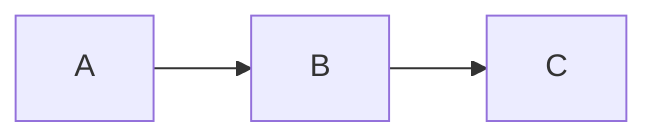

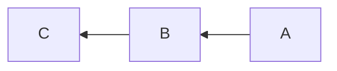

The `RL` diagram above renders identically to `LR` -- same left-to-right flow -- since `RL` is parsed but not actually reversed (see the note at the top of this section).

### Chained arrows and fan-out

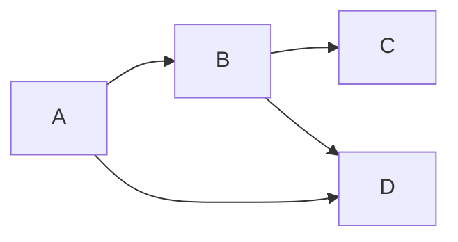

### Bidirectional edges

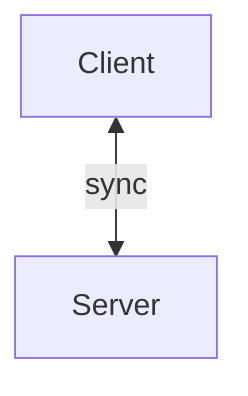

### Subgraphs, including nested

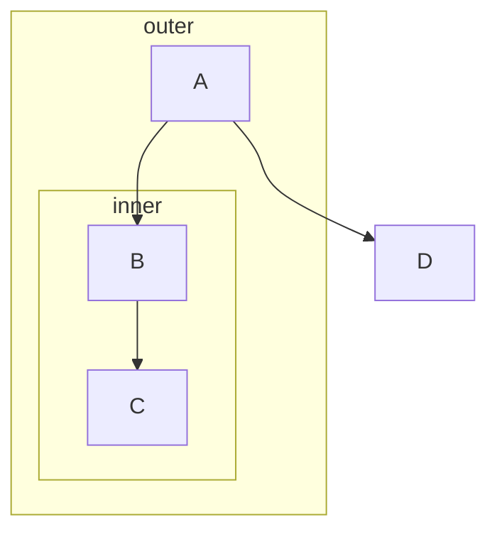

### Subgraphs with left-to-right layout

The `DB --> Server` edge below flows "backward" (right to left) relative to the diagram's overall
`LR` direction, so the router sends it out the bottom of both boxes to avoid threading back
through the nodes in between — and its horizontal segment lands on the same row as the `Backend`
subgraph's own bottom border, visually fusing the arrow into the frame. This is an upstream
`mermaid-ascii` layout limitation (subgraph padding doesn't reserve space for backward-routed
edges), reproduced here byte-for-byte, not a viewmd defect:

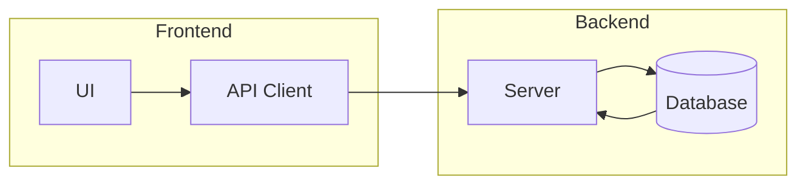

### `classDef`/`:::` styling

Renders as real 24-bit ANSI colour, matching the upstream renderer's `wrapTextInColor` — but only
when the `classDef` line has zero leading whitespace, a real upstream parsing quirk (see
`viewmd/mermaid/flowchart/parser.py`'s `test_classdef_must_be_unindented`):

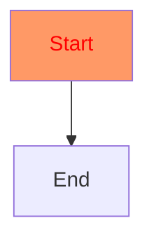

### Parallel edges between the same pair of nodes

```mermaid
graph TD
    A --> B
    A --> B
    A --> B
```

### Self-loops

```mermaid
graph TD
    A --> A
    A --> B
```

### Routing around an obstacle node

The A*-based router sends `A --> D` around `B` and `C` rather than through them:

```mermaid
graph TD
    A --> B
    A --> C
    B --> D
    C --> D
    A --> D
```

### Multi-line labels

```mermaid
graph TD
    A[Line one<br/>Line two] --> B[Single]
```

### Long labels

```mermaid
graph TD
    A[This is a rather long label for testing width] --> B[Another long one here too]
```

## Entity-relationship diagrams

### Attribute tables and crow's-foot cardinality

```mermaid
erDiagram
    CUSTOMER ||--o{ ORDER : places
    CUSTOMER {
        string name
        string custNumber PK
        string sector
    }
    ORDER {
        int orderNumber
        string deliveryAddress
    }
```

### Identifying vs. non-identifying relationships

A solid line (`--`) is an identifying relationship; a dashed line (`..`) is non-identifying:

```mermaid
erDiagram
    A }o..o{ B : "non-identifying"
    B ||--|| C : has
    A ||--|| A : self
```

### Word and numeric cardinality shorthand

Crow's-foot tokens (`||`, `o{`, ...), numeric shorthand (`1`, `0+`), and word phrases (`one`,
`zero or more`) are all accepted, alongside the `to` / `optionally to` word connector:

```mermaid
erDiagram
    A ||--o{ B : "crow's foot"
    A one to zero or more C : "words"
    A 1 to 0+ D : "numeric"
```

### Attribute keys, comments, and non-string types

```mermaid
erDiagram
    PRODUCT {
        string sku PK
        string supplierId FK
        decimal price "unit price"
    }
    ORDER ||--|{ PRODUCT : contains
```

## Graceful fallback

Diagram types other than `sequenceDiagram`, `graph`/`flowchart`, and `erDiagram` — and any block
that fails to parse — render as plain source text instead of raising an error, since only those
three are supported so far:

```mermaid
classDiagram
    Animal <|-- Duck
```
