# Combined fixtures: mermaid_flowchart (*.mmd)

## bare_graph_no_direction

Source:

```
graph
  A --> B
```

Rendered:


## basic_two_nodes

Source:

```
graph TD
  A[Start] --> B[End]
```

Rendered:

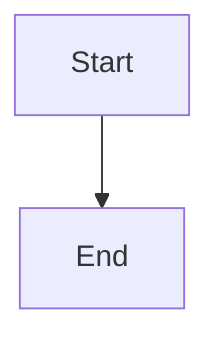

## bidirectional

Source:

```
graph TD
  A[Client] <-->|sync| B[Server]
```

Rendered:

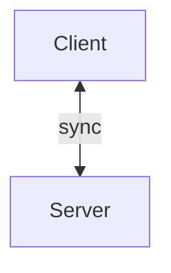

## bt_rl_alias

Source:

```
graph BT
  A --> B
```

Rendered:

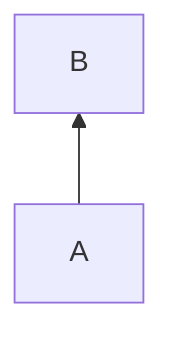

## classdef_color

Source:

```
graph TD
classDef red fill:#f96,color:#ff0000
A[Start]:::red --> B[End]
```

Rendered:

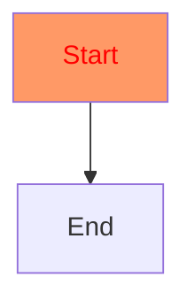

## complex_backend

Source:

```
graph LR
  subgraph Frontend
    UI[UI] --> API[API Client]
  end
  subgraph Backend
    Server[Server] --> DB[(Database)]
    Server --> Cache[(Cache)]
  end
  API --> Server
  DB --> Server
  Cache --> Server
```

Rendered:

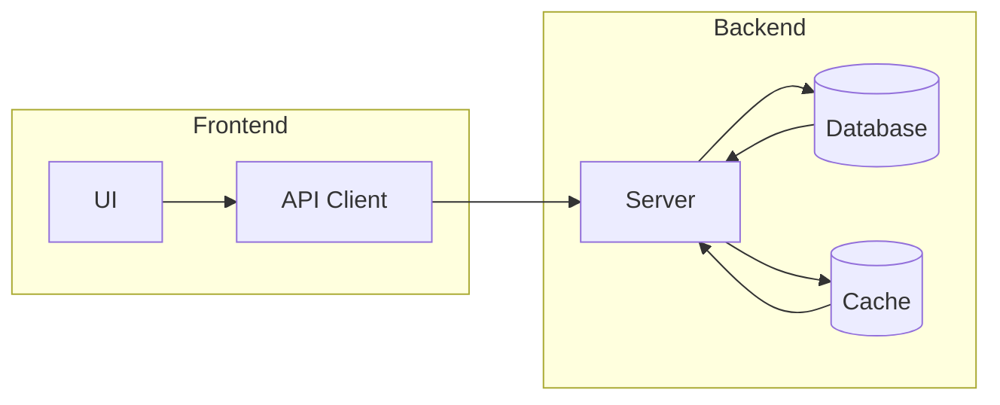

## diamond_merge

Source:

```
graph TD
  A --> B
  A --> C
  B --> D
  C --> D
```

Rendered:

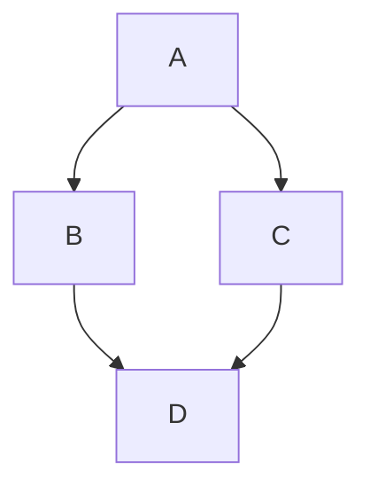

## long_labels

Source:

```
graph TD
  A[This is a rather long label for testing width] --> B[Another long one here too]
```

Rendered:

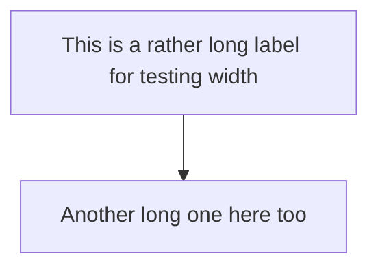

## lr_direction

Source:

```
graph LR
  A --> B --> C
  A & B --> D
```

Rendered:

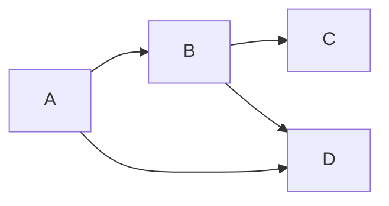

## multiline_label

Source:

```
graph TD
  A[Line one<br/>Line two] --> B[Single]
```

Rendered:

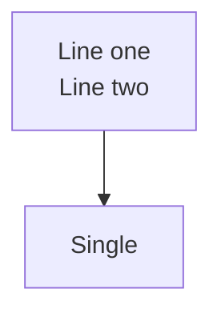

## obstacle_routing

Source:

```
graph TD
  A --> B
  A --> C
  B --> D
  C --> D
  A --> D
```

Rendered:

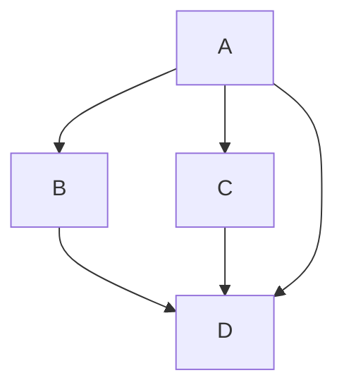

## parallel_edges

Source:

```
graph TD
  A --> B
  A --> B
  A --> B
```

Rendered:

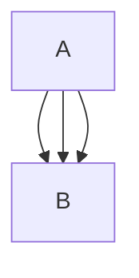

## self_loop

Source:

```
graph TD
  A --> A
  A --> B
```

Rendered:

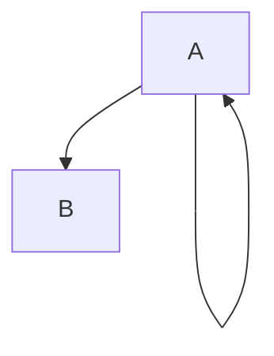

## shape_circle

Source:

```
graph TD
A((Circle))
```

Rendered:

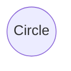

## shape_cylinder

Source:

```
graph TD
A[(Database)]
```

Rendered:

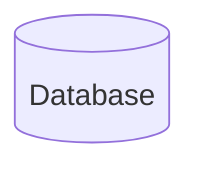

## shape_diamond_lr_chain

Source:

```
graph LR
    S{OK} --> M{Decide}
    M --> L{Continue?}
```

Rendered:

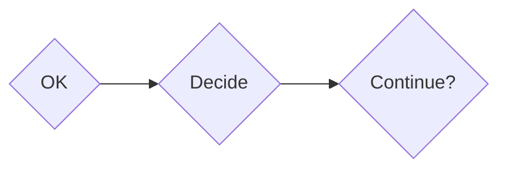

## shape_diamond

Source:

```
graph TD
A{Decision}
```

Rendered:

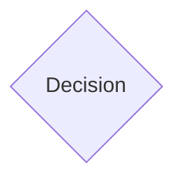

## shape_parallelogram_alt

Source:

```
graph TD
A[\Alt Para\]
```

Rendered:

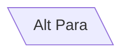

## shape_parallelogram_lr_chain

Source:

```
graph LR
    A[/Parallelogram/] --> B[\Alt Para\]
```

Rendered:

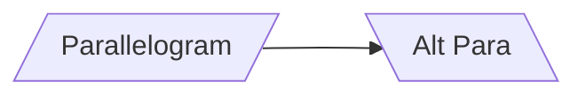

## shape_parallelogram_multiline

Source:

```
graph LR
    A[/Line one<br>Line two/] --> B[\Row one<br>Row two\]
```

Rendered:

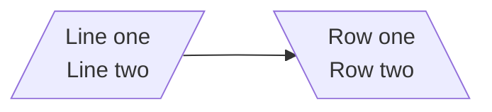

## shape_parallelogram_td_chain

Source:

```
graph TD
    A[/Input/] --> B[/Output/]
```

Rendered:

```mermaid
graph TD
    A[/Input/] --> B[/Output/]
```

## shape_parallelogram

Source:

```
graph TD
A[/Parallelogram/]
```

Rendered:

```mermaid
graph TD
A[/Parallelogram/]
```

## shape_round

Source:

```
graph TD
A(Round)
```

Rendered:

```mermaid
graph TD
A(Round)
```

## shape_stadium

Source:

```
graph TD
A([Stadium])
```

Rendered:

```mermaid
graph TD
A([Stadium])
```

## shape_subroutine

Source:

```
graph TD
A[[Subroutine]]
```

Rendered:

```mermaid
graph TD
A[[Subroutine]]
```

## shapes_fallback

Source:

```
graph TD
  A[Start] --> B{Decide}
  B -->|yes| C[Do it]
  B -->|no| D[Skip]
```

Rendered:

```mermaid
graph TD
  A[Start] --> B{Decide}
  B -->|yes| C[Do it]
  B -->|no| D[Skip]
```

## subgraph_backward_edge_lr

Source:

```
graph LR
    subgraph Frontend
        UI[UI] --> API[API Client]
    end
    subgraph Backend
        Server[Server] --> DB[(Database)]
    end
    API --> Server
    DB --> Server
```

Rendered:

```mermaid
graph LR
    subgraph Frontend
        UI[UI] --> API[API Client]
    end
    subgraph Backend
        Server[Server] --> DB[(Database)]
    end
    API --> Server
    DB --> Server
```

## subgraph_backward_edge_td

Source:

```
graph TD
    subgraph Top
        A[A] --> B[B]
    end
    subgraph Bottom
        D[D] --> C[C]
    end
    B --> D
    C --> D
```

Rendered:

```mermaid
graph TD
    subgraph Top
        A[A] --> B[B]
    end
    subgraph Bottom
        D[D] --> C[C]
    end
    B --> D
    C --> D
```

## subgraph_nested

Source:

```
graph TD
  subgraph outer
    A --> B
    subgraph inner
      B --> C
    end
  end
  A --> D
```

Rendered:

```mermaid
graph TD
  subgraph outer
    A --> B
    subgraph inner
      B --> C
    end
  end
  A --> D
```

## subgraph_simple

Source:

```
graph TD
  A --> B
  subgraph one
    B --> C
  end
  subgraph two
    C --> D
  end
```

Rendered:

```mermaid
graph TD
  A --> B
  subgraph one
    B --> C
  end
  subgraph two
    C --> D
  end
```

