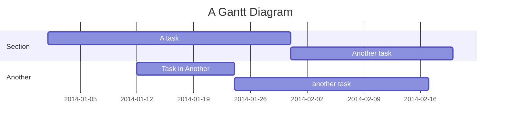
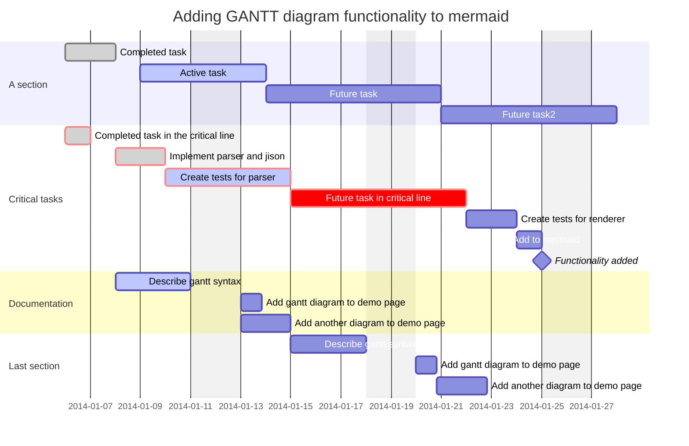
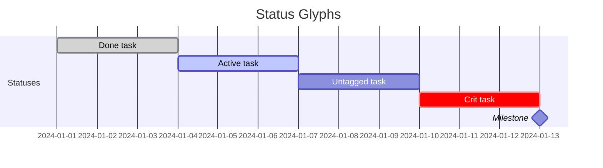

# Combined fixtures: mermaid_gantt (*.mmd)

## d1_basic

Source:

```
gantt
    title A Gantt Diagram
    dateFormat YYYY-MM-DD
    section Section
        A task          :a1, 2014-01-01, 30d
        Another task    :after a1, 20d
    section Another
        Task in Another :2014-01-12, 12d
        another task    :24d
```

Rendered:



## d2_full_syntax

Source:

```
gantt
    dateFormat  YYYY-MM-DD
    title       Adding GANTT diagram functionality to mermaid
    excludes    weekends

    section A section
    Completed task            :done,    des1, 2014-01-06,2014-01-08
    Active task               :active,  des2, 2014-01-09, 3d
    Future task               :         des3, after des2, 5d
    Future task2               :        des4, after des3, 5d

    section Critical tasks
    Completed task in the critical line :crit, done, 2014-01-06,24h
    Implement parser and jison          :crit, done, after des1, 2d
    Create tests for parser             :crit, active, 3d
    Future task in critical line        :crit, 5d
    Create tests for renderer           :2d
    Add to mermaid                      :until isadded
    Functionality added                 :milestone, isadded, 2014-01-25, 0d

    section Documentation
    Describe gantt syntax               :active, a1, after des1, 3d
    Add gantt diagram to demo page      :after a1  , 20h
    Add another diagram to demo page    :doc1, after a1  , 48h

    section Last section
    Describe gantt syntax               :after doc1, 3d
    Add gantt diagram to demo page      :20h
    Add another diagram to demo page    :48h
```

Rendered:



## malformed_missing_colon

Source:

```
gantt
    title Malformed
    dateFormat YYYY-MM-DD
    section S
        A task 2024-01-01, 3d
```

Rendered:

```mermaid
gantt
    title Malformed
    dateFormat YYYY-MM-DD
    section S
        A task 2024-01-01, 3d
```

## use_ascii

Source:

```
gantt
    title Status Glyphs
    dateFormat YYYY-MM-DD
    section Statuses
        Done task       :done, s1, 2024-01-01, 3d
        Active task      :active, after s1, 3d
        Untagged task    :3d
        Crit task        :crit, 3d
        Milestone         :milestone, 2024-01-13, 0d
```

Rendered:



