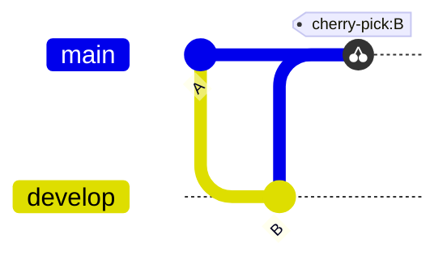
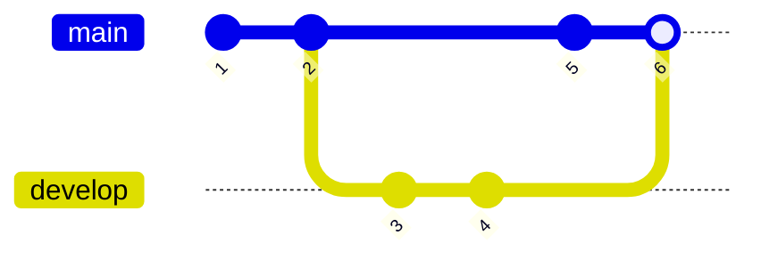
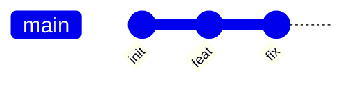
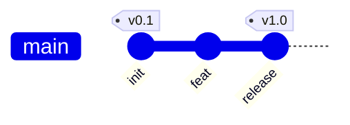

# Combined fixtures: mermaid_gitgraph (*.mmd)

## cherry_pick_cross_lane

Source:

```
gitGraph
    commit id: "A"
    branch develop
    commit id: "B"
    checkout main
    cherry-pick id: "B"
```

Rendered:



## merge_with_id

Source:

```
gitGraph
    commit id: "1"
    commit id: "2"
    branch develop
    commit id: "3"
    commit id: "4"
    checkout main
    commit id: "5"
    merge develop id: "6"
```

Rendered:



## single_lane_commits

Source:

```
gitGraph
    commit id: "init"
    commit id: "feat"
    commit id: "fix"
```

Rendered:



## tags

Source:

```
gitGraph
    commit id: "init" tag: "v0.1"
    commit id: "feat"
    commit id: "release" tag: "v1.0"
```

Rendered:



