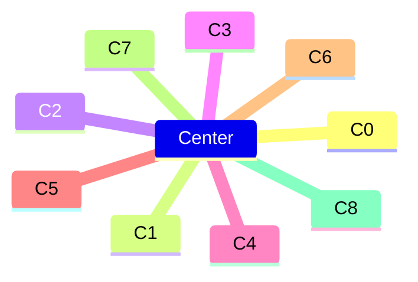
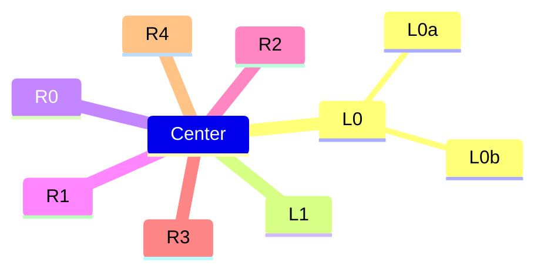
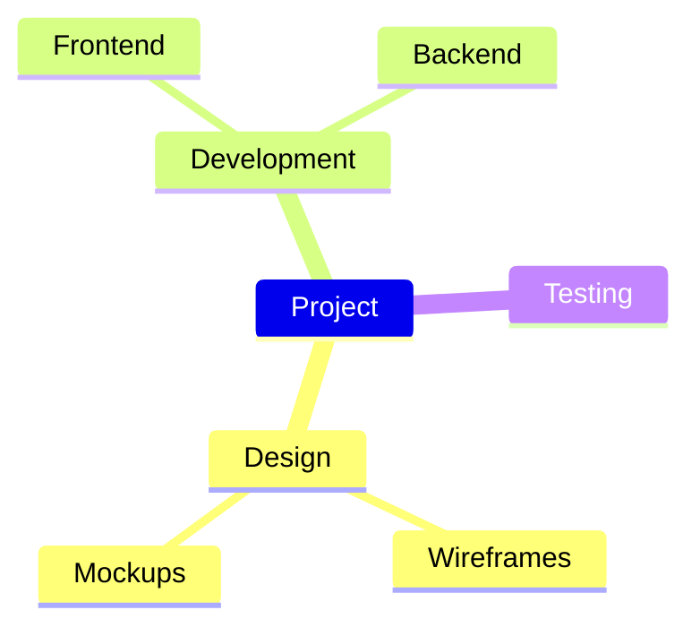

# Combined fixtures: mermaid_mindmap (*.mmd)

## overflow

Source:

```
mindmap
  Center
    C0
    C1
    C2
    C3
    C4
    C5
    C6
    C7
    C8
```

Rendered:



## overflow_nested_left

Source:

```
mindmap
  Center
    L0
      L0a
      L0b
    L1
    R0
    R1
    R2
    R3
    R4
```

Rendered:



## project

Source:

```
mindmap
  Project
    Design
      Wireframes
      Mockups
    Development
      Frontend
      Backend
    Testing
```

Rendered:


