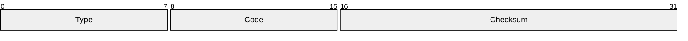
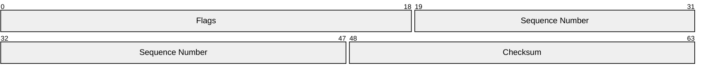
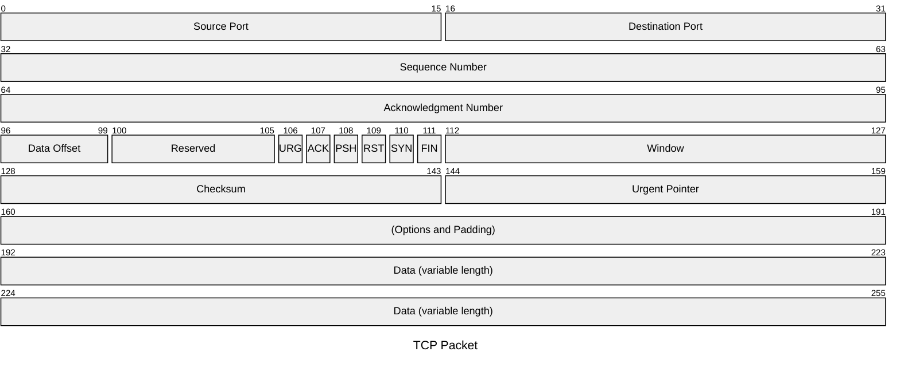
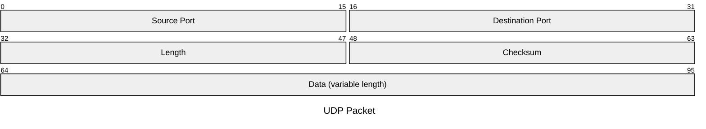
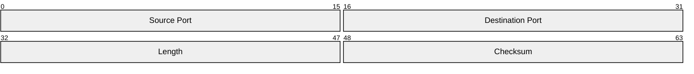
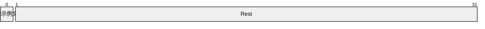

# Combined fixtures: mermaid_packet (*.mmd)

## bits_shorthand

Source:

```
packet-beta
    +8: "Type"
    +8: "Code"
    16-31: "Checksum"
```

Rendered:



## row_boundary_split

Source:

```
packet-beta
    0-18: "Flags"
    19-47: "Sequence Number"
    48-63: "Checksum"
```

Rendered:



## tcp_header

Source:

```
packet-beta
    title TCP Packet
    0-15: "Source Port"
    16-31: "Destination Port"
    32-63: "Sequence Number"
    64-95: "Acknowledgment Number"
    96-99: "Data Offset"
    100-105: "Reserved"
    106: "URG"
    107: "ACK"
    108: "PSH"
    109: "RST"
    110: "SYN"
    111: "FIN"
    112-127: "Window"
    128-143: "Checksum"
    144-159: "Urgent Pointer"
    160-191: "(Options and Padding)"
    192-255: "Data (variable length)"
```

Rendered:



## udp_full

Source:

```
packet
    title UDP Packet
    +16: "Source Port"
    +16: "Destination Port"
    32-47: "Length"
    48-63: "Checksum"
    64-95: "Data (variable length)"
```

Rendered:



## udp_header

Source:

```
packet-beta
    0-15: "Source Port"
    16-31: "Destination Port"
    32-47: "Length"
    48-63: "Checksum"
```

Rendered:



## wide_label

Source:

```
packet-beta
    0: "旗标示例文字"
    1-31: "Rest"
```

Rendered:



