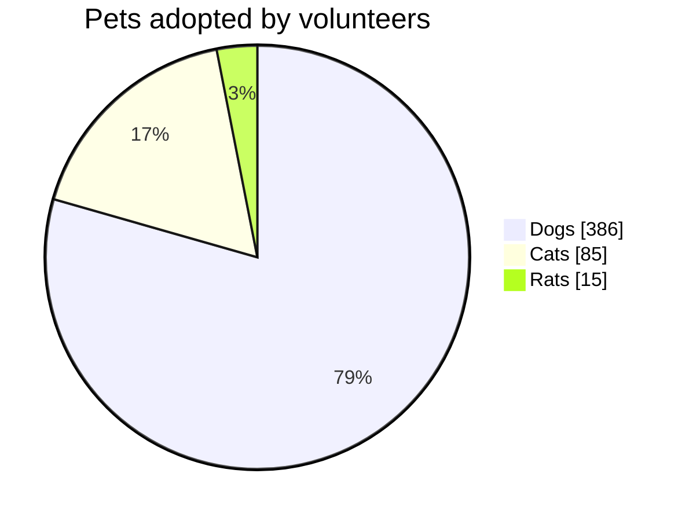
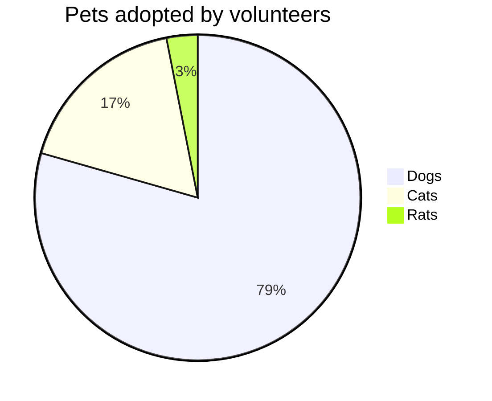

# Combined fixtures: mermaid_pie (*.mmd)

## pets_showdata

Source:

```
pie showData title Pets adopted by volunteers
    "Dogs" : 386
    "Cats" : 85
    "Rats" : 15
```

Rendered:



## pets

Source:

```
pie title Pets adopted by volunteers
    "Dogs" : 386
    "Cats" : 85
    "Rats" : 15
```

Rendered:



