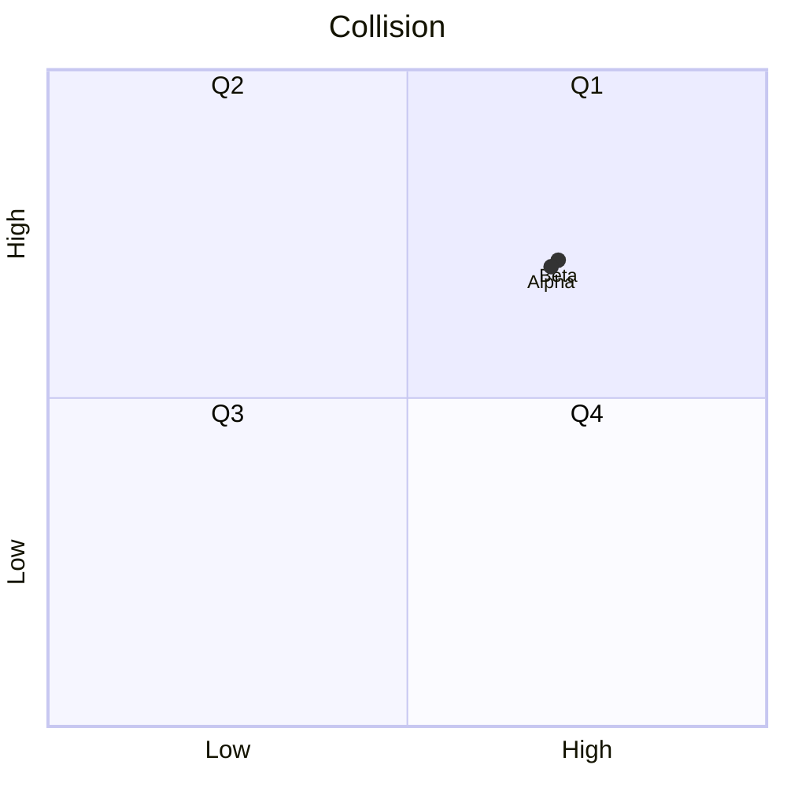
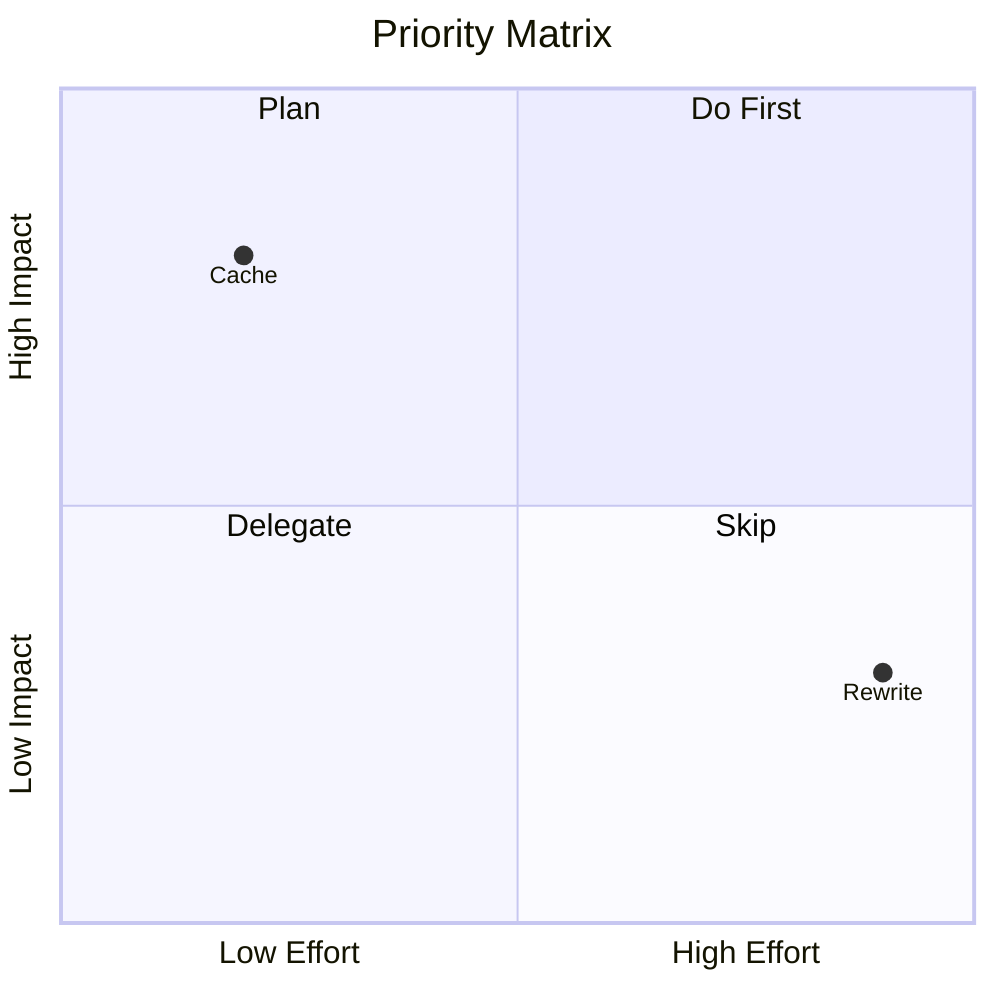

# Combined fixtures: mermaid_quadrant (*.mmd)

## collision

Source:

```
quadrantChart
    title Collision
    x-axis Low --> High
    y-axis Low --> High
    quadrant-1 Q1
    quadrant-2 Q2
    quadrant-3 Q3
    quadrant-4 Q4
    Alpha: [0.7, 0.7]
    Beta: [0.71, 0.71]
```

Rendered:



## priority_matrix

Source:

```
quadrantChart
    title Priority Matrix
    x-axis Low Effort --> High Effort
    y-axis Low Impact --> High Impact
    quadrant-1 Do First
    quadrant-2 Plan
    quadrant-3 Delegate
    quadrant-4 Skip
    Cache: [0.2, 0.8]
    Rewrite: [0.9, 0.3]
```

Rendered:



