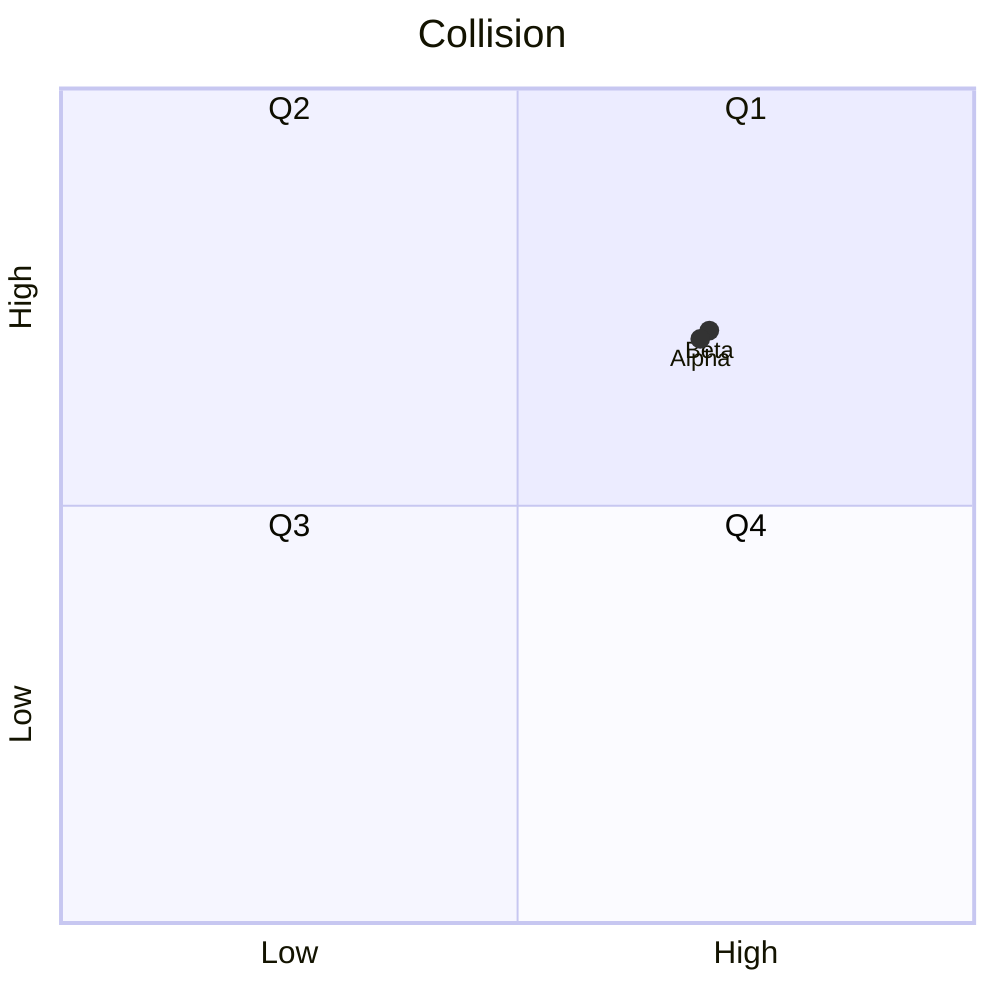
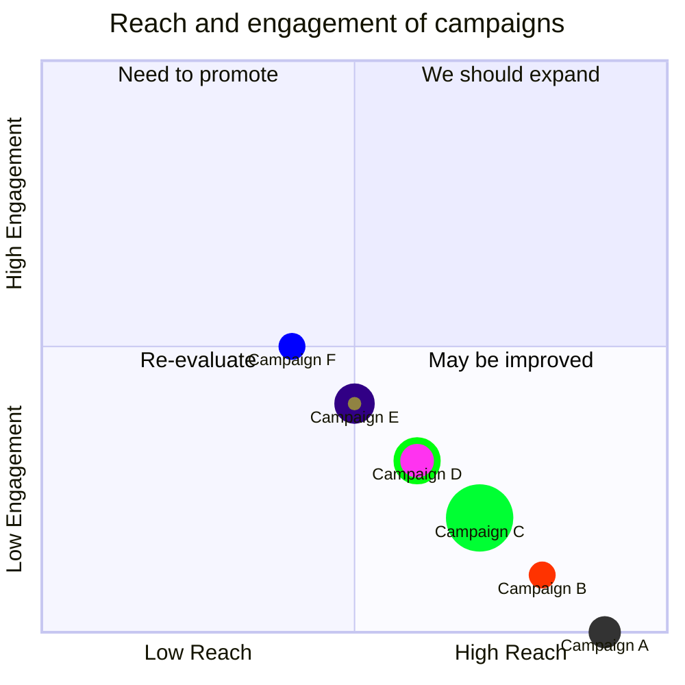
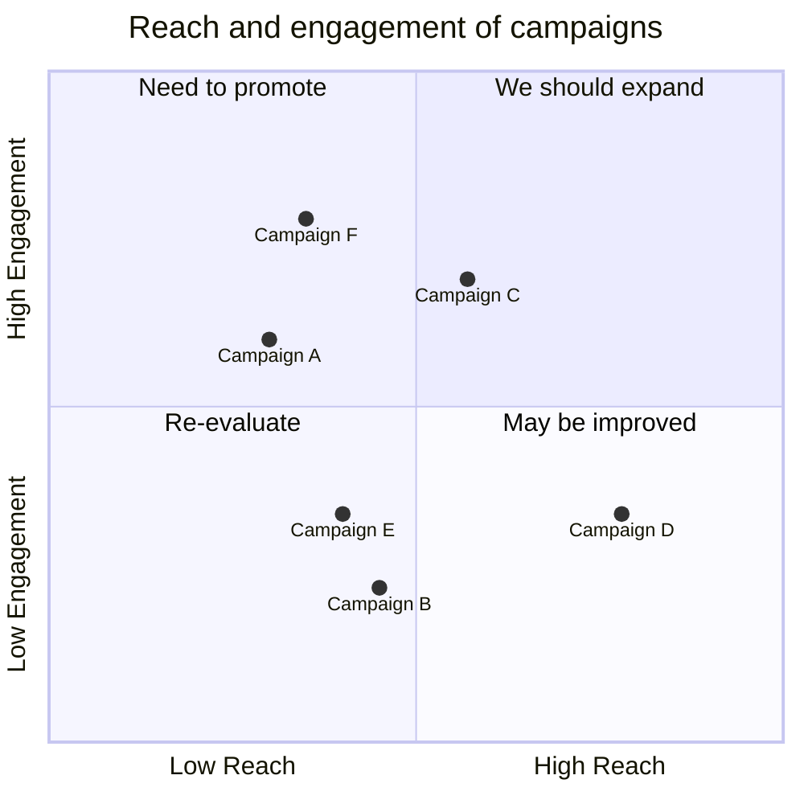
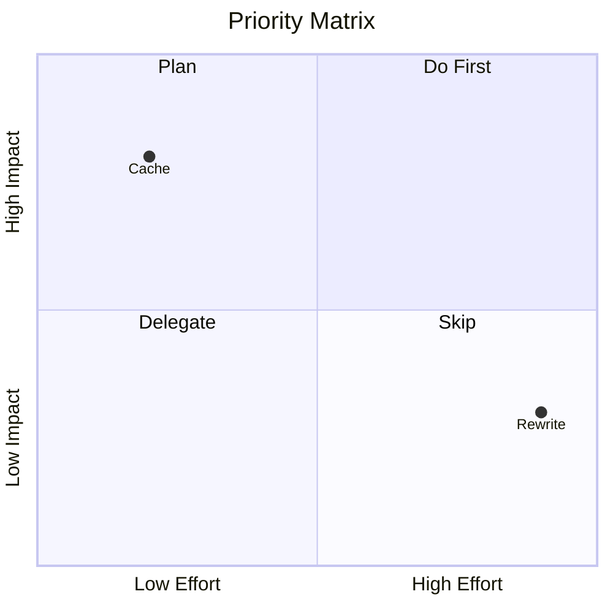

# Combined fixtures: mermaid_quadrant (*.mmd)

## collision

Source:

```
quadrantChart
    title Collision
    x-axis Low --> High
    y-axis Low --> High
    quadrant-1 Q1
    quadrant-2 Q2
    quadrant-3 Q3
    quadrant-4 Q4
    Alpha: [0.7, 0.7]
    Beta: [0.71, 0.71]
```

Rendered:



## example-styled

Source:

```
quadrantChart
  title Reach and engagement of campaigns
  x-axis Low Reach --> High Reach
  y-axis Low Engagement --> High Engagement
  quadrant-1 We should expand
  quadrant-2 Need to promote
  quadrant-3 Re-evaluate
  quadrant-4 May be improved
  Campaign A: [0.9, 0.0] radius: 12
  Campaign B:::class1: [0.8, 0.1] color: #ff3300, radius: 10
  Campaign C: [0.7, 0.2] radius: 25, color: #00ff33, stroke-color: #10f0f0
  Campaign D: [0.6, 0.3] radius: 15, stroke-color: #00ff0f, stroke-width: 5px ,color: #ff33f0
  Campaign E:::class2: [0.5, 0.4]
  Campaign F:::class3: [0.4, 0.5] color: #0000ff
  classDef class1 color: #109060
  classDef class2 color: #908342, radius : 10, stroke-color: #310085, stroke-width: 10px
  classDef class3 color: #f00fff, radius : 10
```

Rendered:



## example

Source:

```
quadrantChart
    title Reach and engagement of campaigns
    x-axis Low Reach --> High Reach
    y-axis Low Engagement --> High Engagement
    quadrant-1 We should expand
    quadrant-2 Need to promote
    quadrant-3 Re-evaluate
    quadrant-4 May be improved
    Campaign A: [0.3, 0.6]
    Campaign B: [0.45, 0.23]
    Campaign C: [0.57, 0.69]
    Campaign D: [0.78, 0.34]
    Campaign E: [0.40, 0.34]
    Campaign F: [0.35, 0.78]
```

Rendered:



## priority_matrix

Source:

```
quadrantChart
    title Priority Matrix
    x-axis Low Effort --> High Effort
    y-axis Low Impact --> High Impact
    quadrant-1 Do First
    quadrant-2 Plan
    quadrant-3 Delegate
    quadrant-4 Skip
    Cache: [0.2, 0.8]
    Rewrite: [0.9, 0.3]
```

Rendered:



