# Combined fixtures: mermaid_sequence (*.mmd)

## all_arrow_types

Source:

```
sequenceDiagram
    A->>B: solid arrow
    A-->>B: dotted arrow
    A->B: solid open
    A-->B: dotted open
    A-xB: solid cross
    A--xB: dotted cross
    A-)B: solid point
    A--)B: dotted point
    A<<->>B: bidirectional solid
    A<<-->>B: bidirectional dotted
```

Rendered:

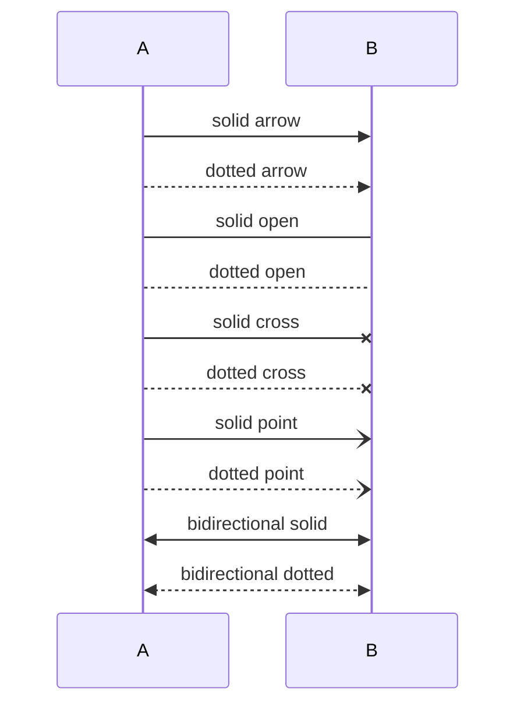
```mermaid
sequenceDiagram
    A->>B: solid arrow
    A-->>B: dotted arrow
    A->B: solid open
    A-->B: dotted open
    A-xB: solid cross
    A--xB: dotted cross
    A-)B: solid point
    A--)B: dotted point
    A<<->>B: bidirectional solid
    A<<-->>B: bidirectional dotted
```

## alt_multi_else

Source:

```
sequenceDiagram
    A->>B: request
    alt case one
        B->>A: one
    else case two
        B->>A: two
    else case three
        B->>A: three
    end
```

Rendered:

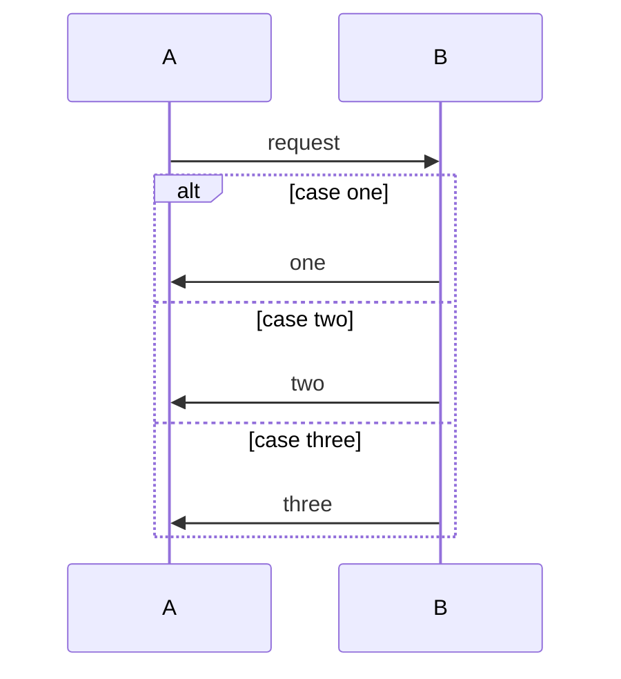
```mermaid
sequenceDiagram
    A->>B: request
    alt case one
        B->>A: one
    else case two
        B->>A: two
    else case three
        B->>A: three
    end
```

## alt_nested_in_par

Source:

```
sequenceDiagram
    par branch
        alt cond
            A->>B: yes
        else
            A->>B: no
        end
    end
```

Rendered:

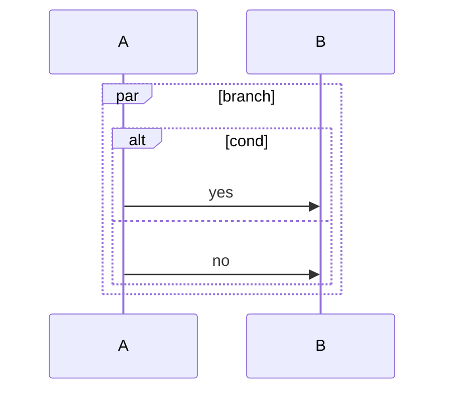
```mermaid
sequenceDiagram
    par branch
        alt cond
            A->>B: yes
        else
            A->>B: no
        end
    end
```

## alt_simple

Source:

```
sequenceDiagram
    A->>B: request
    alt is valid
        B->>A: ok
    else
        B->>A: error
    end
```

Rendered:

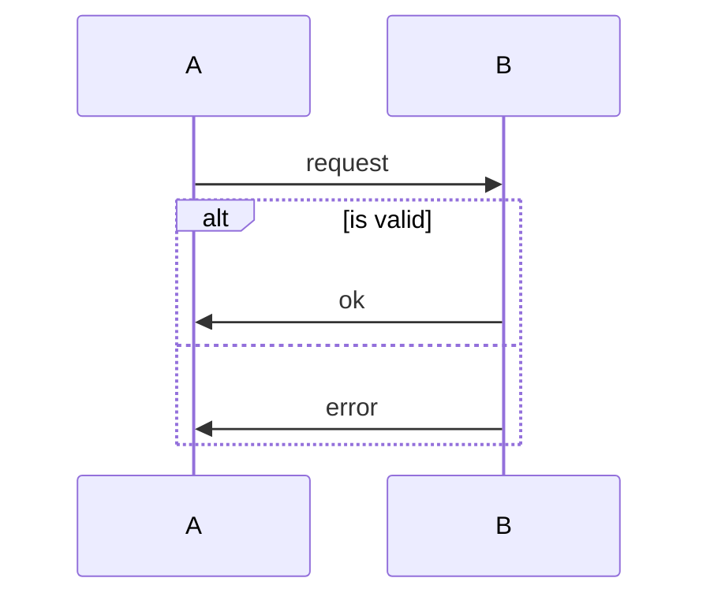
```mermaid
sequenceDiagram
    A->>B: request
    alt is valid
        B->>A: ok
    else
        B->>A: error
    end
```

## autonumber_basic

Source:

```
sequenceDiagram
    autonumber
    A->>B: first
    B->>A: second
```

Rendered:

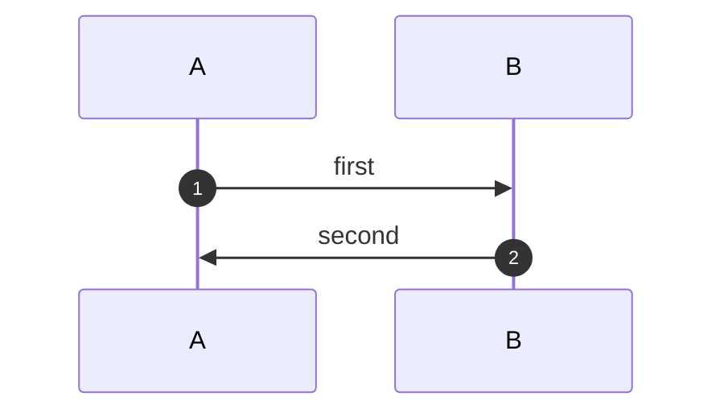
```mermaid
sequenceDiagram
    autonumber
    A->>B: first
    B->>A: second
```

## basic_two_messages

Source:

```
sequenceDiagram
    Alice->>John: Hello John, how are you?
    John-->>Alice: Great!
```

Rendered:

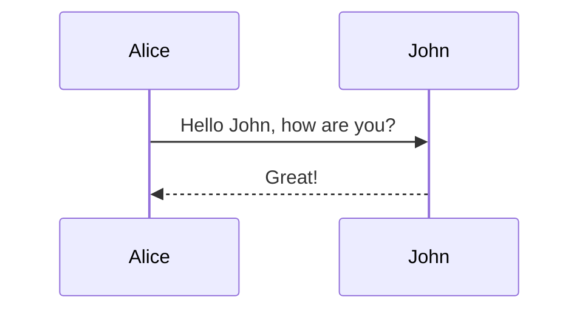
```mermaid
sequenceDiagram
    Alice->>John: Hello John, how are you?
    John-->>Alice: Great!
```

## break_simple

Source:

```
sequenceDiagram
    A->>B: hi
    break when error
        B->>A: stop
    end
```

Rendered:

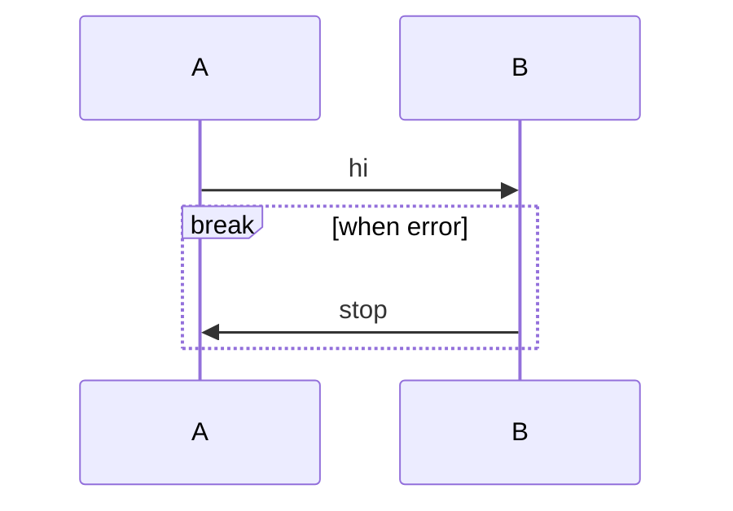
```mermaid
sequenceDiagram
    A->>B: hi
    break when error
        B->>A: stop
    end
```

## central_connections

Source:

```
sequenceDiagram
    A()->>()B: central both ends
    A()->>B: central from
    A->>()B: central to
```

Rendered:

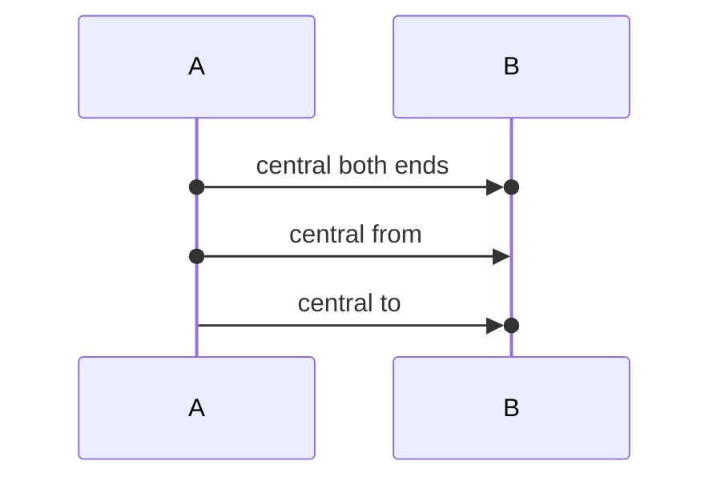
```mermaid
sequenceDiagram
    A()->>()B: central both ends
    A()->>B: central from
    A->>()B: central to
```

## critical_simple

Source:

```
sequenceDiagram
    critical connect
        A->>B: try
    option network failure
        A->>B: retry
    end
```

Rendered:

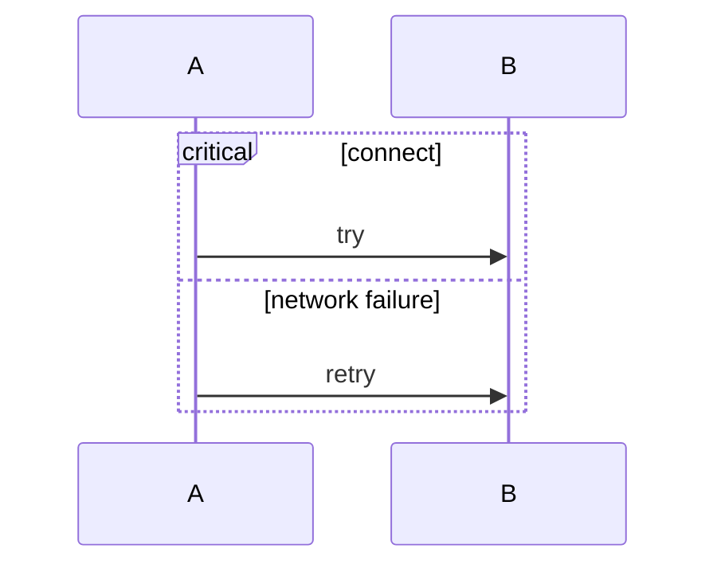
```mermaid
sequenceDiagram
    critical connect
        A->>B: try
    option network failure
        A->>B: retry
    end
```

## explicit_participants

Source:

```
sequenceDiagram
    participant Alice
    participant Bob
    Alice->>Bob: Hi
```

Rendered:

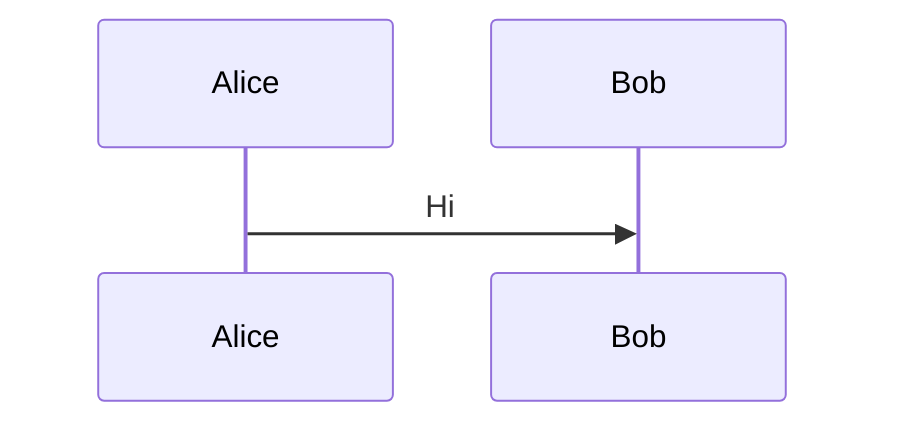
```mermaid
sequenceDiagram
    participant Alice
    participant Bob
    Alice->>Bob: Hi
```

## five_participants

Source:

```
sequenceDiagram
    A->>B: 1
    B->>C: 2
    C->>D: 3
    D->>E: 4
    E->>A: 5
```

Rendered:

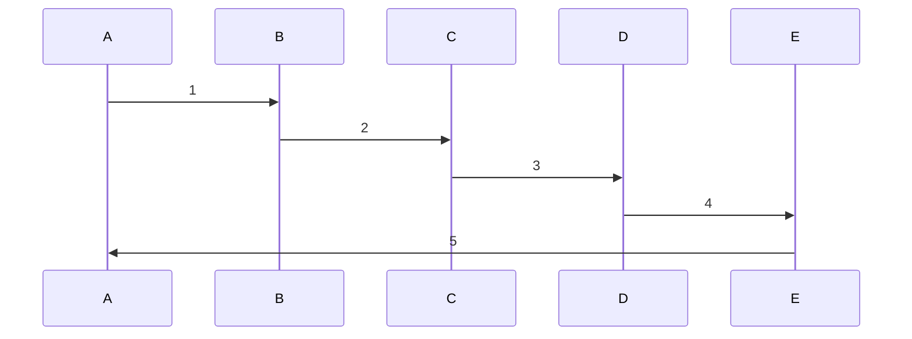
```mermaid
sequenceDiagram
    A->>B: 1
    B->>C: 2
    C->>D: 3
    D->>E: 4
    E->>A: 5
```

## fragment_with_note

Source:

```
sequenceDiagram
    A->>B: hi
    loop retry
        Note over A,B: inside loop
        A->>B: poll
    end
```

Rendered:

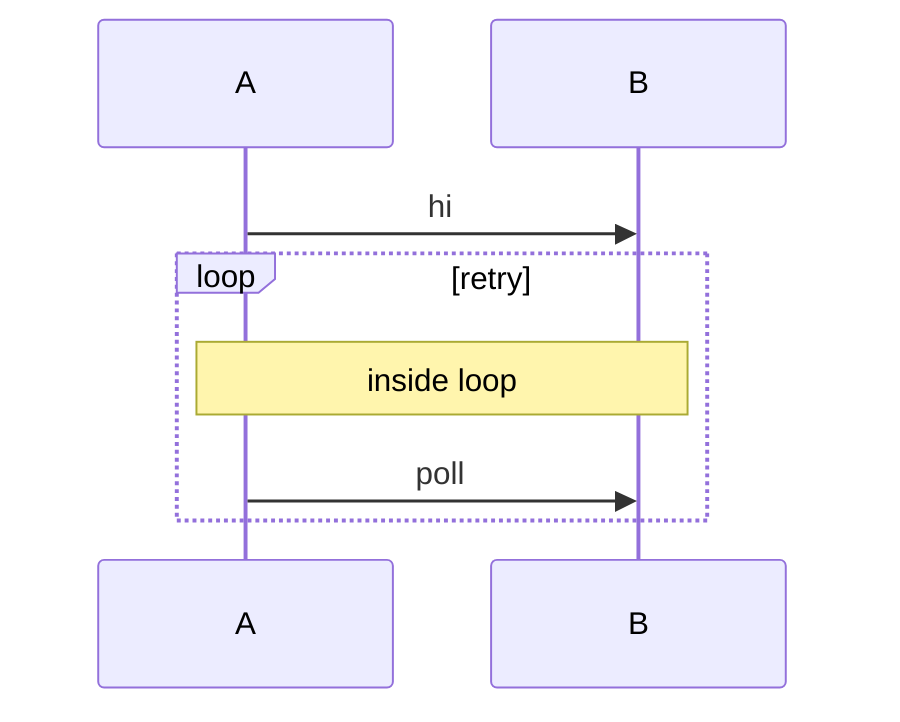
```mermaid
sequenceDiagram
    A->>B: hi
    loop retry
        Note over A,B: inside loop
        A->>B: poll
    end
```

## implicit_participants

Source:

```
sequenceDiagram
A->>B: Hello
```

Rendered:

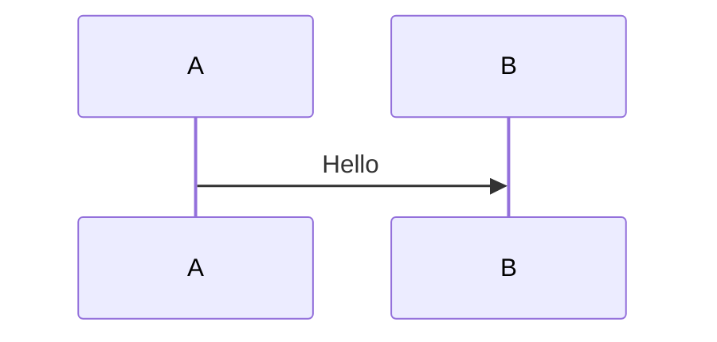
```mermaid
sequenceDiagram
A->>B: Hello
```

## kitchen_sink

Source:

```
sequenceDiagram
    autonumber
    participant A as Alice
    participant B as Bob
    participant C as Carol
    A->>B: hello
    Note over A,B: greeting
    loop retry until ack
        B-->>A: ack?
        alt got ack
            A->>B: yes
        else
            A-)B: nope
        end
    end
    B->>C: forward
    C--xB: failed
    C->>C: self check
```

Rendered:

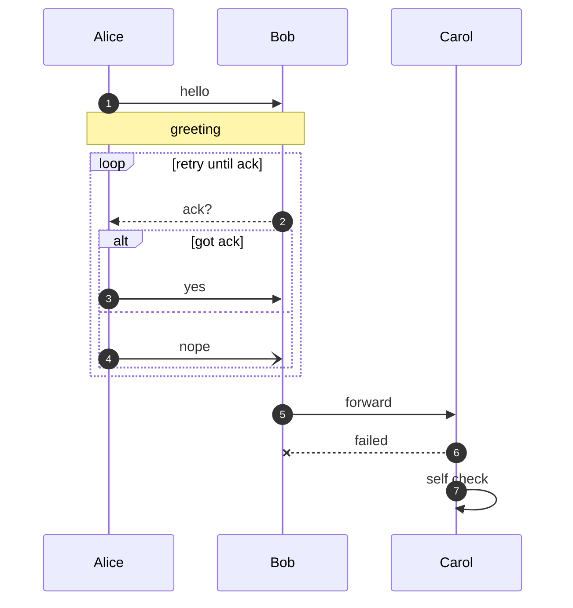
```mermaid
sequenceDiagram
    autonumber
    participant A as Alice
    participant B as Bob
    participant C as Carol
    A->>B: hello
    Note over A,B: greeting
    loop retry until ack
        B-->>A: ack?
        alt got ack
            A->>B: yes
        else
            A-)B: nope
        end
    end
    B->>C: forward
    C--xB: failed
    C->>C: self check
```

## loop_simple

Source:

```
sequenceDiagram
    A->>B: hi
    loop every minute
        A->>B: poll
    end
```

Rendered:

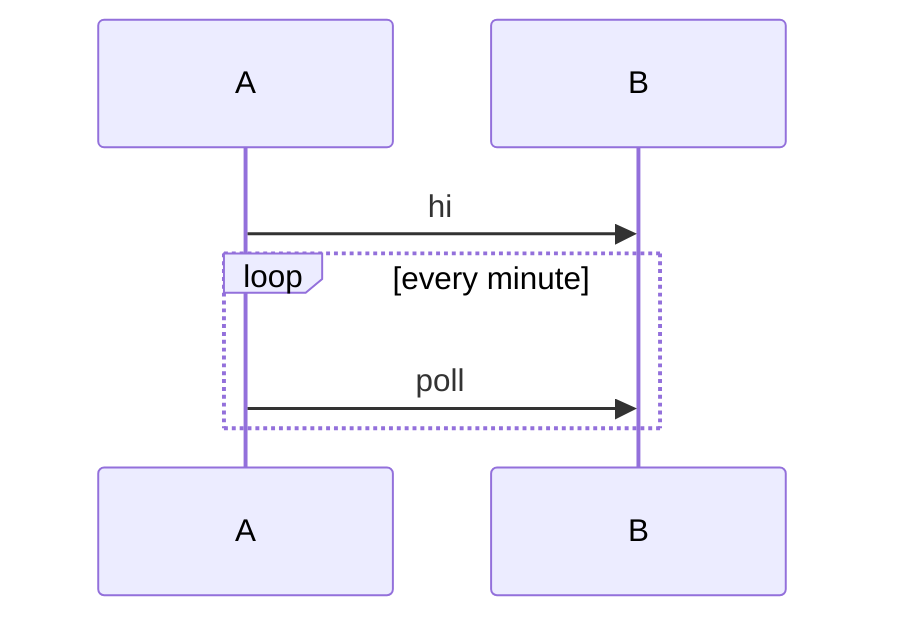
```mermaid
sequenceDiagram
    A->>B: hi
    loop every minute
        A->>B: poll
    end
```

## mixed_arrows_with_labels_long

Source:

```
sequenceDiagram
    Alice->>Bob: this is a fairly long label that stretches things out quite a bit
    Bob-->>Alice: short
```

Rendered:

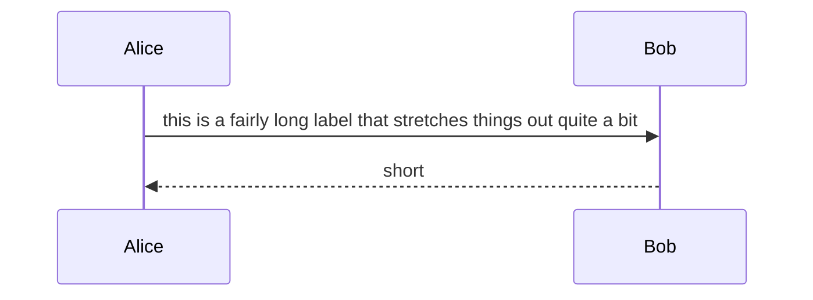
```mermaid
sequenceDiagram
    Alice->>Bob: this is a fairly long label that stretches things out quite a bit
    Bob-->>Alice: short
```

## nested_loop_opt

Source:

```
sequenceDiagram
    A->>B: hi
    loop retry
        opt is premium
            A->>B: extra
        end
    end
```

Rendered:

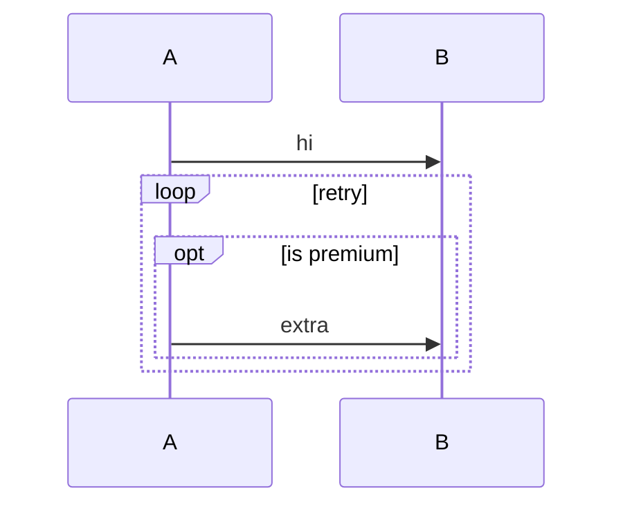
```mermaid
sequenceDiagram
    A->>B: hi
    loop retry
        opt is premium
            A->>B: extra
        end
    end
```

## nested_triple

Source:

```
sequenceDiagram
    A->>B: hi
    loop outer
        alt condition
            opt maybe
                A->>B: deep
            end
        else
            B->>A: no
        end
    end
```

Rendered:

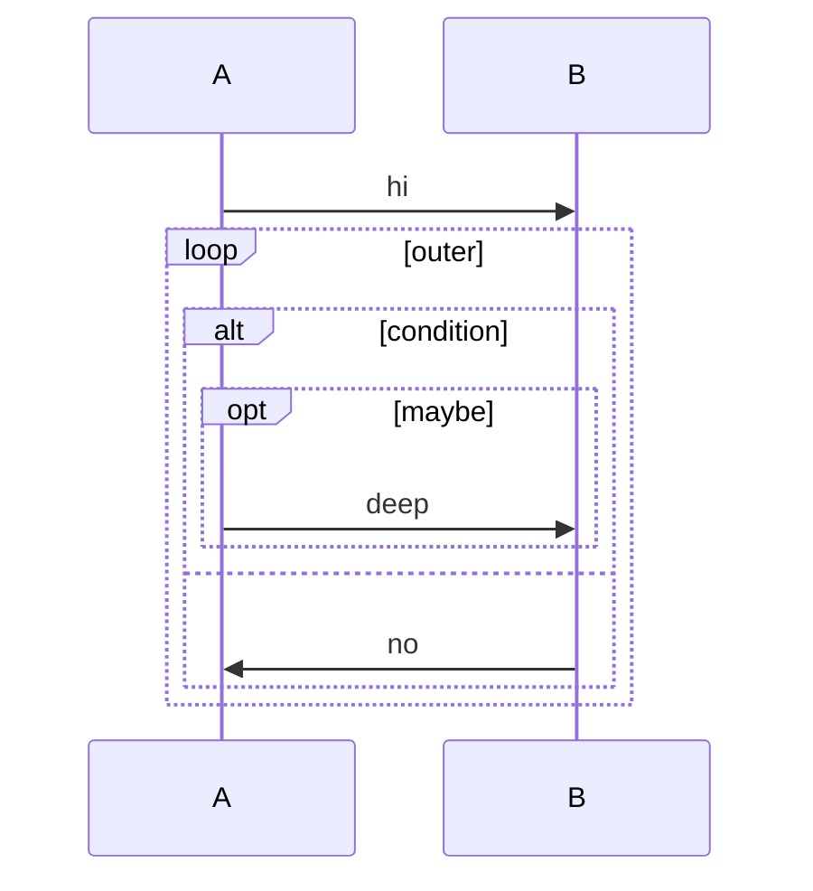
```mermaid
sequenceDiagram
    A->>B: hi
    loop outer
        alt condition
            opt maybe
                A->>B: deep
            end
        else
            B->>A: no
        end
    end
```

## no_label_message

Source:

```
sequenceDiagram
A->>B:
```

Rendered:

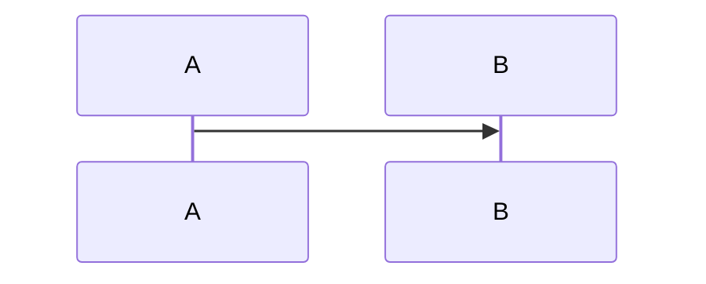
```mermaid
sequenceDiagram
A->>B:
```

## note_left_of_leftmost

Source:

```
sequenceDiagram
    A->>B: hi
    Note left of A: leftmost note
    loop retry
        A->>B: poll
    end
```

Rendered:

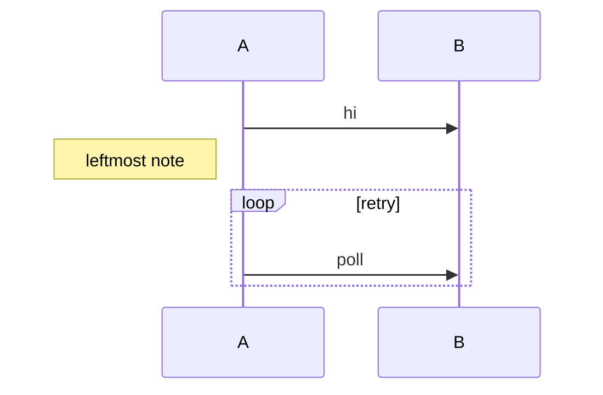
```mermaid
sequenceDiagram
    A->>B: hi
    Note left of A: leftmost note
    loop retry
        A->>B: poll
    end
```

## note_left_of

Source:

```
sequenceDiagram
    A->>B: hi
    Note left of A: left note
```

Rendered:

```mermaid
sequenceDiagram
    A->>B: hi
    Note left of A: left note
```

## note_long_text

Source:

```
sequenceDiagram
    A->>B: hi
    Note over A,B: this is a much longer note than the participants are wide
```

Rendered:

```mermaid
sequenceDiagram
    A->>B: hi
    Note over A,B: this is a much longer note than the participants are wide
```

## note_over_one

Source:

```
sequenceDiagram
    A->>B: hi
    Note over A: A note
```

Rendered:

```mermaid
sequenceDiagram
    A->>B: hi
    Note over A: A note
```

## note_over_three

Source:

```
sequenceDiagram
    A->>B: hi
    B->>C: hi
    Note over A,C: spans three
```

Rendered:

```mermaid
sequenceDiagram
    A->>B: hi
    B->>C: hi
    Note over A,C: spans three
```

## note_over_two

Source:

```
sequenceDiagram
    A->>B: hi
    Note over A,B: spanning note
```

Rendered:

```mermaid
sequenceDiagram
    A->>B: hi
    Note over A,B: spanning note
```

## note_right_of_last_participant

Source:

```
sequenceDiagram
    A->>B: hi
    Note right of B: trailing note
```

Rendered:

```mermaid
sequenceDiagram
    A->>B: hi
    Note right of B: trailing note
```

## note_right_of

Source:

```
sequenceDiagram
    A->>B: hi
    Note right of B: right note
```

Rendered:

```mermaid
sequenceDiagram
    A->>B: hi
    Note right of B: right note
```

## opt_simple

Source:

```
sequenceDiagram
    A->>B: hi
    opt is premium
        A->>B: extra
    end
```

Rendered:

```mermaid
sequenceDiagram
    A->>B: hi
    opt is premium
        A->>B: extra
    end
```

## par_simple

Source:

```
sequenceDiagram
    par branch one
        A->>B: one
    and branch two
        A->>C: two
    end
```

Rendered:

```mermaid
sequenceDiagram
    par branch one
        A->>B: one
    and branch two
        A->>C: two
    end
```

## par_three_branches

Source:

```
sequenceDiagram
    par one
        A->>B: 1
    and two
        A->>C: 2
    and three
        A->>D: 3
    end
```

Rendered:

```mermaid
sequenceDiagram
    par one
        A->>B: 1
    and two
        A->>C: 2
    and three
        A->>D: 3
    end
```

## participant_alias

Source:

```
sequenceDiagram
    participant A as Alice Smith
    participant B as Bob
    A->>B: Hi
```

Rendered:

```mermaid
sequenceDiagram
    participant A as Alice Smith
    participant B as Bob
    A->>B: Hi
```

## quoted_participant

Source:

```
sequenceDiagram
    participant "Alice Smith" as A
    A->>B: Hi
```

Rendered:

```mermaid
sequenceDiagram
    participant "Alice Smith" as A
    A->>B: Hi
```

## rect_no_color

Source:

```
sequenceDiagram
    rect
        A->>B: plain rect
    end
```

Rendered:

```mermaid
sequenceDiagram
    rect
        A->>B: plain rect
    end
```

## rect_simple

Source:

```
sequenceDiagram
    A->>B: hi
    rect rgb(200, 150, 150)
        A->>B: in rect
    end
```

Rendered:

```mermaid
sequenceDiagram
    A->>B: hi
    rect rgb(200, 150, 150)
        A->>B: in rect
    end
```

## reverse_direction_arrow

Source:

```
sequenceDiagram
    participant A
    participant B
    B->>A: reverse message
```

Rendered:

```mermaid
sequenceDiagram
    participant A
    participant B
    B->>A: reverse message
```

## self_message_bidirectional

Source:

```
sequenceDiagram
A<<-->>A: ping pong
```

Rendered:

```mermaid
sequenceDiagram
A<<-->>A: ping pong
```

## self_message_central

Source:

```
sequenceDiagram
    A()->>()A: central self
```

Rendered:

```mermaid
sequenceDiagram
    A()->>()A: central self
```

## self_message_dotted

Source:

```
sequenceDiagram
A-->>A: Self dotted
```

Rendered:

```mermaid
sequenceDiagram
A-->>A: Self dotted
```

## self_message_with_others

Source:

```
sequenceDiagram
    A->>B: hello
    B->>B: thinking
    B-->>A: done
```

Rendered:

```mermaid
sequenceDiagram
    A->>B: hello
    B->>B: thinking
    B-->>A: done
```

## self_message

Source:

```
sequenceDiagram
A->>A: Self
```

Rendered:

```mermaid
sequenceDiagram
A->>A: Self
```

## unicode_labels

Source:

```
sequenceDiagram
    participant A as Ålice
    participant B as 日本語
    A->>B: héllo wörld
```

Rendered:

```mermaid
sequenceDiagram
    participant A as Ålice
    participant B as 日本語
    A->>B: héllo wörld
```

## with_comments

Source:

```
sequenceDiagram
%% full line comment
A->>B: Hi %% inline comment
```

Rendered:

```mermaid
sequenceDiagram
%% full line comment
A->>B: Hi %% inline comment
```

