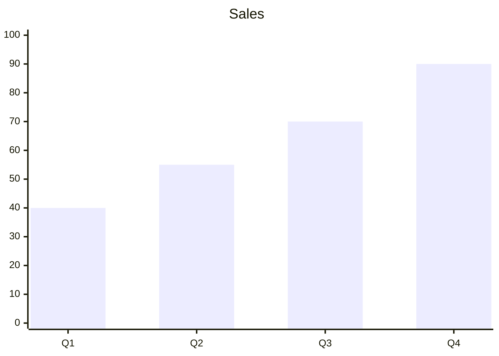
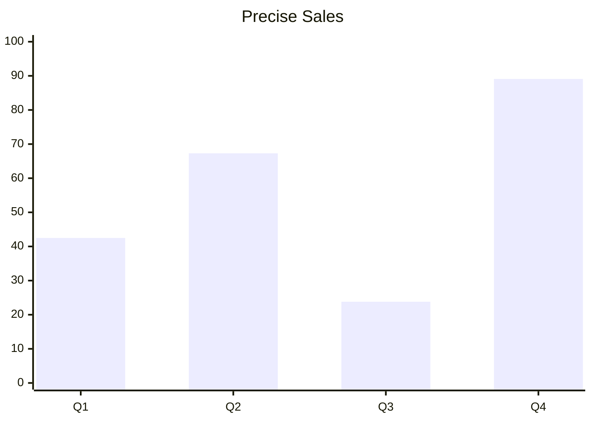
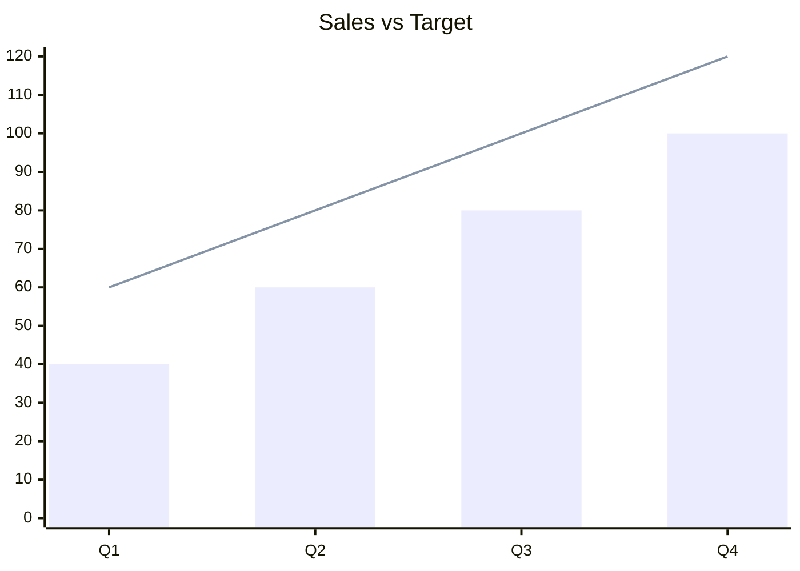

# Combined fixtures: mermaid_xychart (*.mmd)

XY charts (`xychart-beta` / `xychart`) plot bar and/or line datasets against a categorical x-axis and a numeric y-axis. Bars use eighth-resolution block glyphs (`▁`–`█`); lines are an orthogonal step/staircase with rounded corners. Size scales with the render `--width` (plot area between 50% and 100% of it). See [VIEWMD-0048](../issues/VIEWMD-0048-mermaid-xy-charts.md) and [docs/nvidia-stock-xychart.md](nvidia-stock-xychart.md) for the 13-category real-data example.

## sales

Source:

```
xychart-beta
    title "Sales"
    x-axis [Q1, Q2, Q3, Q4]
    y-axis 0 --> 100
    bar [40, 55, 70, 90]
```

Rendered:



## precise_sales

Source:

```
xychart-beta
    title "Precise Sales"
    x-axis [Q1, Q2, Q3, Q4]
    y-axis 0 --> 100
    bar [42.5, 67.3, 23.8, 89.1]
```

Rendered:



## revenue_trend

Source:

```
xychart-beta
    title "Revenue Trend"
    x-axis [Q1, Q2, Q3, Q4]
    y-axis 0 --> 100
    line [40, 60, 20, 100]
```

Rendered:

```mermaid
xychart-beta
    title "Revenue Trend"
    x-axis [Q1, Q2, Q3, Q4]
    y-axis 0 --> 100
    line [40, 60, 20, 100]
```

## sales_vs_target

Source:

```
xychart-beta
    title "Sales vs Target"
    x-axis [Q1, Q2, Q3, Q4]
    y-axis 0 --> 120
    bar  [40, 60, 80, 100]
    line [60, 80, 100, 120]
```

Rendered:


