# Monty Python and the Holy Grail: a Mermaid showcase

King Arthur has no horse, only a servant banging two coconut halves together, and yet somehow
still needs an org chart. This file tells the story of the quest for the Holy Grail using ten
different Mermaid diagram types — flowcharts, sequence diagrams, and an ER diagram (the three
kinds viewmd already renders today), and seven more (`gantt`, `journey`, `kanban`, `timeline`,
`block-beta`, `classDiagram`, `gitGraph`) that only exist as proposed issues
([VIEWMD-0032](../issues/VIEWMD-0032-mermaid-gantt-charts.md),
[VIEWMD-0033](../issues/VIEWMD-0033-mermaid-user-journey-diagrams.md),
[VIEWMD-0034](../issues/VIEWMD-0034-mermaid-kanban-diagrams.md),
[VIEWMD-0035](../issues/VIEWMD-0035-mermaid-timeline-diagrams.md),
[VIEWMD-0040](../issues/VIEWMD-0040-mermaid-block-beta-diagrams.md),
[VIEWMD-0041](../issues/VIEWMD-0041-mermaid-class-diagrams.md),
[VIEWMD-0042](../issues/VIEWMD-0042-mermaid-gitgraph-diagrams.md)) so far. Viewing this file with
`./viewmd.sh docs/monty-python-holy-grail.md` today will render the flowchart, sequence, and ER
sections as box-drawing art and raise `UnsupportedDiagramError` on the rest — which is itself
a fitting bit of Grail-quest futility: the fences are there, correctly written, and the
Bridgekeeper still throws you in the gorge.

For the record, before the silliness starts: released in 1975 on a budget of just £282,035, shot
mostly around Doune Castle and Glen Coe in Scotland, and financed in part because rock acts like
Led Zeppelin and Pink Floyd were looking for a tax write-off against Britain's 90% top income tax
rate at the time. The coconuts exist purely because the production couldn't afford real horses —
a budget gag so beloved it gave the film its German title, *Die Ritter der Kokosnuß* ("The Knights
of the Coconut"). It turned 50 in 2025, with a Fathom Events theatrical re-release and Terry
Gilliam doing the rounds at festivals to mark it — the source material for this file is at least
that well-tested. (Sources: [Wikipedia](https://en.wikipedia.org/wiki/Monty_Python_and_the_Holy_Grail),
[IMDb](https://www.imdb.com/title/tt0071853/).)

## The quest begins — flowchart

Three men on foot, banging coconuts together, do not simply walk to the Bridge of Death — they
get interrogated by a keeper who lobs the unprepared into the Gorge of Eternal Peril for wrong
answers, and gets lobbed in himself for an unanswerable one:

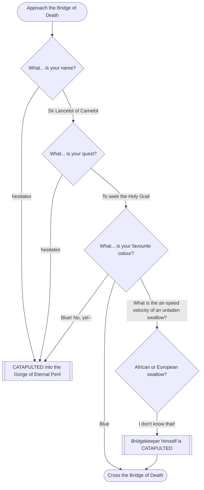

Lancelot storms it, Robin bottles the colour question, Galahad nearly makes it and then blows
"blue" at the last syllable, and Arthur turns the question back on the Bridgekeeper — who has no
answer for his own riddle and joins his victims in the gorge.

## The Black Knight — sequence diagram

Widely voted the single funniest scene in the film: Arthur wins a swordfight against an opponent
who refuses, on principle, to acknowledge losing any of his limbs:

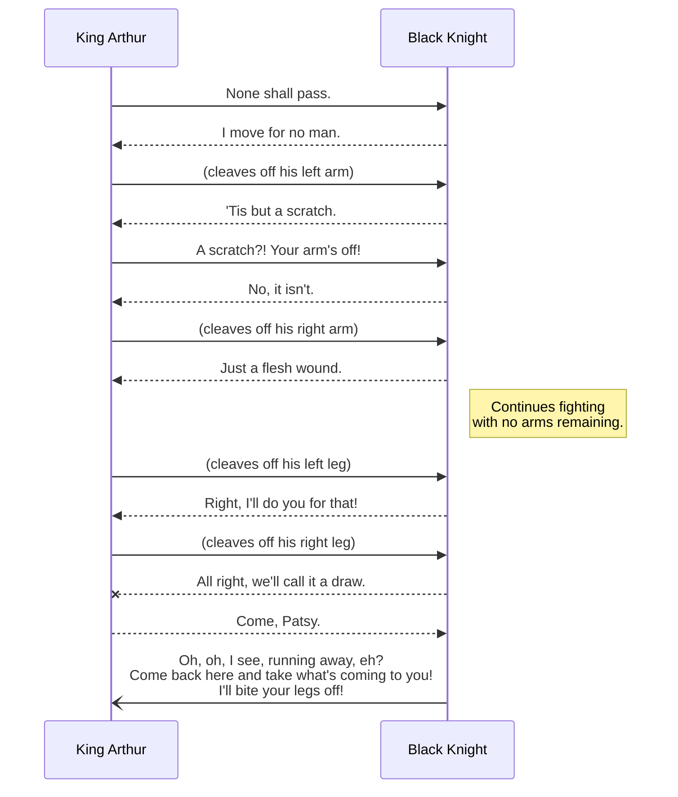

## French taunting — sequence diagram

Arthur's polite request for a look around the Grail-holding castle meets the finest diplomacy
France has to offer:

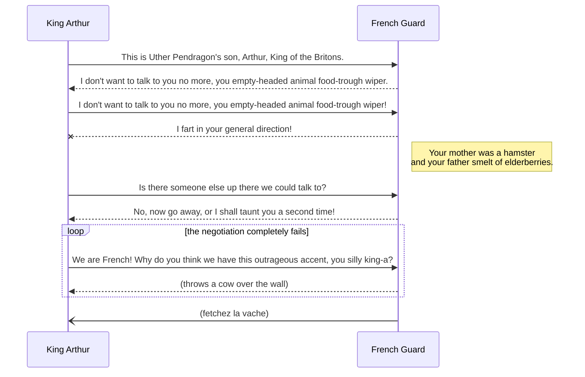

## The Round Table — entity-relationship diagram

Camelot, contrary to popular myth, is a silly place, and everyone who lives, quests, or gets
turned into a newt there fits neatly into an ER diagram:

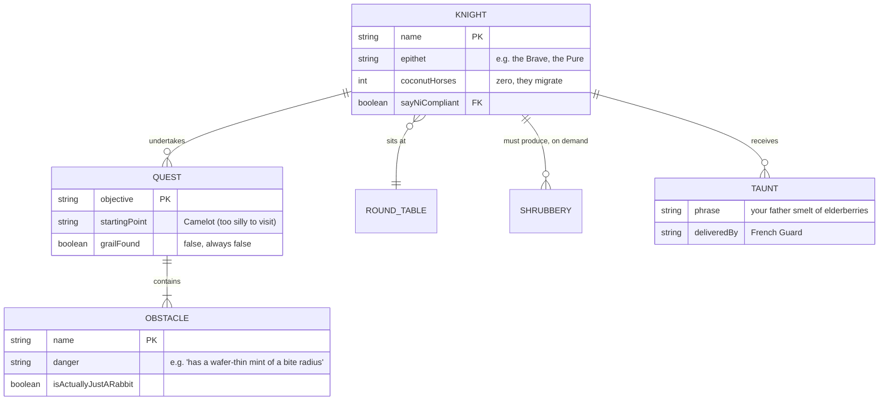

## Quest schedule — Gantt chart

Assembling the knights, negotiating with the Knights Who Say Ni, and building a large wooden
badger all take actual calendar time, and somebody has to track it — badly, on a scroll, in a
silly place:

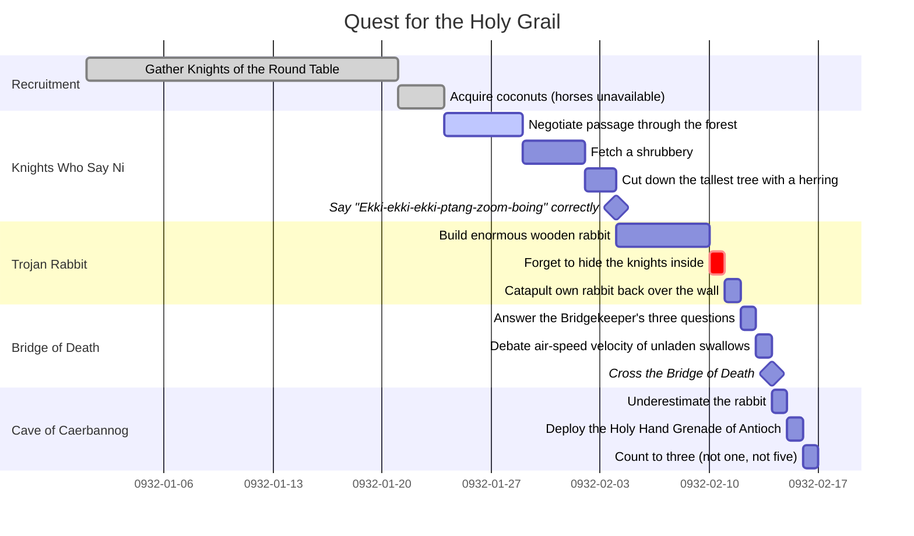

`crit` and `%%` weekend-exclusion syntax above are deliberately used but out of scope for
[VIEWMD-0032](../issues/VIEWMD-0032-mermaid-gantt-charts.md) as currently written — a `crit,
done`-tagged forgetful rabbit-building step falls back to whichever of `done`/`active` it also
carries, same as any other Mermaid gantt chart.

## Sir Robin's brave day — user journey

Brave Sir Robin ran away, bravely ran away, away — a day better told as a journey than a boast:

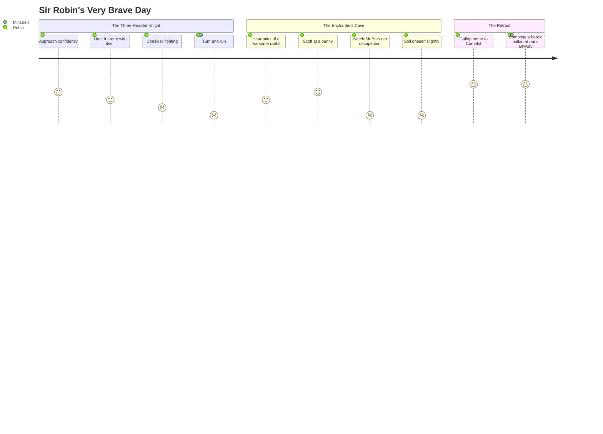

## The Round Table backlog — kanban board

Even a legendary quest runs on a task board, and this one has been blocked on the same column
for three scenes running:

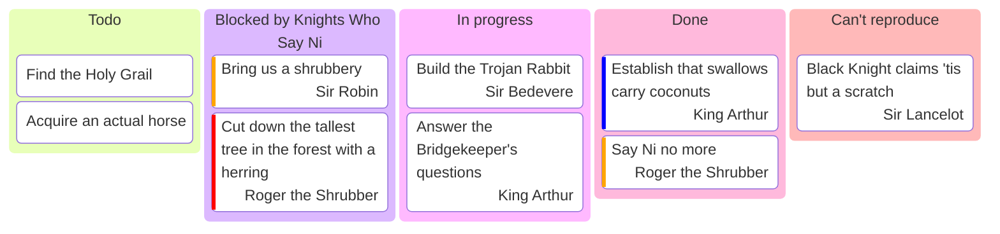

## A brief history of Camelot — timeline

The legend, condensed, from founding myth to the point where everyone collectively decides it's
a silly place and they won't go there:

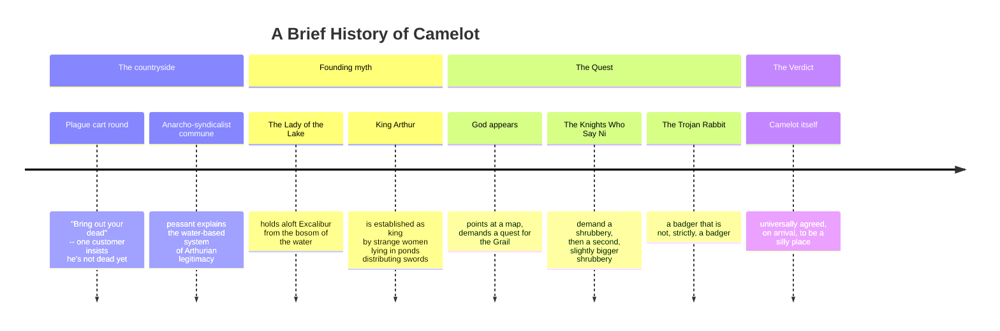

## Castle Anthrax floor plan — block-beta diagram

Castle Anthrax, home to Zoot, Dingo, and "eight score young blondes and brunettes, all between
sixteen and nineteen-and-a-half," has a floor plan best expressed as blocks:

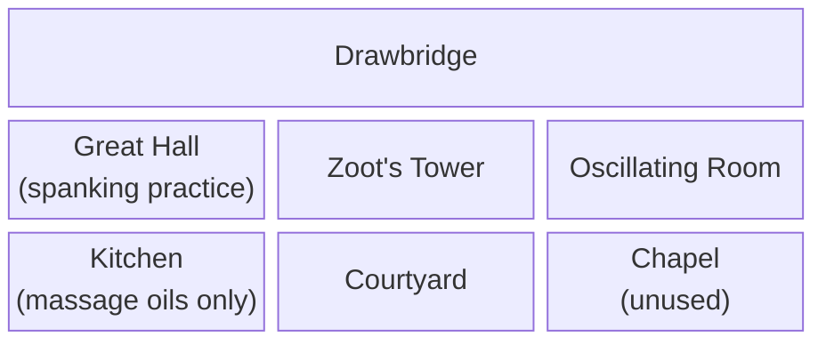

## Bestiary and cast taxonomy — class diagram

A proper taxonomy of who's a knight, who's a rabbit, and who is, strictly speaking, a killer:

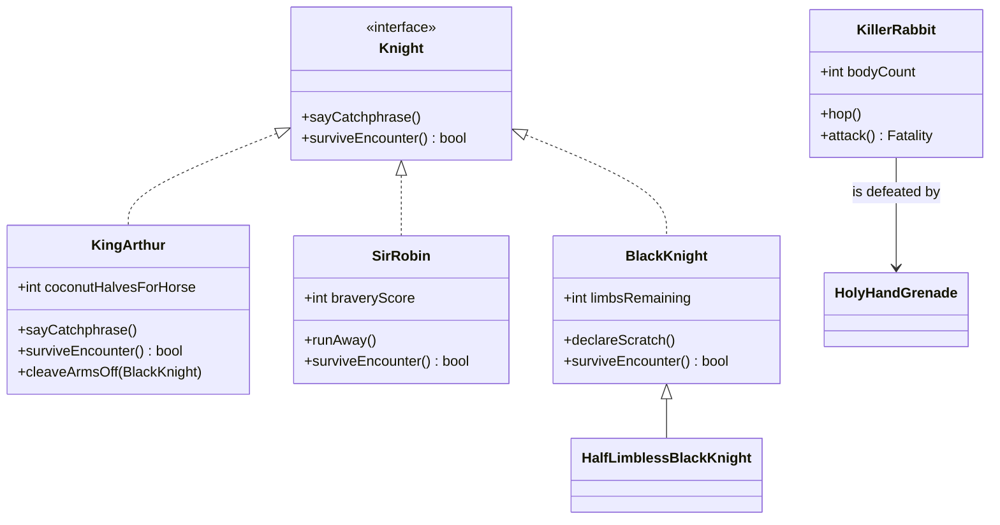

## Branches of the quest — gitGraph

The knights don't quest as one party for long — Arthur splits them up to search separately, and
the timeline branches and merges (badly) right up to the film's famously unresolved ending:

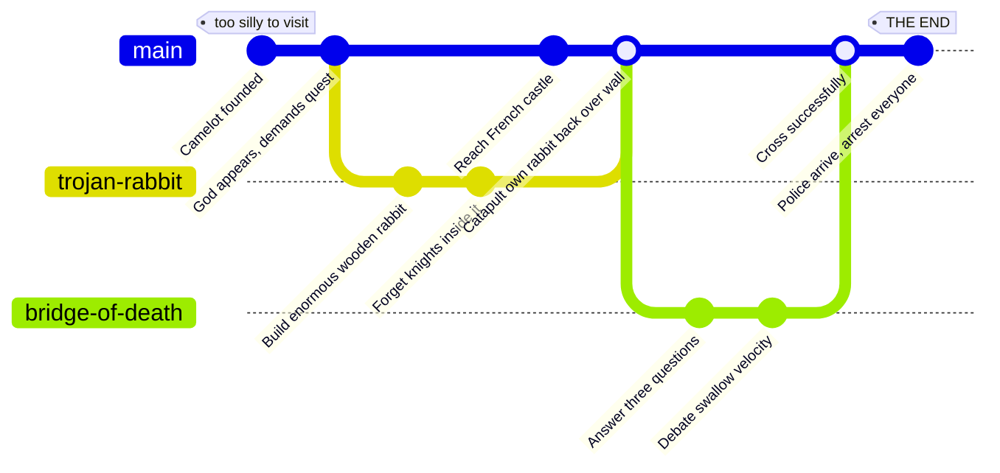

## Closing note

None of the seven proposed-only sections above render yet — until
[VIEWMD-0032](../issues/VIEWMD-0032-mermaid-gantt-charts.md)–[VIEWMD-0042](../issues/VIEWMD-0042-mermaid-gitgraph-diagrams.md)
land, viewing this file shows the flowchart/sequence/ER art in full and a graceful
`UnsupportedDiagramError` fallback for the rest, which — much like the quest itself — ends not
with a bang, but with a mildly apologetic shrug and a man in a suit turning off the camera.
