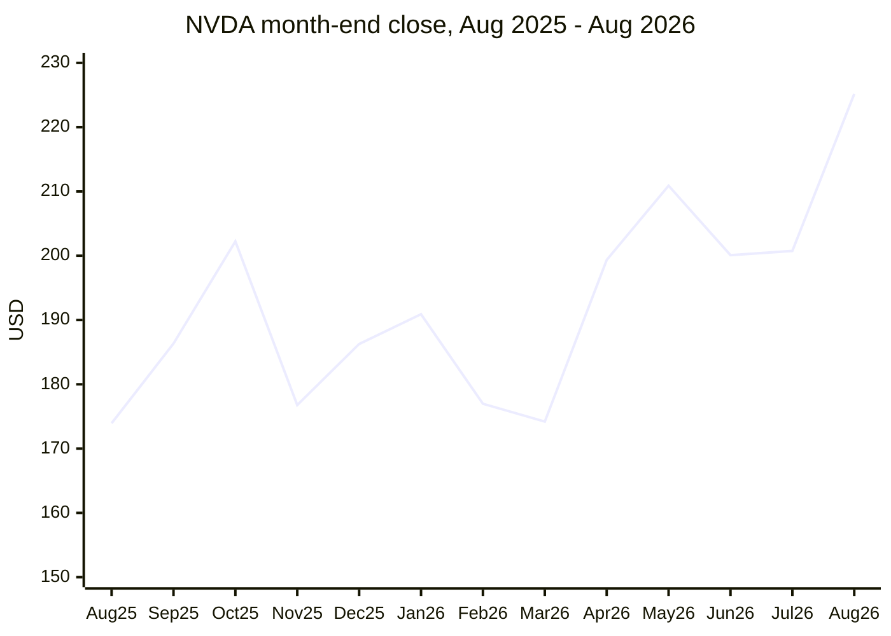

# NVIDIA (NVDA) 1-year stock price

This page uses NVIDIA (NVDA): a real, publicly traded, AI-infrastructure-adjacent stock, plotted with Mermaid's `xychart-beta` diagram type.

Month-end closing prices, August 2025 through August 2026:

Viewing this file with `./viewmd.sh docs/nvidia-stock-xychart.md` renders the chart above as a stair-step line chart (VIEWMD-0048). Plot width follows `--width` (capped at the viewport; never narrower than half of it).

Data source: month-end close prices as reported via public financial-data aggregators
(stockanalysis.com, StatMuse) in August 2026; treat as approximate, not exchange-verified ticks.
