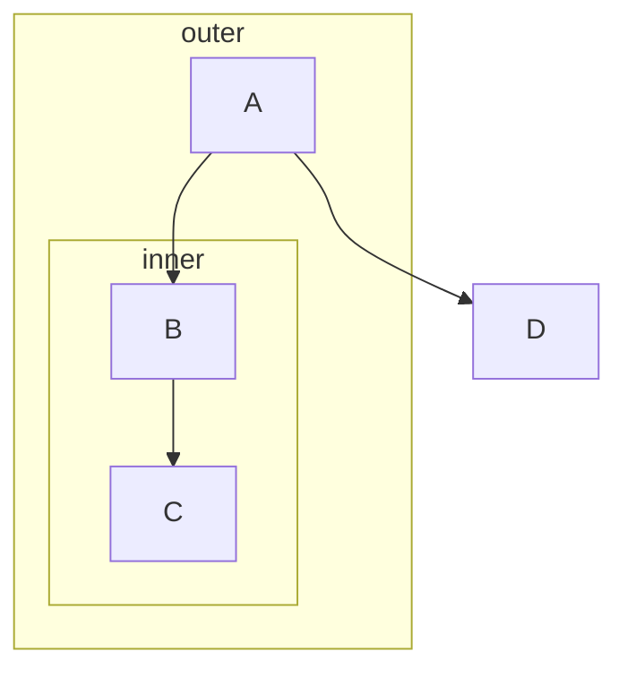

# Include every node an edge touches in a flowchart subgraph declared around it

## Summary

VIEWMD-0015 ported flowchart rendering byte-for-byte against `github.com/AlexanderGrooff/mermaid-ascii`, which determines subgraph membership by whether a node is *newly discovered* while the subgraph is open, not by whether an edge declared inside the subgraph touches it. A node already known from an earlier line (outside any subgraph) that's later referenced by an edge inside a subgraph doesn't get added to that subgraph, even though the edge connecting to it is drawn as if it belongs there. This issue is to make subgraph membership follow edges declared inside the subgraph instead, now that the flowchart engine (`viewmd/mermaid/grid/`, `viewmd/mermaid/flowchart/`) exists to build on.

## Motivation / problem

Confirmed against the real `mermaid-ascii` binary (not a viewmd-only artifact) with `docs/mermaid-examples.md`'s own "Subgraphs, including nested" example:

`B` is discovered by the `A --> B` line, which runs *before* `subgraph inner` opens -- so by the time `B --> C` is parsed inside `inner`, `B` is already a known node and doesn't count as "newly discovered," and only `C` (the genuinely new one) gets added to `inner`'s node list. The rendered result: `inner`'s frame only wraps `C`, leaving `B` -- one of the two endpoints of the edge declared inside `inner` -- visually stranded above the frame instead of inside it. Real Mermaid (mermaid.live) renders `B` inside `inner`, matching what a reader of the source would expect: everything the `B --> C` edge touches, drawn inside the subgraph it's declared in.

## Requirements

1. MUST change subgraph-membership tracking in `viewmd/mermaid/flowchart/parser.py`'s `parse()` (the "add new nodes to current subgraph(s)" step) so that when an edge is parsed while a subgraph is open, *both* the edge's endpoints get added to every currently-open subgraph -- not just nodes that are new to `gp.data` as of that line.
2. MUST keep existing outer-vs-inner subgraph assignment correct for nested subgraphs: a node touched by an edge declared inside `inner` belongs to both `inner` and every ancestor subgraph on the stack (`outer`), matching how newly-discovered nodes are already added to the whole stack today.
3. MUST NOT add a node to a subgraph it has no textual connection to -- only nodes touched by an edge (or bare node declaration) parsed while that subgraph is open qualify, not e.g. every node mentioned anywhere in the file.
4. MUST NOT change the byte-for-byte-matched behavior for diagrams with no subgraphs, or where every edge's endpoints are genuinely first-discovered inside the subgraph they're declared in (the common case, and every non-nested VIEWMD-0015 subgraph fixture) -- this issue only changes membership for the specific "edge references an already-known node" case.
5. MUST leave a flowchart fence untouched (no crash) on any subgraph structure not yet handled, same fallback discipline as VIEWMD-0015 requirement 6.

## Non-goals

- Matching any upstream reference byte-for-byte for this specific behavior -- there is none to match, since `mermaid-ascii` has the bug this issue fixes. Fixtures for this issue are necessarily hand-authored/visually-verified, unlike VIEWMD-0014/0015/0016's differential-tested ones.
- The unrelated node-shape (VIEWMD-0022), direction-reversal (VIEWMD-0027), parallel-edge-collision (see the maintainer's parallel-edges finding, not yet filed as its own issue), or A*-corner-minimization (VIEWMD-0025) issues -- separate root causes, separate fixes.
- Redesigning subgraph bounding-box calculation itself (`calculate_subgraph_bounding_box`) -- once membership is correct, the existing bounding-box logic should just work from the corrected node list; only touch it if it turns out not to.

## Design notes / links

VIEWMD-0015 (`issues/archive/VIEWMD-0015-mermaid-flowchart-diagrams.md` once archived) is the byte-for-byte baseline this diverges from. `viewmd/mermaid/flowchart/parser.py:parse`'s subgraph-stack loop (the `existing_nodes = set(gp.data.keys())` diff before/after `_parse_string`, then adding only genuinely-new node names to `subgraph_stack`) is the exact mechanism to change -- it needs to also inspect the parsed edge(s)' endpoints directly rather than relying solely on the before/after `gp.data` key diff. `tests/test_mermaid_flowchart_parser.py:test_subgraph_nesting` currently asserts the *buggy* behavior (`inner.nodes == {"C"}`, with a comment explaining why) and needs updating to assert the fixed behavior (`inner.nodes == {"B", "C"}`) as part of this issue.

## Acceptance / verification

- The `docs/mermaid-examples.md` "Subgraphs, including nested" example renders with `B` inside `inner`'s frame (not stranded above it), matching what mermaid.live renders for the same source.
- `test_subgraph_nesting` updated to assert the corrected membership (`inner.nodes == {"B", "C"}`, `outer.nodes == {"A", "B", "C"}`).
- A fixture confirming a subgraph containing only genuinely-new nodes (the common case) is unaffected.
- All of VIEWMD-0015's existing fixtures still pass unchanged, or are deliberately updated with a clear note if their subgraph rendering changes as a result of this fix (regression guard on the byte-for-byte baseline, with any intentional deviations called out explicitly).
- `./run-tests.sh` green.

## Peer review

Left blank until implemented and tested; filled in as part of the Definition of Done landing gate.
