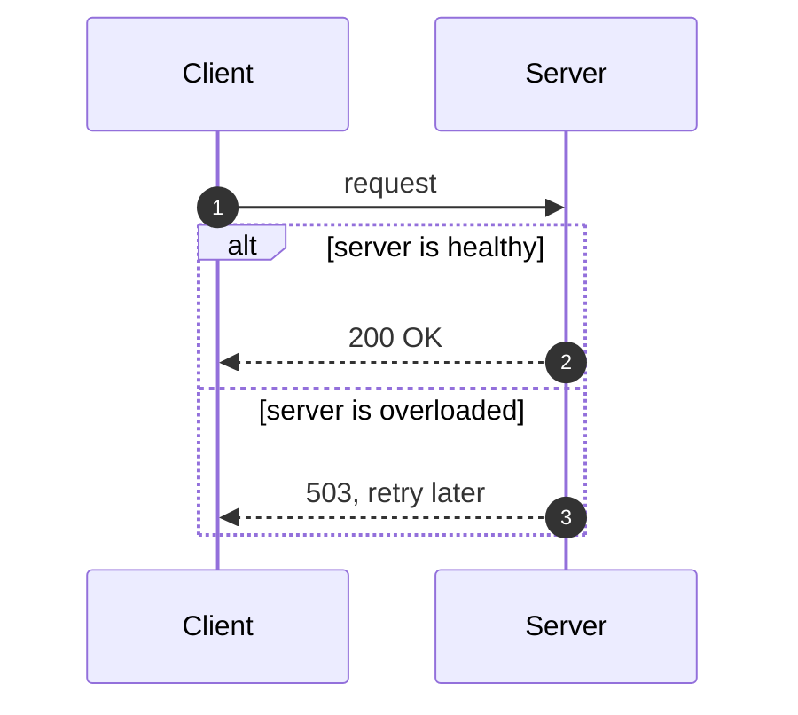

## Mermaid diagrams

A fenced ` ```mermaid ` block containing a `sequenceDiagram`, `graph`/`flowchart`, `erDiagram`,
`pie`, `packet-beta`/`packet`, or `quadrantChart` renders as box-drawing art in place of its
source. Other Mermaid diagram types, and any block that fails to parse, are left as plain source
text rather than causing an error.

### Sequence diagrams

Sequence diagrams support notes, loop/alt/par fragments, and `actor` participants (drawn as a
random 3-line stick figure instead of a box).


