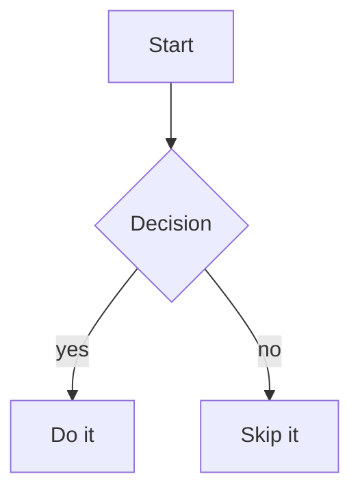

### Flowcharts

Flowcharts support subgraphs, labelled and bidirectional edges, `classDef` styling, A*-based
routing around other nodes, and distinct node shapes (round, stadium/pill, circle, subroutine,
cylinder/database, and diamond decision nodes rendered as a rounded lozenge -- see
[docs/diamonds.md](diamonds.md) for the shape specifically). One real limitation inherited from the upstream
renderer flowcharts are ported from: `BT`/`RL` directions are accepted but not actually reversed
(aliased to `TD`/`LR`).

Source:

```
graph TD
    A[Start] --> B{Decision}
    B -->|yes| C[Do it]
    B -->|no| D[Skip it]
```

Rendered:


