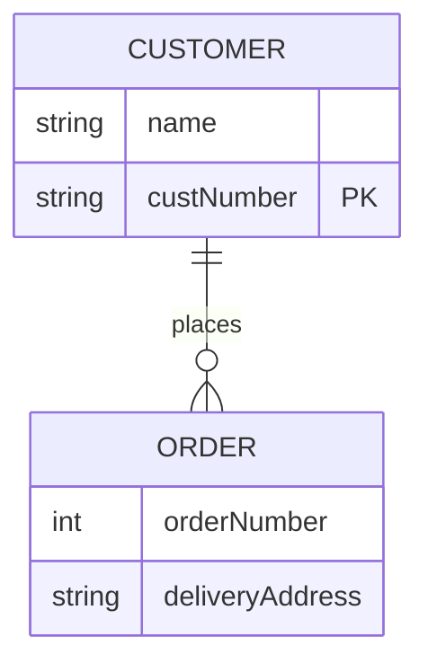

### ER diagrams

ER diagrams support attribute tables, crow's-foot cardinality notation, and
identifying/non-identifying relationships. See [docs/mermaid-examples.md](mermaid-examples.md)
for an exhaustive tour of sequence diagrams, flowcharts, and ER diagrams -- every arrow type and
fragment, every flowchart direction/subgraph/styling case, ER cardinality notation, and the
graceful-fallback behavior for diagram types that aren't supported yet.

Source:

```
erDiagram
    CUSTOMER ||--o{ ORDER : places
    CUSTOMER {
        string name
        string custNumber PK
    }
    ORDER {
        int orderNumber
        string deliveryAddress
    }
```

Rendered:


