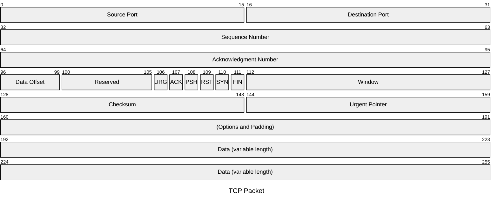

### Packet diagrams (VIEWMD-0049)

A `packet-beta`/`packet` block draws a fixed-width bit/byte field layout -- the kind used to
document a network protocol header -- wrapped onto rows of 32 bits each. See
[docs/mermaid-packet.md](mermaid-packet.md) for fixtures with the `+<count>` shorthand and a
field spanning a row boundary.

