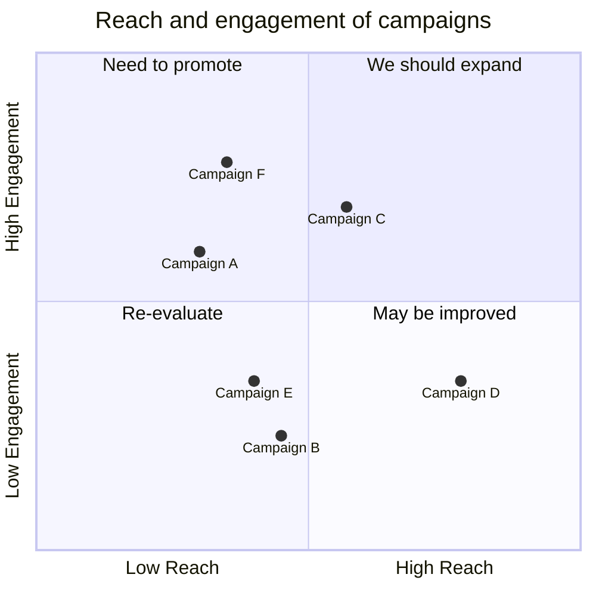

### Quadrant charts (VIEWMD-0047)

A `quadrantChart` block draws a bordered box split into four labelled quadrants by an internal
cross, with each `<label>: [x, y]` point plotted at its `(x, y)` position and labelled beneath its
marker. Like the pie chart, its size scales to the render width, and with color available each
quadrant's border, label, and points are tinted a distinct color over a darkened background fill.
Without color, the same box renders plain instead. See
[docs/mermaid-quadrant.md](mermaid-quadrant.md) for more fixtures.

