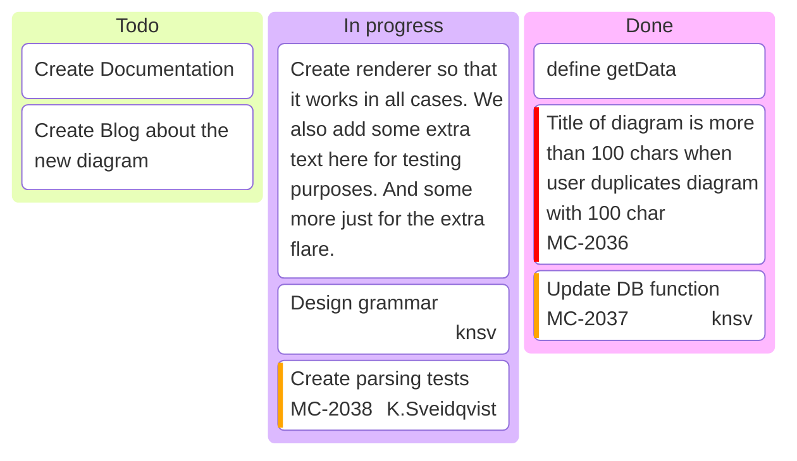

### Kanban boards (VIEWMD-0034)

A `kanban` block draws ordered columns of stacked task cards, each column its own colored-header
box and each card its own nested box within it. Cards word-wrap long labels and can carry
`@{ ticket, assigned, priority }` metadata, rendered as a colored line under the label: a
severity-colored `[H]`/`[VH]`/`[L]`/`[VL]`/`[M]` priority token, an underlined ticket ID, and a
right-aligned assignee. Columns size to a uniform card width but hug their own content height, so
a short column doesn't pad out to match a taller one beside it.

