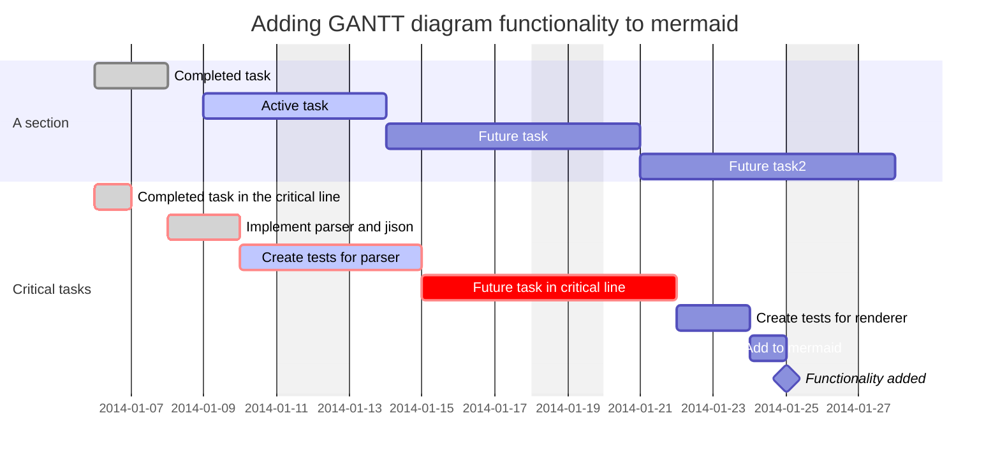

### Gantt charts (VIEWMD-0032)

A `gantt` block draws one row per task: a status-tagged bar (`done`/`active`/untagged/`crit`) or a
single `◆` point for a `milestone`, against a scaled timeline axis with full-height gridlines and
`section`-grouped rows. With color available, each status gets its own hue and `crit` tasks get a
distinct bracket color layered on top; a longer span switches the axis to week ticks and adds a
date-anchor line under the chart so `W<n>` labels still say what date they fall on. This is
Mermaid's own "full syntax" reference example, exercising `excludes weekends`, `after`/`until`
chaining, hour-granularity durations, and every status tag at once -- see
[docs/mermaid-gantt.md](mermaid-gantt.md) for more.

