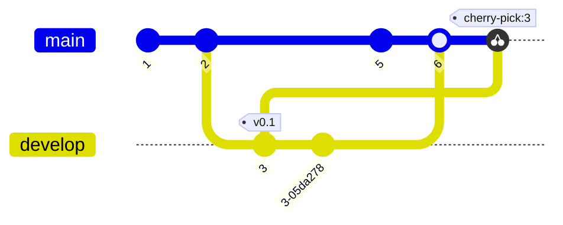

### gitGraph diagrams (VIEWMD-0042)

A `gitGraph` block draws one horizontal lane per branch, in first-appearance order, as `──●──`
segments with commit ids centered beneath each marker. Supports `branch`/`checkout`, `merge`,
`cherry-pick`, an optional `tag:` in `[brackets]`, and a bare `commit` with no `id:` (auto-generates
a random 4-hex-char id, matching Mermaid's own behavior). Vertical connectors merge into
`┼`/`├`/`┤` where they cross a lane's own content. With color available, each branch gets its own
hue and every commit id shares one neutral hue across the diagram -- see
[docs/mermaid-gitgraph.md](mermaid-gitgraph.md) for more.

