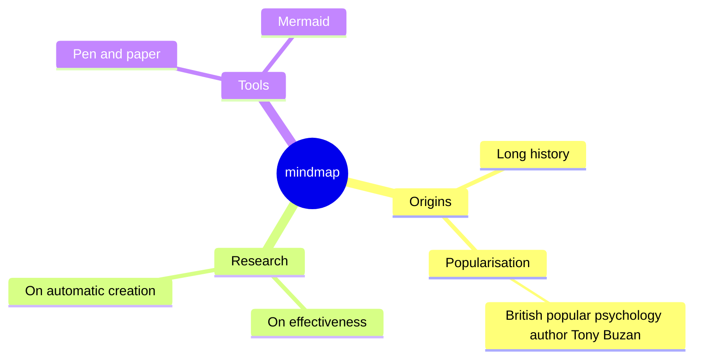

### Mindmap diagrams (VIEWMD-0045)

A `mindmap` block draws an indentation-defined tree radiating from a root: children fan out to the
right via `─╭─`/`─├─`/`─╰─` branch connectors, and once a single-direction fan would grow too tall
some root children overflow to the left instead. Mermaid shape markers (`(round)`, `[square]`,
`((circle))`, `{{hexagon}}`, `)cloud(`) are stripped to plain text; `**bold**` and `*italic*` spans
in a label render as real ANSI styling. See [docs/mermaid-mindmap.md](mermaid-mindmap.md) for more.

