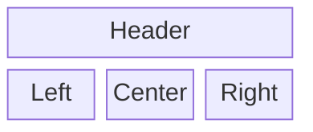

### Block diagrams (VIEWMD-0040)

A `block-beta` (or bare `block`) diagram lays labeled boxes onto an explicit or implicit grid,
positioned by declaration order rather than by edges: a `columns N` directive fixes row width, and
a `:N` suffix lets a block span multiple columns, widening to match their combined width. Blocks
sharing a grid column equalize to the widest one in that column, even across rows. A block can
optionally connect to another same-row block with a plain flowchart-style `-->` arrow. See
[docs/mermaid-block.md](mermaid-block.md) for more.

