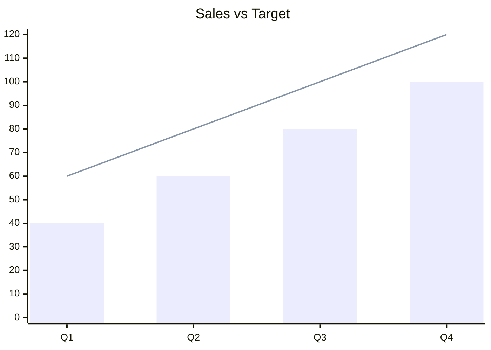

### XY charts (VIEWMD-0048)

An `xychart-beta` (or bare `xychart`) block plots one bar dataset, one line dataset, or both on the same axes: categories along the bottom, numeric values up the left. Bars fill with eighth-resolution block glyphs; lines are a rounded-corner step/staircase drawn on top of the bars in a combo chart. Plot size scales with `--width` (capped at the viewport, never narrower than half of it). See [docs/mermaid-xychart.md](mermaid-xychart.md) and [docs/nvidia-stock-xychart.md](nvidia-stock-xychart.md) for more.

